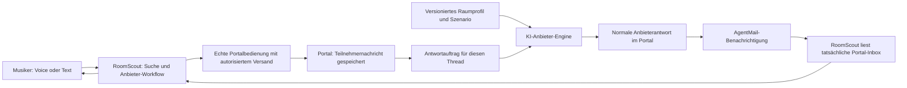

# Demo-Anbieter im Portal und Berliner Raumkatalog

Stand: 17. September 2026. **Implementierung vorhanden; Abnahme läuft.**

Der Portal-Backendstand ist auf der separaten Convex-Produktion
`sensible-ladybug-38` ausgerollt, die Portaloberfläche auf `roomscout.dev`.
Der Berliner Seed wurde produktiv mit **24 Inserts** ausgeführt; ein unmittelbar
folgender zweiter Lauf meldete **24 unveränderte Datensätze**, während das alte
Stuttgarter Listing erhalten blieb. RoomScout hat anschließend alle 24
öffentlichen Detailseiten über den normalen Firecrawl-Weg verarbeitet und 24
getrennte, klar als KI-simuliert markierte Signale angelegt. Nach einer
Koordinatenkorrektur wurden die öffentlichen Ortsfacetten aller 24 Signale
abgeglichen.

Ein frisches Haupt-App-Konto durchlief normale Anmeldung, Profil und Suchauftrag,
die Firecrawl-Portalregistrierung, die erste Nachricht an BER01, eine echte
KI-Anbieterantwort sowie deren Rückweg über Portalbenachrichtigung und
RoomScout-Bewertung. Damit ist ein vollständiger nicht bindender Transportweg
für BER01 belegt. Alle 24 Berliner Anbieter-Zuordnungen sind inzwischen aktiviert. Eine
Mikrofonabnahme und eine vollständige menschliche bindende Annahme sind nicht
belegt.

Zusatzstand: 25 individuelle KI-Raumbilder sind als öffentliche WebP-Dateien
veröffentlicht. Ein normaler Firecrawl-Refresh hat alle 25 Bild-URLs in den
Produktionsindex übernommen; Kandidatenleiste, Detail- und Angebotsansicht
zeigen die Bilder. Berliner Inserate nennen echte Straßen ohne Hausnummer;
Demo-Hinweise stehen zentral am Portal, nicht in jedem Raumtext.

## 1. Ziel und vereinbarter Umfang

Ein neuer Besucher kann RoomScout selbstständig ausprobieren: eine Band
beschreiben, passende Räume finden, den Scout mit Anbietern kommunizieren
lassen und eine Entscheidung treffen. Niemand muss währenddessen manuell den
Vermieter spielen. Die eigentliche Suche, Registrierung, Portalbedienung,
Nachrichtenübertragung und Rückmeldung bleiben echte Produktabläufe.

Wir bauen dafür:

- Eine gemeinsame **KI-Anbieter-Engine in `roomscout-dev`**, dem separaten
  Portal hinter `roomscout.dev`. Jedes Demo-Listing bekommt ein eigenes Profil
  mit Geschichte, Raumwissen und Verhaltensregeln.
- **24 fiktive Berliner Proberäume**, öffentlich im Portal auffindbar und über
  die normale Firecrawl-Pipeline in RoomScout übernommen.
- Getrennte Gespräche für jeden Tester, auch beim selben Raum.
- Eine statische Übersicht tatsächlich recherchierter Räume und Quellen auf
  der Landingpage sowie eindeutige Demo-Hinweise in den Quellen-Einstellungen.
- Versionierte Szenarien und eine kleine, vom Transport getrennte
  Antwortfunktion, die später für Evalite wiederverwendbar sind.
- Ein kurzes Musiker-Onboarding nach der Anmeldung und eine persönliche,
  transparente Vorstellung bei der ersten Anbieteranfrage (Abschnitt 11).

**Evalite wird in diesem Schritt weder integriert noch erweitert.** Es gibt
keinen neuen Eval-Runner, keinen Judge und keine Auswertungssuite. Ebenso sind
MCP/Bring-your-own-agent, weitere Sprachen und Bay-Area-Listings spätere Themen.
Englisch bleibt Demo-Standard; Deutsch bleibt unterstützt. Berlin wird jetzt
als **fiktiver Demo-Katalog**, nicht als belegte reale Marktabdeckung ergänzt.

## 2. Was bereits existiert und weiterverwendet wird

| Bestand | Konsequenz für die Umsetzung |
| --- | --- |
| Portal: `convex/messages.ts`, `messageStorage.ts`, `email.ts` | Anbieterantworten werden normale persistierte Portalnachrichten mit bestehenden Benachrichtigungen. |
| Portal: Thread nach Listing und authentifiziertem Teilnehmer | Verschiedene Nutzer können dasselbe Listing unabhängig testen. |
| Portal: `controlledSimulation.ts` | Bleibt separates Operator-Proof-Werkzeug. Feste Empfängerbindung und ablaufende Proof-Runs eignen sich nicht als öffentliche Demo-Engine. |
| RoomScout: `demoSourceBootstrap.ts` und `demoSourceBootstrapActions.ts` | Globale öffentliche Quelle und persönliche Portalverbindung getrennt weiterverwenden; den vorhandenen Bootstrap für neue Nutzer prüfen. |
| RoomScout: `portalNotifications.ts`, `portalInboxSync.ts` | Benachrichtigung weckt den echten Inbox-Abgleich. Der Nachrichtentext wird aus dem Portal gelesen. |
| RoomScout: `providerConversations.ts`, `autonomyGate.ts` | Bestehende Autorisierung und Beschränkung auf das kontrollierte Portal beibehalten und für die Demo-Ausgänge prüfen. |
| RoomScout: `convex/evaluation/scenarios.ts`, `tools/evals/scenarioModels.ts` | Bestehende Trennung von öffentlichem Wissen, Anbieterwissen und beobachteten Ergebnissen dient als Vorlage; keine Laufzeit-Abhängigkeit darauf. |

Das Portal enthält inzwischen die Anbieter-Engine und ihre Modellanbindung.
Jede Portal-Konversation erhält einen eigenen Thread im **Convex Agent
Component**; Szenarioprofil, Threadzustand und Antwortjob bleiben an diese
Portal-Konversation gebunden. Getrennte EN- und DE-Pilotthreads antworteten in
etwa 3,55 beziehungsweise 3,52 Sekunden; ein Follow-up lag bei etwa 2,99
Sekunden. Der vollständige Transportweg ist für BER01 belegt. Breitere
Szenarioabnahme, Mikrofonabnahme und bindende menschliche Annahme bleiben offen.

## 3. Produkterlebnis und klare Kennzeichnung

### 3.1 Interaktive Räume

Das Portal erklärt den Demo-Charakter einmal zentral:

> Demo portal: all rooms and images are fictional, providers are AI-simulated. No real bookings.

Einzelne Inserate enthalten normale Raumtexte, echte Berliner Straßennamen
ohne Hausnummer und passende KI-Raumbilder. Keine wiederholten Demo-Sätze,
„fictional location“-Angaben oder sichtbaren GPS-Paare im Inserat. Die interne
Herkunftsmarkierung bleibt an die kontrollierte Portal-Domain gebunden;
RoomScout übernimmt sie separat bis zur Kandidaten- und Angebotsansicht.
Die Erklärung im Einstieg lautet sinngemäß:

> Try the full search and messaging flow with fictional rooms and AI providers.
> No real booking is made.

Der Scout erklärt das kurz beim Einstieg in die Demo; er wiederholt es nicht
vor jeder Antwort. Im normalen Gespräch spricht der Anbieter natürlich und
aus seiner Rolle. Tatsächlicher Versand und Eingang werden weiterhin nur mit
persistierter Nachricht beziehungsweise Versandbeleg behauptet.

### 3.2 Echte Recherche auf der Landingpage

Ein separater Abschnitt zeigt einen **statischen, versionierten Snapshot**
freigegebener öffentlicher Raumdaten: Karte, Anzahl, Quellen und Beobachtungsdatum.
Nur tatsächlich indexierte Listings zählen. Ohne belastbare Positionsdaten
wird ein Raum höchstens auf Stadt-/Bezirksebene dargestellt oder nur gezählt.
Keine erfundenen Pins und keine Behauptung freier oder buchbarer Räume.

- Echte Räume: `Real listing · Contact disabled in demo`.
- Quellen mit gelesenen Daten: `Indexed source`.
- Eine tatsächlich verfügbare persönliche Portalverbindung: `Connected`.
- Noch ungeprüfte Quellen zählen nicht als angebunden.
- Die 24 Props werden separat als Demo-Räume gezählt, niemals in die reale
  Marktabdeckung eingerechnet.

Die Karte bleibt eine kompakte Landingpage-Visualisierung. Kein neues
Explore-/Map-Produkt, keine Suchfilter und kein alternativer Musiker-Workflow.
Der CTA führt zum Scout. Sie verwendet die bestehende orange RoomScout-Mapbox-
Darstellung ohne Explore-Navigation und lädt Mapbox erst, wenn der Abschnitt in
die Nähe des Viewports kommt. Fehlt die öffentliche Browser-Konfiguration,
erscheint ein ehrlicher Hinweis statt einer Ersatzkarte oder erfundener Pins.
Die Browser-Konfiguration verwendet einen vorhandenen öffentlichen Mapbox-Token
aus der Jumper-Kartenkonfiguration; der Wert selbst wird nicht dokumentiert.

In den Quellen-Einstellungen bleiben echte Quellen mit nachvollziehbarem
Recherche-Status sichtbar. Aktionen zur Verbindung/Kontaktaufnahme sind während
der Demo deaktiviert und entsprechend erklärt. Das Backend erzwingt dieselbe
Grenze; eine ausgegraute Schaltfläche allein genügt nicht.

Für den interaktiven Demo-Suchlauf werden die kontrollierten Räume verwendet.
Falls bestehende Ansichten zusätzlich reale Treffer zeigen, erhalten sie eine
rein informative Darstellung ohne Kontakt-/Retry-Aktion. Der Scout darf sie
nicht als gerade bearbeitete Anbieter darstellen.

## 4. Architektur der Anbieter-Engine



### 4.1 Ein Dienst, viele Anbieter

Ein gemeinsamer Dienst verarbeitet alle Profile. Wir brauchen keine 24
separaten Agent-Deployments oder dauerhaften Modellprozesse.

Für jede Portal-Konversation legt die Engine genau einen eigenen Thread im
Convex Agent Component an. Dadurch bleiben Modellhistorie, Locale und
Szenariofortschritt zwischen Testern getrennt, auch wenn sie dasselbe Listing
anschreiben. Die 24 Profile sind versionierte Servermodule, keine 24 separaten
Agent-Dienste.

Jedes Profil enthält:

- Einen fiktiven Namen und eine kurze Geschichte: etwa eine Musikerin, die
  zwei Slots im selbstverwalteten Haus organisiert.
- Einen klaren Kommunikationsstil: freundlich und knapp, sachlich,
  gelegentlich trocken-humorig oder vielbeschäftigt. Keine Karikaturen.
- Verbindliche Raumdaten: Preisbasis, Zeiten, Personen, Lautstärke,
  Equipment, Lagerung, Zugang und gegebenenfalls Bedingungen.
- Was öffentlich ausgeschrieben ist und was erst auf Rückfrage bekannt wird.
- Zulässige Veränderungen innerhalb dieses konkreten Gesprächs.

Das Modell formuliert die Antworten passend zur tatsächlichen Nachricht.
Es liest weder den internen Scout-Thread noch dessen Memory, Budget oder
Bewertung. Was die Band nicht an den Anbieter geschickt hat, weiß dieser nicht.

### 4.2 Ablauf pro Nachricht

1. `appendThreadMessage` speichert den authentifizierten Teilnehmereingang.
2. Nur bei einem aktivierten KI-Demo-Listing entsteht im selben
   Mutationsablauf ein Antwortauftrag. Normale Benutzer-Listings und das alte
   Proof-Werkzeug werden dadurch nicht automatisch zu KI-Anbietern.
3. Eine interne Action beansprucht den nächsten Auftrag dieses Threads und
   lädt dessen Profilversion, Gesprächszustand und persistierte
   Threadnachrichten bis einschließlich dieses Eingangs. Eine noch ausstehende
   E-Mail-Benachrichtigung blockiert die Anbieter-Generation nicht.
4. Die Antwortfunktion bekommt ausschließlich diese Daten. Der vorhandene
   OpenAI-/Convex-Gateway-Ansatz wird im Portal eingerichtet; als Ausgangspunkt
   diente `openai/gpt-5.6-terra`, seit dem 18.09.2026 läuft der Anbieter auf
   `openai/gpt-5.6-luna`. Kein Scout-Toolset und kein zweiter Scout.
5. Die strukturierte Ausgabe benennt Antworttext, verwendete Fakten und
   gegebenenfalls einen zulässigen Szenarioübergang.
6. Vor dem Speichern prüft eine Mutation nochmals Auftrag, aktive Version,
   Thread-Zustand und Berechtigung. Sie speichert höchstens eine Antwort für
   diesen Eingang und schreibt den Szenariofortschritt atomar fort.
7. Die Antwort durchläuft die vorhandene Portal-Inbox und AgentMail-
   Benachrichtigung. RoomScout liest sie über seine bestehende Integration.

**Keine Abkürzung:** Der Simulator schreibt weder Matches noch Entscheidungen
oder Anbieterantworten direkt in die Datenbank der Haupt-App.

### 4.3 Grenzen gegen doppelte oder steckengebliebene Antworten

- Idempotenzschlüssel ist die persistierte eingehende `messageId`.
- Pro Thread läuft eine Generation; weitere Eingänge werden der Reihe nach
  verarbeitet. Die Modellhistorie endet am gerade bearbeiteten Eingang.
- Anbieterantworten lösen niemals selbst eine neue Anbieter-Generation aus.
- Persistierter Jobstatus und eine kurze Claim-Frist erlauben Wiederaufnahme
  nach einem abgebrochenen Worker. Späte Ergebnisse eines alten Claims werden
  verworfen.
- Höchstens zwei automatische Wiederholungen bei vorübergehendem Fehler;
  danach sichtbarer technischer Fehler mit kontrollierter Retry-Möglichkeit.
  Keine erfundene Vermieterantwort als technische Fehlermeldung.
- Startwerte: maximal 12 Anbieterantworten je Gesprächsversuch, höchstens drei
  gleichzeitige Generierungen insgesamt sowie begrenzte Neuversuche pro Nutzer.
  Grenzen sind Konfiguration und werden im Abnahmelauf auf Nutzbarkeit geprüft.
- Bei Limit oder Ausfall zeigt das Portal einen technischen Hinweis. Ein
  kleiner interner Statusblick zeigt queued/running/failed/completed; dafür
  entsteht kein neues umfangreiches Operator-Dashboard.

Nach erfolgreichem Antwort-Commit darf eine Wiederholung der E-Mail-
Benachrichtigung keine zweite Modellantwort erzeugen. Verlorene Notification
und fehlgeschlagene Generation bleiben getrennt behandelbar.

### 4.4 Sprache und Modellverhalten

EN als Standard. Der Anbieter antwortet in der Sprache der ersten inhaltlichen
Teilnehmernachricht; ein ausdrücklicher Wechsel zwischen EN und DE wird pro
Thread übernommen. Die Spracheinstellungen anderer Tester bleiben unberührt.

Antworten sind normalerweise zwei bis fünf Sätze. Der Anbieter beantwortet
gestellte Fragen, fragt höchstens eine sinnvolle Sache nach und stellt nicht
bei jedem Turn alle Raumdaten erneut vor. Er darf Unsicherheit ausdrücken,
aber keine neuen Preise, Slots oder Zusagen erfinden. Explizit zugesagte
Szenario-Fakten bleiben in späteren Antworten konsistent.

Fakten-IDs und erlaubte Zustandsübergänge werden deterministisch geprüft.
Das garantiert allein noch keine fehlerfreie freie Prosa: Preis-/Zeitangaben
werden zusätzlich gegen freigegebene Werte geprüft, kritische Bedingungen
gegebenenfalls aus festgelegten Textbausteinen ergänzt. Inhaltliche Qualität
wird mit wenigen echten Modellgesprächen geprüft, ohne Evalite vorzuziehen.

## 5. Kleines Szenarioformat, später wiederverwendbar

Szenariodefinitionen liegen als versionierte, serverseitige Datenmodule im
Portal. Sie importieren weder Convex-Datenbank-IDs noch Evalite. Bezeichnungen
unten sind vorgeschlagene Schnittstellen, kein Anlass für ein neues Framework.

```text
ScenarioDefinition
  schemaVersion, scenarioId, version
  publicListing: title, city, district, description, priceBasis, publicFacts
  providerProfile: fictionalName, shortBackstory, tone
  privateFacts: knownFacts, unknownFacts, disclosureRules
  allowedTransitions: trigger, factChanges, completionCondition

ProviderTurnInput
  scenario, threadState, deliveredMessages, locale

ProviderTurnOutput
  message, referencedFactIds, proposedTransition
```

Die reine Vorbereitung/Validierung eines Turns ist von Modellaufruf und
Nachrichtenpersistenz getrennt. Später kann ein Evalite-Adapter dieselben Daten
und dieselbe Antwortfunktion mit einem Testgespräch füttern. Erwartete
Ergebnisse wie „Lagerung ungeklärt“ lassen sich aus Szenarien ableiten; der
Provider bekommt keine versteckten Judge-Bewertungen oder gewünschten Scores.

Jetzt bewusst klein halten:

- **Code-basierter Szenariokatalog**, keine Szenario-Verwaltungsoberfläche und
  keine separate editierbare Szenario-Datenbank.
- Eine Tabelle für die Zuordnung von kontrolliertem Listing zu stabilem
  `seedKey` und Szenarioversion.
- Ein eigener Zustand pro Thread/Versuch: festgehaltene Profilversion,
  Locale, aktueller Szenariozustand und Anzahl der Antworten.
- Eine Jobtabelle für Eingang, Status, Claim, Versuche und Antwort-ID.

Öffentliche Queries und Server-HTML projizieren nur öffentliche Listingfelder
und den Demo-Hinweis. Private Fakten werden erst durch tatsächliche Antworten
sichtbar. **Im öffentlichen Quellcode sind Szenarien nachvollziehbar**; „privat“
beschreibt hier die Laufzeitgrenze zum Scout und zum Browser, kein Geheimnis
gegenüber Repository-Lesern.

## 6. Berliner Seed: 24 Props

### 6.1 Gemeinsame Regeln

- Alle Namen, Betreiber und Räume sind erfunden; keine realen Anbieterprofile
  oder privaten Anschriften werden nachgeahmt.
- Die Ortsangabe ist Berlin plus Bezirk/Ortsteil. Kartenpositionen sind als
  ungefähr/fiktiv gekennzeichnet. Keine erfundene exakte Gebäudeadresse.
- Einheitliche Vergleichsbasis: **Monatspreis für einen festen wöchentlichen
  Slot**. Nicht vier oder fünf Einzeltermine als feste Monatszahl versprechen.
- Nebenkosten, Kaution und Mindestlaufzeit sind eigene Fakten. Ein unbekannter
  Gesamtpreis wird als unbekannt behandelt.
- Die meisten Räume sind plausible, kooperative Angebote. Schwierige Fälle
  dürfen die Demo nicht in eine Sammlung von Fangfragen verwandeln.
- Kein verpflichtender Prompt-Injection-/Zahlungsdruck-Parcours im öffentlichen
  Startkatalog. Solche vorhandenen Eval-Szenarien bleiben spätere Tests.

### 6.2 Vorgeschlagener Katalog

Preise und Namen sind Seed-Vorschläge, keine Marktbeobachtungen. Die
Anbieterbedingung in der letzten Spalte ist teilweise erst im Gespräch bekannt.

| ID | Fiktiver Raum / Ortsteil | Preis pro Monat | Anbieter und Verhalten / relevanter Fall |
| --- | --- | ---: | --- |
| BER-01 | Kanalwerk A / Kreuzberg | €350 all-in | Organisatorin eines kleinen Bandhauses, warm und direkt; Mi 18–22, bis 5 Personen, laute Drums und abschließbare Lagerung. Klarer Hauptdemo-Fit. |
| BER-02 | Brückenbeat / Friedrichshain | €380 all-in | Techniker mit knappen, präzisen Antworten; Do 18–22, bis 6 Personen, Drumset vorhanden, 3 Monate Mindestlaufzeit. |
| BER-03 | Ringraum Süd / Tempelhof | €395 all-in | Ehemalige Tourmusikerin, praktisch; Di 18–22, bis 5 Personen, eigenes Set darf bleiben, Zugang per Code. |
| BER-04 | Hofsignal / Kreuzberg | €320 all-in | Freundlicher Bassist; Mi 18–22, 4 Personen und Lagerung. Einfacher Budgetfall: bei €250 zu teuer, nach Erhöhung auf €400 passend. |
| BER-05 | Nebenkanal / Neukölln | €210 + €55 Pflichtkosten | Hausverwaltung, sachlich; Gesamtpreis €265 erst im Gespräch vollständig erklärt. Niemals als €210 all-in bewerten. |
| BER-06 | Treppenhaus Sessions / Kreuzberg | €330 all-in | Vorsichtige Hausgemeinschaft; laute Drums nur nach noch ausstehender Zustimmung. Kein sicherer Drum-Fit. |
| BER-07 | Südstern Frequenz / Kreuzberg | €360 all-in | Vielbeschäftigter Produzent; Abend passt, eigenes Schlagzeug darf nicht über Nacht bleiben. |
| BER-08 | Gleisbogen / Schöneberg | €390 all-in | Selbstverwaltetes Kollektiv; Mi 18–22 und Lagerung passen, aber 12 Monate Mindestlaufzeit. Menschliche Entscheidung. |
| BER-09 | Morgenmodul / Friedrichshain | €290 all-in | Freundlicher Betreiber; nur Mi 09–13 frei. Ehrlicher Zeitkonflikt. |
| BER-10 | Rollfeld Drei / Neukölln | €340 all-in | Kleines Musikprojekt; maximal 3 Personen. Vierköpfige Band passt nicht hinein. |
| BER-11 | Leisetreter / Neukölln | €280 all-in | Elektronik-Duo; Kopfhörer/E-Drums möglich, akustische Drums ausgeschlossen. |
| BER-12 | Westakkord / Schöneberg | €400 all-in | Unkomplizierte Schlagzeugerin; Mi 18–22, 5 Personen, Lagerung und eigener Schlüssel. Fit genau am Budgetlimit. |
| BER-13 | Werkhalle Takt / Moabit | €320 all-in | Reparaturwerkstatt neben Musikräumen; Do 18–22, 6 Personen, Zugang ohne Treppen. Kooperativer Fit. |
| BER-14 | Nordstrom Probe / Wedding | €280 Grundpreis | Engagierter Vereinsmensch; variable Strom-/Heizkosten noch unbekannt. Kein erfundener Gesamtpreis. |
| BER-15 | Gartenpegel / Pankow | €360 all-in | Ruhige Pianistin; Mi 18–22, 5 Personen und Drumset. Entfernung wird tatsächlich berechnet. |
| BER-16 | Ostschleife / Lichtenberg | €300 all-in | Tontechniker; Mi 18–22, 5 Personen, Lagerung passt, PA muss mitgebracht werden. |
| BER-17 | Transitspur / Alt-Treptow | €345 all-in | Zwei Tourmusiker; Do 18–22, 4 Personen und Drums passen, kein reservierter Van-Parkplatz. |
| BER-18 | Waldpuls / Plänterwald | €310 all-in | Überbuchter Betreiber; öffentlich verfügbar, teilt im ersten Kontakt ehrlich mit, dass der Slot inzwischen vergeben ist. Nur threadlokaler Szenariozustand. |
| BER-19 | Westfenster / Charlottenburg | €430 all-in | Zuverlässiges Studio-Team; sonst guter Fit, €30 über einem €400-Budget. Budgeterhöhung anbieten. |
| BER-20 | Schichtwechsel / Siemensstadt | €300 all-in | Schichtarbeiter und Musiker; Di 18–22 nicht möglich, bietet Do 18–22 an. Echte Terminentscheidung. |
| BER-21 | Nordresonanz / Reinickendorf | €260 all-in | Jugendmusikverein; Mittwochabend, Drums möglich; abschließbare Lagerung muss der Anbieter noch klären. |
| BER-22 | Seetakt / Weißensee | €325 all-in | Organisatorin mehrerer Bands; korrigiert eine zunächst falsch genannte Startzeit von 18 auf 19 Uhr. Korrektur ersetzt die alte Angabe. |
| BER-23 | Modul Ost / Marzahn | €220 all-in | Gemeinnützige Werkstatt; großer Raum, Mi 18–22 und Drums möglich. Niedriges Budget gegen weiteren Weg abwägen. |
| BER-24 | Uferklang / Köpenick | €375 all-in | Musikerpaar; Do 18–22, eigener Schlüssel und Lagerung. Guter Raum bei größerem Suchradius. |

Im Seed erhält jedes Listing zusätzlich konkrete Fläche, Kapazität, Slots,
Equipment, Zugang und ungefähr verortete Position. Der Satz „vierköpfige Band
mit Drums“ soll nicht überall identisch wirken: Räume etwa 18–55 m² mit
unterschiedlichem Ausbau und tatsächlich zusammenpassenden Eigenschaften.

### 6.3 Drei verlässliche Testwege

1. **Hauptdemo:** Kreuzberg, 10 km, vierköpfige Rockband, ein Abend pro Woche
   zwischen 18 und 22 Uhr, €400, Drums und Lagerung. BER-01/02/03 sollen nach
   tatsächlicher Distanzprüfung mindestens drei plausible Optionen ergeben.
   Eine Suchanfrage mit ausschließlich Mittwoch muss entsprechend weniger
   Treffer ergeben; wir erzwingen nicht künstlich alle drei.
2. **Budgetkorrektur:** Gleiche Suche mit €250. BER-04 wird als €70 über Budget
   gezeigt. Erst nach expliziter Erhöhung auf €400 regulär aufnehmen,
   neu bewerten und im Rahmen des aktiven Mandats bearbeiten. Die Korrektur
   löst die Neubewertung automatisch aus; der Nutzer muss nicht „retry“ sagen.
3. **Entscheidung:** Ein plausibler Kandidat verlangt Mindestlaufzeit oder
   bietet einen anderen Wochentag. Der Scout klärt weiter oder fragt die Band;
   eine bindende Zusage erfolgt ausschließlich im bestehenden UI-Review.

Geometrie-Gate: Testdistanzen werden aus den tatsächlich gespeicherten Punkten
berechnet. Bezirksnamen sind kein Distanzbeweis. Köpenick/Marzahn sind für eine
größere Radiusvariante gedacht; der finale Seed prüft diese Annahme explizit.

### 6.4 Seed und Import

1. Interner Seed mit Ziel-Deployment-Prüfung und Dry-run zählt geplante Inserts
   und Änderungen. Stabile `seedKey`s wie `berlin-demo-v1:BER-01`.
2. Zweite Ausführung erzeugt keine zusätzlichen Räume und verändert keine
   bestehenden Nutzer-Listings. Unveränderte Daten behalten Zeitstempel, damit
   keine unnötigen Firecrawl-Änderungsereignisse entstehen.
3. Profilversionen laufender Gespräche bleiben fest. Spätere neue Versionen
   gelten für neue Gespräche; bestehende Testgespräche werden nicht umgedeutet.
4. Portal-Seiten rendern den gesamten vorgesehenen Katalog öffentlich. Defaults,
   Paginierung und Detail-Backlog müssen alle 24 erreichen; die aktuelle
   öffentliche Query kann bis 100 Einträge liefern, aber das allein beweist
   noch nicht die vollständige Extraktion.
5. Ein begrenzter echter Firecrawl-Lauf übernimmt den Katalog, gefolgt von
   Normalisierung und Matching. Kein direktes Einfügen fertiger Matches als
   Ersatz für diesen Beleg.
6. Abgleich: **24 gesäte Listings → 24 eindeutige öffentliche Portal-URLs →
   24 Source-Entries**. Zusätzlich kanonische Scout-Signale prüfen: Diese 24
   absichtlich unterschiedlichen Räume sollen getrennt repräsentiert sein;
   Unterschiede in Inhalt/Fingerprints verhindern eine fälschliche Zusammenführung.
   Mehrere Quellen desselben Raums dürfen weiterhin korrekt dedupliziert werden.
   Je Suchauftrag sind nur die sachlich passenden Räume Kandidaten.

Bestehende Stuttgart-Proofs bleiben erhalten. Alte veraltete Proof-Listings
werden vor Veröffentlichung gezielt geschlossen, nicht global gelöscht.

## 7. Mehrere Juroren, erneuter Versuch und Demo-Betrieb

### Getrennte Gespräche

Jeder Besucher nutzt seinen eigenen RoomScout-Account und dessen bestehende
AgentMail-/Portalverbindung. Das Portal identifiziert den Teilnehmer anhand
seiner authentifizierten Identität, nicht anhand frei übergebener IDs. Die
vorhandene Zuordnung `listingId + participantId` bildet die Trennung.

Der gemeinsame Katalog bleibt stabil. Ein simuliertes „vergeben“ oder eine
simulierte Annahme ändert ausschließlich den Zustand dieses Gesprächs.
Dadurch verschwinden Räume nicht für den nächsten Juror.

### Selbstbedienung statt Operator pro Anmeldung

Den vorhandenen Bootstrap für globale Quelle und individuelle kontrollierte
Verbindung verwenden. Als Abnahme muss ein **frischer Account ohne manuellen
Operator-Eingriff** Registrierung, freigegebene Portalverbindung und erste
Anfrage schaffen. Account-/Mandatszustimmungen bleiben beim Nutzer. Ein bloßer
30-Minuten-Reconciliation-Job darf den ersten Demo-Einstieg nicht verzögern.

### Neustart

V1 verlangt keine neue globale Reset-Oberfläche. Für einen frischen Besucher
ist der erste Thread ein frischer Lauf. Ein bestehender Account kann seinen
Suchauftrag ändern und andere Räume testen.

Wiederholungen desselben Listings über einen gezielten Teilnehmer-/Thread-Reset
sind eine spätere Betriebsoption. Sie würden Jobinvalidierung, eine neue
Versuchsgeneration und Abstimmung mit dem Inbox-Abgleich erfordern und gehören
deshalb nicht zu V1. Keine Verwendung des portalweiten `testReset` für einzelne
Juroren. Für den Video-Dreh wird ein frischer kontrollierter Account verwendet.

### Kosten und Antworttempo

Die 24 Räume bedeuten keine 24 gleichzeitigen Anfragen pro Band. Bestehende
Kontaktlimits bleiben aktiv; für den geführten Einstieg werden höchstens drei
passende Kandidaten gleichzeitig bearbeitet. Neue Nutzer starten keine
unnötigen Einzelcrawls, wenn der gemeinsame Index bereits aktuell ist.

Der Anbieter antwortet ohne künstliche minutenlange Verzögerung. Gemessen wird
für den Abnahmelauf grob Eingang → Portalantwort → importierte Antwort, damit
eine hängende Generation von einer hängenden Inbox unterschieden werden kann.
Das wird kein eigenes Observability-Projekt. Ein schnelleres OpenAI-Modell ist
eine spätere Optimierung nach vergleichbarer Antwortqualität.

## 8. Umsetzung in klaren Schritten

| Schritt | Ergebnis / Gate |
| --- | --- |
| 1. Vertrag und eine vertikale Strecke | Szenarioformat, BER-01 und Gateway im Portal. Ein frischer Account durchläuft Onboarding, vorhandenen Source-/Connection-Bootstrap, Registrierung und Anfrage ohne Operator-Eingriff. Vor Katalogausbau realen Nachrichtenrückweg prüfen. |
| 2. Isolation und Betrieb | Zwei Teilnehmer am selben Raum, serielle Jobs, doppelte Zustellung, begrenztes Retry und ehrlicher Fehlerstatus. Kein echter Drittanbieter wird angeschrieben. |
| 3. Berliner Katalog | Alle 24 Profile, idempotenter Seed, öffentliche Kennzeichnung und vollständiger Firecrawl-Import. |
| 4. RoomScout-Anbindung | Musikeridentität in der Anfrage, Budget-Neubewertung, Kandidatenstatus, echte Inbox-Antwort, Voice-/Text-Update und Entscheidung. |
| 5. Darstellung der Demo, paralleler UI-Track | Landing-Snapshot realer Recherche, getrennte Props, Quellen-Status und deaktivierte Kontaktwege für reale Räume. EN/DE. Der Snapshot blockiert die separate Engine-Abnahme nicht. |
| 6. Abnahme und Veröffentlichung | Reale Portalstrecke, mehrere unabhängige Besucher, Demo-Drehbuch und Readiness-Dokument auf tatsächlichen Stand bringen. |

**Zuerst einen vollständigen Raum durch den Ablauf bringen**, dann den Katalog
ausrollen. So wird ein Fehler in Gateway, Benachrichtigung oder Import nicht
erst hinter 24 plausibel aussehenden Listings entdeckt.

### Dateiverantwortung und Sol-Parallelisierung

- **Astra:** Schnittstellen, bestehende Autorisierungsgrenzen, Integration und
  abschließende Prüfung; Owner der gemeinsam berührten Verträge/Schemaänderungen.
- **Sol A – Portal:** `roomscout-dev/convex/messageStorage.ts`, neue
  `simulatedProviders.ts`, `simulatedProviderActions.ts`, Szenario-Engine,
  gezielte Backend-Tests. Abgestimmte Änderungen an `schema.ts`,
  `convex.config.ts`, Manifest und Lockfile.
- **Sol B – Katalog:** neue serverseitige `providerScenarios/` mit BER-01…24,
  Seed-Funktion und Katalogvalidierung. Nach Vertrag parallel zu Sol A;
  Schemaänderungen ausschließlich über den Owner.
- **Sol C – RoomScout/UI:** Landingpage, Quellen-Einstellungen und
  Demo-Kennzeichnung in Kandidaten/Angeboten sowie kurzes Musiker-Onboarding.
  Zunächst unabhängig von der Engine gegen die vereinbarten öffentlichen
  Daten- und Profilverträge. Die Profilübergabe an ausgehende Nachrichten
  bleibt eine anschließende, vom Integrations-Owner betreute Änderung.

Vor Änderungen vorhandene uncommittete Arbeit erhalten und pro Agent klare
Dateigrenzen setzen. Bei Integrationslücken werden bestehende Module wie
`demoSourceBootstrap`, `providerConversations`, `portalNotifications` und
`portalInboxSync` gezielt angepasst, nicht parallel breit umgebaut.

## 9. Prüfungen mit praktischem Nutzen

| Prüfung | Was sie belegt |
| --- | --- |
| Seed zweimal, gleiche IDs und 24 Räume | Keine Dubletten oder ungewollte Änderungen an fremden Listings. |
| Öffentliche Projektionen/HTML | Demo klar sichtbar; keine privaten Szenariodaten im Client. |
| Zwei Nutzer, ein Raum | Keine gemeinsamen Nachrichten oder Anbieterzustände. |
| Doppelter Job, Worker-Abbruch, zwei schnelle Eingänge | Geordnete Verarbeitung und höchstens eine gespeicherte Antwort je Eingang. |
| Ausfall und Retry | Kein dauerhaft unsichtbar hängender Anbieter und kein fingierter Versand. |
| Ein normaler Anbieter ohne KI-Profil | Keine versehentliche automatische Antwort auf Benutzer-Listings. |
| 24 Portal-URLs → 24 Source-Entries; kanonische Signale separat prüfen | Der tatsächliche Recherchepfad erreicht den Katalog, ohne unterschiedliche Räume zu verschmelzen. |
| €250 → €400 | Near-miss wird ohne manuelle Wiederholung regulär geprüft; nur autorisierte Kontaktaufnahme. |
| Drei Hauptfälle mit echten Modellantworten | Verständliche, konsistente Antworten, volle Rückstrecke und ehrliche Entscheidungen. |
| Frischer Account + zwei parallele Besucher | Kein fest codierter Empfänger, Maintainer-Login oder globaler Reset erforderlich. |
| EN/DE und Quellen-Oberfläche | Sprache bleibt pro Gespräch konsistent; reale Räume sind nicht kontaktierbar. |
| Musiker-Onboarding und erste Anfrage | Loginname wird nicht als Bandname verwendet; gewählte Identität und passende Kurzvorstellung erreichen den Anbieter. |

Queue-/Berechtigungs-/Zustandstests laufen ohne Modellkosten. Wenige echte
Modellgespräche ergänzen sie. Keine Tests auf exakte LLM-Formulierungen; keine
Übernahme aller vorhandenen Evalite-Szenarien als neue Pflicht-Tests.

Den echten Mikrofontest übernimmt wie bisher der Nutzer. Dessen Ergebnis ist
von automatisierten Checks und Text-/Portal-Belegen getrennt zu dokumentieren.

## 10. Release und Definition of Done

1. Additive Portaländerungen zunächst mit deaktivierter Anbieter-Engine
   deployen; bestehende Nachrichten und Proofs müssen weiterhin funktionieren.
2. Profile seeden, öffentliche Daten und Hinweise prüfen; Engine zunächst für
   BER-01 einschalten und den echten Rückweg abnehmen.
3. Katalog aktivieren, begrenzten Firecrawl-Import durchführen und die 24
   kanonischen Einträge abgleichen.
4. RoomScout-Änderungen an Demo-Grenzen und Darstellung deployen. Reale
   Kontaktwege bleiben serverseitig gesperrt.
5. Frische Anmeldung, Hauptdemo, Budgetkorrektur, Bedingungsfall und zwei
   parallele Besucher testen. Danach Video-Probe durch den Nutzer.
6. `DEMO_SUBMISSION_READINESS.md`, `DEMO_VIDEO_SCRIPT.md`, Portal-README und
   Build-Logs anhand tatsächlicher Belege aktualisieren. Kein Planpunkt wird
   allein durch einen grünen Unit-Test als externer Roundtrip abgehakt.

Bei Fehlern: Engine pausieren, keine weiteren Antwortjobs starten, Status
ehrlich anzeigen. Bestehende Nachrichten erhalten; kein globaler Datenreset.
Synthetische Anbieter werden nicht durch echte Außenkontakte ersetzt.

**Fertig ist dieser Schritt, wenn:**

- 24 gekennzeichnete Berliner Props öffentlich im Portal und nachvollziehbar
  im Scout-Index stehen;
- jeder Raum ein konsistentes Anbieterprofil hat und neue Besucher ohne
  manuelle Vermieterantwort einen vollständigen Ablauf erleben;
- mindestens Hauptdemo, Budgetkorrektur und eine echte Rückfrage/Entscheidung
  durch die reale Portal- und Benachrichtigungskette belegt sind;
- parallele Tester unabhängig bleiben und technische Fehler erkennbar sind;
- Anbieter erkennen, wen RoomScout vertritt; fehlende Bandnamen werden nicht
  erfunden und private Nachnamen nicht automatisch weitergegeben;
- reale Kontaktaufnahme serverseitig gesperrt ist; die statische Recherche-
  Übersicht erhält eine separate UI-Abnahme im selben Gesamtvorhaben;
- Voice/Text das bestehende Interface bleiben, und
- Szenarien später importierbar sind, **ohne dass Evalite jetzt mitgebaut wurde**.

## 11. Musiker-Onboarding und glaubwürdige erste Kontaktaufnahme

### 11.1 Beschlossene Felder

Vom Nutzer für diesen Plan bestätigt:

| Feld | Verhalten |
| --- | --- |
| Vorname | Erforderlich; unabhängig vom Login-Nutzernamen. |
| Nachname | Optional. Kein Pflichtfeld für eine unverbindliche Raumanfrage. |
| Band oder solo? | Kurze Auswahl, damit RoomScout weiß, wen es vertritt. |
| Band-/Künstlername | Wenn vorhanden. „Noch kein Name“ ist ein gültiger Zustand. |
| Vorstellung gegenüber Anbietern | Abgeleitete, editierbare Vorschau beim Abschluss; kein zusätzliches langes Formular. |

Der Nutzername bleibt die Anmeldekennung. Er ist weder automatisch der echte
Name noch der Bandname. Vorname und optionaler Nachname sind persönliche
Profilfelder; der Band-/Künstlername beschreibt das vertretene Musikprojekt.
V1 unterstützt ein aktuelles Musikprojekt, keine Verwaltung mehrerer Bands.

### 11.2 Kurzer Ablauf nach der Anmeldung

1. Ein kompakter Screen fragt die obigen Angaben ab, EN/DE entsprechend der UI.
2. Vorschau: `RoomScout for Neon Harbour`, darunter eine verständliche
   Erklärung, dass der Scout diesen Namen bei Raum-Anfragen verwendet.
3. Ohne Bandnamen etwa `RoomScout for Alex's band`, solo ohne Künstlernamen
   `RoomScout for Alex`. Der Nutzer sieht und bestätigt diese Darstellung.
4. Nach dem Speichern weiter zum ursprünglichen Ziel beziehungsweise Scout.
   Kein erneutes Abfragen desselben Namens zu Beginn des Voice-Gesprächs.
5. Änderungen sind später in Settings möglich. Musikalische Details wie Genre,
   Besetzung, Instrumente und gewünschter Raum bleiben Teil des Scout-Gesprächs.

Ein optional eingetragener Nachname wird **nicht automatisch** Teil der
Anbieter-Vorstellung. Die Vorschau macht die nach außen verwendete Identität
sichtbar. Keine neue Profil-Freigabe pro Nachricht, wenn die bestehende
Autorisierung den vorgesehenen Umfang bereits abdeckt.

Bestehende Nutzer müssen ihr Konto nicht neu anlegen. Sie erhalten eine kurze
Profilergänzung. Gespeicherte Suchen und Gespräche bleiben lesbar; ausgehende
Anfragen mit unvollständiger Identität warten mit einem konkreten Hinweis auf
diese Ergänzung. Eine bereits laufende Suche darf diese Prüfung nicht durch
einen Hintergrundjob umgehen.

### 11.3 An vorhandene Felder und Versandpfade anschließen

Aktueller Befund:

- `convex/users.ts` erstellt das Konto mit `username`; `users.displayName`
  ist optional und bislang ein freier Anzeigename.
- `convex/settings.ts` und `LiveSettingsPage.tsx` bearbeiten den Anzeigenamen;
  ein strukturiertes Musikerprofil fehlt.
- `src/app/AuthRoute.tsx` führt nach Signup direkt zum Rücksprungziel.
- `convex/providerActions.ts` und `convex/offerAcceptance.ts` setzen den
  Portal-Absender fest auf `RoomScout musician`.
- Der ältere Formularpfad in `convex/externalActions.ts` verwendet teilweise
  `displayName ?? username`.

Umsetzung:

1. Kleine kanonische Profilerweiterung in `users` mit Vor-/Nachname,
   Musikprojekt-Typ, optionalem Band-/Künstlernamen, gewähltem Außenname und
   Abschlussstatus. Bestehendes `displayName` für die UI eindeutig zuordnen;
   keine konkurrierenden, voneinander abweichenden Namen einführen.
2. Auth-Einstieg und Settings an denselben Profilvertrag anschließen. Server
   validiert die Felder; der Browser kann Vollständigkeit nicht behaupten.
3. Provider-Kontext in `providerConversations.ts` erhält die freigegebene
   Identität und die Information, ob dies der erste Kontakt im Thread ist.
4. Ein zentraler Resolver liefert die Absenderdarstellung für Portal-Anfrage,
   Angebotsannahme und den bestehenden Formularpfad. Kein blinder Rückfall auf
   den Login-Namen; keine Ableitung des Bandnamens aus freier LLM-Erfindung.
5. Bestehende Datenfreigaben beachten: Bandname beziehungsweise Vorname werden
   als passende Profil-Datenkategorien im vorhandenen Autonomiepfad behandelt.
   Insbesondere `shareProfile`, `band_name` und `member_first_names` prüfen;
   keine zusätzliche unbemerkte Weitergabe des gesamten Profils/Memory.
6. Absendername und Vorstellung sind Teil des erzeugten Versandentwurfs.
   Bereits freigegebene Inhalte nach einer Profiländerung niemals still
   umschreiben; erforderlichenfalls neuen Entwurf nach bestehender Regel bilden.
   Frühere Nachrichten behalten ihre ursprüngliche Identität.

Eine Voice-Funktion zum späteren Ändern des Künstlernamens ist optional für
eine spätere Iteration. Das kleine Onboarding löst den aktuellen Bedarf, ohne
die gerade stabilisierte Discovery erneut umzubauen.

### 11.4 Wie eine Anfrage klingen soll

Erster Kontakt enthält **Identität, zwei passende Kontextpunkte und die
konkrete offene Frage**. Nur gespeicherte und zur Weitergabe freigegebene
Angaben verwenden. Keine vollständige Suchauftrag-Zusammenfassung und keine
unbelegten Aussagen wie „zuverlässige, langjährige Mieter“.

Fiktives Beispiel:

> Hi! I'm RoomScout, helping Neon Harbour, a four-piece glam-rock band, find a
> rehearsal space. They're looking for one evening a week and your room looks
> promising. Is Wednesday 18:00–22:00 available, and could they leave their
> drum kit there?

Wenn das Listing die Lagerung bereits klar beantwortet, wird sie nicht
nochmals abgefragt. Bei einer Folgeantwort genügt die konkrete Fortsetzung;
die Band wird nicht jedes Mal neu vorgestellt. Kostenobergrenzen werden nicht
ungefragt offengelegt, nur weil sie im Suchprofil gespeichert sind.

„RoomScout for Neon Harbour“ ist auch als sichtbarer Portal-Absender besser
als „RoomScout musician“. Das Portal muss deshalb nicht den echten Account-
Login oder eine E-Mail-Adresse als Anzeigenamen verwenden. Die bestehende
Mitgliedschaftsprüfung und die stabilen Versandbelege bleiben unverändert.

### 11.5 Abnahme dieser Ergänzung

- Neue Band mit Namen, Band ohne Namen und Solo-Musiker mit/ohne Künstlername
  können den kurzen Einstieg abschließen.
- Der Scout kennt diese Angaben nach dem Wechsel zu Voice und Text, ohne sie
  nochmal zu erfinden oder abzufragen.
- Die erste echte Portal-Anfrage zeigt den gewählten Absender und eine
  passende, wahrheitsgemäße Vorstellung; Folgenachrichten wiederholen sie nicht.
- Fehlende Identität führt zu einer konkreten Profil-Rückfrage, nicht zu
  `RoomScout musician`, einem Login-Namen oder stiller Nichtzustellung.
- Ein optionaler Nachname bleibt außen vor, solange er nicht bewusst Teil der
  freigegebenen Vorstellung ist. Bestehende Nutzer-/Anbieter-Threads bleiben
  erhalten.
