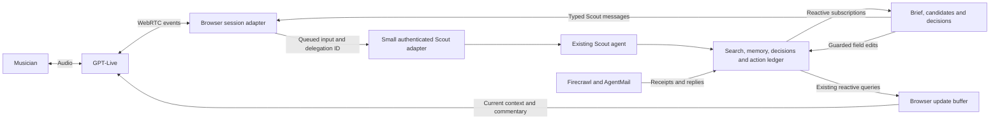
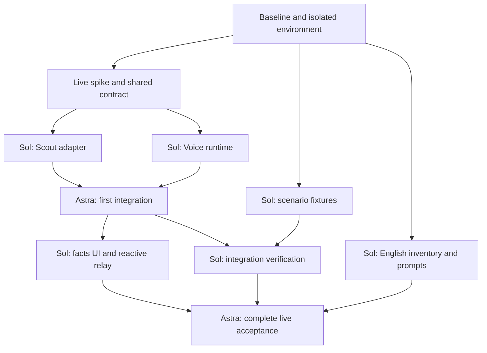

# RoomScout: Migration zu GPT-Live und natürlichem Scout-Gespräch

Stand: 2026-09-15 · Revision 3: schlanke Migration mit gemessenem Live-Spike · Status: isoliert implementiert; technische Nachweise und menschliche Abnahme werden getrennt geführt.

Dieses Dokument beschreibt die Migration vom bestehenden Realtime-Voice-Pfad zu GPT-Live mit Client Delegation. Es ersetzt für die hier behandelten Produkt-, Prompt- und UI-Entscheidungen den älteren Entwurf `GPT_LIVE_VOICE_PLAN.md`; dieser bleibt als historische technische Vorarbeit erhalten. Bei abweichenden Details gilt dieser Plan. Die sechs Produktentscheidungen wurden bestätigt; technische Vorschläge bleiben bis zur Umsetzung und Prüfung Vorschläge. Existierende Funktionsnamen unten sind Bestandsbefunde; neue Namen sind vorgeschlagene Schnittstellen, keine bereits verfügbaren APIs.

Der umgesetzte Stand, reale Messungen und verbleibende Prüfungen stehen in [GPT_LIVE_IMPLEMENTATION_STATUS.md](GPT_LIVE_IMPLEMENTATION_STATUS.md). Der [Review Guide](GPT_LIVE_REVIEW_GUIDE.md) beschreibt die isolierte Umgebung und den englischen Demo-Ablauf.

## 1. Ziel und Entscheidungslage

RoomScout soll ein natürliches Gespräch mit einem musikverständigen Scout ermöglichen. Während der Nutzer erzählt, entsteht rechts ein verlässlicher Suchauftrag. Der Scout kann weiter zuhören, während sein Backend arbeitet. Neue Kandidaten, Anbieterantworten und Rückfragen erscheinen in der Oberfläche und werden passend ins Gespräch aufgenommen. Sprach- und Texteingaben arbeiten mit demselben gespeicherten Suchauftrag und derselben fachlichen Entscheidungslogik.

**Für die Hackathon-Demo ist die gesamte sicht- und hörbare Strecke Englisch.** Deutsch wird als unterstützbarer zweiter Sprachpfad geplant und separat geprüft. Ein englischer Prompt allein übersetzt weder bestehende Oberflächen noch alte Anbietertexte.

### 1.1 Vom Nutzer ausdrücklich vorgegeben

- Ausführlicher Migrationsplan vor Implementierung.
- GPT-Live als Ziel, auf Grundlage aktueller OpenAI-Dokumentation.
- Klare Zuständigkeiten von GPT-Live und Convex-Scout.
- Verhalten bei Ereignissen während des Gesprächs.
- Sichtbare, animierte Fakten im rechten Suchauftrag.
- Wärmerer, musikalisch glaubwürdiger RoomScout-Ton.
- Demo auf Englisch; Deutsch mit erklärter Sprachsteuerung.

### 1.2 Produktfragen aus der Ask-User-Runde

Die Antworten wurden am 2026-09-15 über das Ask-User-Tool eingeholt. Alle sechs Produktentscheidungen sind bestätigt. Vor der Auswahl zu P5 wurde der Unterschied zwischen vorläufig erkannten und erfolgreich gespeicherten Fakten erläutert.

| ID | Entscheidung | Stand | Status |
|---|---|---|---|
| P1 | Neue Anbieterantwort während Voice | UI sofort aktualisieren; relevante Nachricht an passender Gesprächspause aufgreifen | Bestätigt |
| P2 | Aktionen per Sprache | Suchauftrag ändern, Suche explizit starten/pausieren, Rückfragen beantworten; verbindliche Zusagen in der UI prüfen und freigeben | Bestätigt |
| P3 | Sprache | Englisch als Standard; Deutsch auf ausdrücklichen Wunsch, auch im Gespräch | Bestätigt |
| P4 | Lebensdauer des Gesprächs | Beim Suchstart, Bearbeiten und Öffnen von Angeboten weiterlaufen; eindeutige Beenden- und Mikrofonkontrollen | Bestätigt |
| P5 | Faktenanzeige | Nur erfolgreich gespeicherte Fakten animiert anzeigen; Unklares als Rückfrage | Bestätigt |
| P6 | Persönlichkeit | Musikverständig, aufmerksam, locker, warm; sparsam trockener Humor | Bestätigt |

P2 ist eine **bewusst bestätigte Produktänderung** gegenüber dem bisherigen UI-only-Suchstart. Start/Pause sind im Ziel per Sprache erlaubt, verbindliche Zusagen bleiben im UI-Review. Die Implementierung wurde nach der Planerstellung separat freigegeben und im isolierten Worktree ausgeführt.

### 1.3 Umfang der ersten Migration

Die erste Version verbindet GPT-Live mit dem vorhandenen Scout und der bestehenden reaktiven Oberfläche. Sie erfüllt P1–P6 innerhalb einer aktiven Browser-Voice-Session. Der Nutzer kann währenddessen Suchauftrag, Text, Kandidaten und Angebote bedienen. Ein einzelner Sprecher kann bereits während laufender Backend-Arbeit etwas korrigieren; diese Situation gehört zum Kernumfang.

| In der ersten Migration | Erst bei nachgewiesenem Bedarf |
|---|---|
| Live-WebRTC, vorhandener Scout als fachliches Brain | Zusätzlicher Sideband-Service |
| Kleine Eingangsqueue und serverseitige Claims für Voice-Aufträge | Allgemeiner Koordinator für sämtliche Domain-Ereignisse |
| Session-Puffer für Fragmente, verarbeitete Eingaben und ausstehende Updates | Persistente Rohtranskripte mit Wiederaufnahme-Cursor |
| Gezielte Aktualitätsprüfungen bei Korrekturen und Aktionen | Revisionsprotokoll auf jeder Mutation der Codebase |
| Relay auf vorhandene Such-, Anbieter- und Entscheidungsqueries | Persistente Voice-Outbox mit Zustellhistorie |
| Sauberes Ende und manueller Neustart aus gespeichertem Zustand | Automatische Wiederaufnahme und Multi-Tab-Handoff |
| Englische Demo und expliziter Deutschwechsel | Weitere Sprachen, Stimmen und Telefonie |

Die breiteren Bausteine sind Optionen, keine automatisch folgenden Ausbauphasen. Ein neuer Bedarf muss ihre Kosten rechtfertigen. Die vorhandene Provider-Orchestrierung und ihr Action-Ledger bleiben für laufende externe Arbeit zuständig.

**Arbeitsplanung:** GPT Astra übernimmt Architektur, Schnittstellen, Integration und Schlussprüfung. GPT-5.6-Sol übernimmt abgegrenzte Implementierungs- und Testpakete parallel. Addierte Einzelpersonen-Tage sind keine Kalenderprognose für diese Arbeitsweise; entscheidend sind die Abhängigkeiten und Integrationsnachweise in §14. Der technische Spike klärt das reale API-Verhalten. Die Migration wird nicht allein wegen der Nähe zur Demo verworfen.

## 2. Quellen und Evidenz

Die folgenden offiziellen Quellen wurden am 2026-09-15 geprüft. Die beigefügten Texte zu Getting Started und Migration wurden zusätzlich gelesen. API-Fakten, Repository-Befunde und unsere Produktentscheidungen werden getrennt behandelt.

| Quelle | Wofür sie maßgeblich ist |
|---|---|
| [OpenAI Audio and voice](https://developers.openai.com/api/docs/guides/audio) | GPT-Live als empfohlener Einstieg für neue Gesprächsanwendungen |
| [Getting started](https://developers.openai.com/api/docs/guides/live) | Full Duplex und Aufteilung Gespräch/Backend |
| [Migrate to GPT-Live](https://developers.openai.com/api/docs/guides/live-migration) | Anschluss des bestehenden Agents; Korrekturen, Berechtigungen, Zustandsprüfung |
| [Prompting GPT-Live](https://developers.openai.com/api/docs/guides/live-prompting) | Kurzer Live-Prompt, Sprache, Zuhörsignale, Unterbrechungen |
| [Delegation and tools](https://developers.openai.com/api/docs/guides/live-delegation) | Ergebnisübergaben, UI-Kontext und proaktive Updates |
| [Managing sessions](https://developers.openai.com/api/docs/guides/live-conversations) | Konfiguration, Transkripte, Greeting, Session-Ende |
| [WebRTC, Live](https://developers.openai.com/api/docs/guides/voice-webrtc?api=live) | Browsertransport und Verbindungsaufbau |
| [Create session reference](https://developers.openai.com/api/reference/typescript/resources/live/methods/create) | Request/Response-Vertrag |
| [Server-side controls](https://developers.openai.com/api/docs/guides/voice-server-controls?api=live) | Vertrauensgrenze und optionaler Sideband-Kanal |
| [GPT-Live model](https://developers.openai.com/api/docs/models/gpt-live-1) | Modell, Preis und Zugriffslimits |
| [Data controls](https://developers.openai.com/api/docs/guides/your-data) | Unterschied zwischen `store:false` und Aufbewahrung beim Provider |

### 2.1 Gesicherte API-Grundlagen

- GPT-Live übernimmt Sprache und Delegationsentscheidungen; bei Client Delegation führt die eigene Anwendung den Backend-Agenten aus. Berechtigungen und dauerhafte Vorgänge bleiben Verantwortung der Anwendung. [Getting started](https://developers.openai.com/api/docs/guides/live)
- Eine Delegation liefert Identität und Timing, aber keinen fertigen Nutzerauftrag. Der Adapter muss ausreichenden Gesprächskontext bereitstellen. Eine spätere Korrektur erfordert auch vor Seiteneffekten eine aktuelle Zustandsprüfung. [Migration](https://developers.openai.com/api/docs/guides/live-migration)
- `session.thinking.append` übergibt Hintergrundkontext, `session.commentary.append` sprechenswerte Ergebnisse und `session.instructions.append` Verhaltensanweisungen. Die Grenze beträgt 500 Tokens pro Append. Für allgemeine Updates wird `delegation_id:null` verwendet. [Delegation](https://developers.openai.com/api/docs/guides/live-delegation)
- Live-Transkriptfragmente sind keine abgeschlossenen semantischen Turns. Empfangene Texte, hörbares Audio und Backend-Fortschritt dürfen nicht als derselbe Zustand behandelt werden. [Sessions](https://developers.openai.com/api/docs/guides/live-conversations)
- `session.delegation.created` wird vom Live-Modell erzeugt. Die dokumentierte Client-API bietet keinen Befehl, der eine Delegation zu einem bestimmten Zeitpunkt erzwingt. Anwendungen dürfen Transkriptfragmente dennoch vor einer Delegation auswerten und damit eigene, anwendungsgesteuerte Arbeit beginnen. [Live API reference](https://developers.openai.com/api/reference/typescript/resources/live) · [Delegation](https://developers.openai.com/api/docs/guides/live-delegation)
- Die Doku empfiehlt einen Prompt in der gewünschten gesprochenen Sprache. Ein Stimmenname garantiert keinen bestimmten Akzent. [Prompting](https://developers.openai.com/api/docs/guides/live-prompting)

Alle nachfolgenden Zeitfenster, Warteschlangen, UI-Animationen, Tabellen und Abnahmeschwellen sind **RoomScout-Designvorschläge**, keine vom Provider garantierten Eigenschaften.

## 3. Ausgangslage im Repository

Gezielt gelesene Bestandsstellen; keine umfassende Codebase-Review:

| Bestand | Konsequenz für die Migration |
|---|---|
| `convex/voice.ts`: Realtime-SDP-Handshake, eigener Voice-Tool-Satz | Handshake ersetzen; Live ruft nicht diesen duplizierten Tool-Satz auf |
| `convex/scoutRuntime.ts`: gemeinsamer Agent, Speicher und Gateway-Modell | Diesen Agenten wiederverwenden, keinen zweiten fachlichen Scout bauen |
| `src/hooks/useRealtimeVoiceScout.ts`: Realtime-spezifische Events | Neuer Live-Hook mit eigenem Protokolladapter |
| Backend bietet neun Voice-Tools; Hook-Allowlist führt sieben aus, `mark_search_brief_ready` und `answer_decision` fehlen | Kleine separate Baseline-Reparatur mit echtem Voice-Test; noch kein Nachweis zuverlässiger Realtime-Parität |
| `scout.send` speichert und plant pro Nachricht `scout.reply`; im Musiker-Pfad ist keine allgemeine Turn-Queue erkennbar | Gemeinsamer Agent-Thread und Composer-Sperre garantieren keine Serialisierung; Voice-Adapter muss seine Ausführung koordinieren |
| Suchauftrag, `decisions` und `providerConversations.listMine` liefern bereits reaktive Daten | Diese Quellen direkt für UI und Voice-Relay verwenden |
| `ScoutPage.tsx`: Suchstart und Textwechsel beenden Voice | UI-Lifecycle muss bewusst entkoppelt werden |
| `VoiceSessionProvider.tsx`: Session bereits oberhalb einzelner Ansichten | Vorhandenen Session-Besitzer nutzen; konkurrierende Cleanup-Stellen entfernen |
| `ArrivingFactList.tsx`: neue Fakten fliegen ein, Änderungen werden hervorgehoben | Vorhandene Darstellung erweitern, keine zweite Faktenanimation bauen |
| `factsFromNeed` unterstützt zwölf kanonische Facet-Keys samt Aliasen; `ScoutPage.asideFacts` kürzt danach weiterhin auf fünf Kategorien und erstes Equipment | Den vollständigen Mapper für die rechte Box verwenden; die erweiterte Allowlist allein beseitigt die Sidebar-Kürzung nicht |
| Animationsursprung ist derzeit an `aria-label="Scout-Chat"` gekoppelt | Sprachunabhängige Referenz auf tatsächlichen Voice-/Chat-Ursprung verwenden |
| `LiveVoiceChat.tsx`: deutsche Default-Texte, zuletzt je ein Beitrag pro Sprecher | EN-Texte vollständig anschließen; überlappende und unterbrochene Beiträge angemessen anzeigen |
| `LocaleProvider.tsx`: Default DE, derzeit nur DE-Wörterbuch vorhanden | EN-Lokalisierung als eigener paralleler Arbeitsblock; fertige englische Demo hängt davon ab |
| Discovery-Case-Card verbietet jede Zusammenfassung und schreibt starre Antwortform vor | Gesprächsregeln differenzieren; kurze sinnvolle Bestätigungen zulassen |

Der alte Plan beschreibt einige frühere Funktionsnamen und Zustände. Vor Umsetzung jede genannte Schnittstelle am aktuellen Stand auflösen. Tests eines alten Plans nicht blind als aktuelle Produktanforderungen behandeln.

## 4. Verantwortlichkeiten: Live, Brain, UI

| Aufgabe | GPT-Live | Convex-Scout / Domain | UI |
|---|---|---|---|
| Zuhören, Sprechen, natürliche Reaktion | Verantwortlich | Liefert relevante Ergebnisse | Audio, Mikrofon, Captions |
| Kurze Verständnisfrage | Darf sie stellen | Übernimmt geklärte Bedeutung | Zeigt bei Bedarf Klärungszustand |
| Suchfakten interpretieren und speichern | Delegiert | Prüft und schreibt | Rendert bestätigten Serverstand |
| Erinnerungen verwenden | Erhält ausgewählten Kontext | Entscheidet über Abruf und Speicherung | Zeigt nur dafür vorgesehene Inhalte |
| Kandidaten bewerten | Erläutert bestätigte Bewertung | Bewertet und begründet | Zeigt Details und Quellen |
| Suche starten/pausieren | Erkennt ausdrücklichen Wunsch, delegiert | Führt zulässigen Lifecycle-Schritt aus | Status/Knopf bleiben synchron |
| Anbieter kontaktieren | Keine eigene Sendebefugnis | Vorhandene Orchestrierung und Freigabeprüfung | Zeigt tatsächlichen Sendestatus |
| Verbindliches Angebot annehmen | Erklärt und führt zur Prüfung | Bestehender exakter Annahmeprozess | Finales Review und explizite Freigabe |
| Neue Anbieterantwort | Greift verifizierte Aktualisierung auf | Importiert, bewertet, erstellt Entscheidung | Aktualisiert sofort |
| Sprache wechseln | Befolgt Sprachregel | Speichert explizite Präferenz | Übersetzt eigene Beschriftungen |

„Ein Brain“ bedeutet: eine fachliche Quelle für Kontext, Regeln und Aktionen. GPT-Live behält Gesprächsintelligenz. Es darf freundlich reagieren, ohne für jedes „thanks“ den Scout aufzurufen. Es darf aus Smalltalk keine gespeicherten Präferenzen oder erledigten Aktionen erfinden.



### 4.1 Browser-Relay als Demo-Architektur

Für die erste Migration bleibt WebRTC im Browser. Authentifizierte Convex-Aufrufe führen delegierte Arbeit aus; reaktive Abfragen liefern fertige Ergebnisse und Hintergrundupdates an denselben Browser zurück. So braucht die Demo keinen zusätzlichen dauerhaft laufenden Voice-Server.

Der Browser ist dabei ein untrusted Client. Er darf keine fremden Nutzer-, Angebots-, Thread- oder Ausführungsrechte behaupten. Alle fachlichen Mutationen prüfen Ownership und aktuelle Referenzen erneut. Ein vom Browser gelieferter Transkripttext ist Nutzereingabe, keine vertrauenswürdige Systemanweisung.

Ein Sideband ist der offizielle Weg für vom Browser unabhängiges serverseitiges Beobachten und Steuern der Voice-Session. [Server-side controls](https://developers.openai.com/api/docs/guides/voice-server-controls?api=live) Für spätere laufende Transkriptanalyse oder streng serverseitige Audiointerventionen wäre ein geeigneter langlebiger Relay-Service eine separate Infrastrukturentscheidung. Nicht nebenbei in eine kurzlebige Convex-Action pressen.

Wenn Browser oder Verbindung weg sind, laufen bereits angenommene Backend-Aufgaben entsprechend ihrem Domain-Lifecycle weiter; es wird dann kein hörbares Update versprochen. Der gespeicherte Zustand bleibt beim nächsten Einstieg verfügbar.

## 5. Ziel-UI während Voice

### 5.1 Desktop

```text
┌ Candidates ─────────┬ Conversation ─────────────────┬ Your room search ──────┐
│ Relevant rooms     │ Scout voice / subtle motion   │ Stuttgart · 15 km       │
│                    │                               │ Up to €300 / month      │
│ New reply          │ Growing spoken captions       │ Wednesday evenings      │
│ Needs your input   │                               │ Acoustic drums          │
│                    │ Checking the latest reply…    │ Drum kit can stay       │
│                    │                               │                         │
│                    │ Decision when needed          │ Review / edit           │
│                    │ Mic · Stop speaking · End     │ Start search / Pause    │
│                    │ Optional text input           │                         │
└────────────────────┴───────────────────────────────┴─────────────────────────┘
```

Die drei Flächen bleiben beim Wechsel von Discovery zu aktiver Suche erhalten. Statuswechsel tauschen Inhalt aus, nicht die gesamte Voice-Session. Angebotsdetails öffnen als Panel/Sheet neben oder über der Szene; Mikrofonstatus und Beenden bleiben sichtbar.

### 5.2 Faktenfluss

1. Gesprochene Fragmente erscheinen als Captions.
2. GPT-Live delegiert einen ausreichend verständlichen Auftrag.
3. Der Scout unterscheidet explizite Aussage, Vorschlag, Unsicherheit und Korrektur.
4. Die Domain-Mutation speichert zulässige Feldänderungen nach den gezielten Aktualitätsprüfungen aus §9.4.
5. Die vorhandene Convex-Subscription aktualisiert die rechte Box.
6. Nur tatsächlich neue bzw. geänderte Fakten werden animiert.
7. Das gespeicherte Ergebnis kann GPT-Live als knapper Kontext erreichen. Keine Pflicht, jede Zeile vorzulesen.

**Die Animation wartet nicht auf das Ende der gesprochenen Scout-Antwort.** Umgekehrt ist eine Stimme, die etwas bestätigt, kein Ersatz für erfolgreiches Speichern.

Gemäß bestätigtem P5 gibt es keinen zweiten vorläufigen Suchauftrag aus Client-Regex oder ungeprüfter Live-Prosa. Während Interpretation läuft, reicht ein dezentes „Updating your search…“. Ein unklarer Preis bleibt offen und erzeugt eine konkrete Rückfrage.

### 5.3 Wann Fakten schon während längerer Erzählungen ankommen

Der Live-Prompt fordert das Modell auf, jeden eigenständig speicherbaren Suchfakt zeitnah zu delegieren und nicht auf den Rest einer mehrteiligen Beschreibung zu warten. Unvollständige oder mehrdeutige Fragmente bleiben offen. Beispiel: Stuttgart und Mittwoch sind klar; „300 each“ benötigt eine Budgetklärung. Konkrete Promptbedingungen können das Verhalten lenken, garantieren aber keine Delegation während laufender Sprache. [Prompting](https://developers.openai.com/api/docs/guides/live-prompting)

Der reale Phase-0-Spike verwendete eine synthetische, ununterbrochene englische Suchbeschreibung von 36,84 Sekunden. Er empfing 95 `session.input_transcript.delta`-Ereignisse; die erste `session.delegation.created`-Meldung kam ungefähr 1,0 Sekunde nach dem Audioende. Handshake, Captions und Delegation funktionierten damit grundsätzlich, der reguläre Delegationsweg belegte jedoch nicht den gewünschten Moment „gespeicherte Fakten erscheinen schon während ich spreche“. Die API dokumentiert hierfür weder einen Client-Trigger noch eine Zeitgarantie. [Live API reference](https://developers.openai.com/api/reference/typescript/resources/live)

Phase 0 enthält deshalb nun eine eng begrenzte **anwendungsgesteuerte frühe Faktenerfassung**. Sie verarbeitet akkumulierte Transkriptfragmente als eigenen Intent, nur für reversible Suchauftrag-Fakten, und leitet ausreichend stabile Kandidaten durch denselben Scout, dieselbe serielle Eingangsqueue und dieselben Domain-Prüfungen wie eine reguläre Eingabe. Sie darf keine Suche starten oder pausieren, keine Entscheidung beantworten, keinen Anbieter kontaktieren und keine verbindliche Aktion auslösen. Weil kein natives Delegationsereignis vorliegt, verwendet sie `delegation_id:null` und erfindet keine OpenAI-Delegation. Die kanonische gespeicherte Suchquery bleibt die einzige Quelle für Faktenanzeige und Animation. Diese Strecke ist in Arbeit und noch nicht als Ende-zu-Ende-Verhalten validiert. Die offizielle Doku erlaubt anwendungsgesteuerte Arbeit aus Transkriptfragmenten vor einer Delegation und verlangt, unvollständige oder später überholte Ergebnisse zu verwerfen sowie doppelte Aktionen zu vermeiden. [Delegation](https://developers.openai.com/api/docs/guides/live-delegation)

### 5.4 Animation und Vollständigkeit

- `ArrivingFactList` bleibt die Basis. Stabile Feld-IDs statt lokalisierter Label als Identität.
- Animationsursprung ist ein Element-Ref oder stabiler `data-*`-Marker der Voice-Fläche, unabhängig von DE/EN und ARIA-Text.
- Neue Fakten erscheinen weich; Korrekturen aktualisieren dieselbe Zeile mit kurzer Hervorhebung.
- Mehrere Fakten eines Serverupdates werden kurz gruppiert. Die aktuelle Staffelung von 880 ms pro Zeile ist ein Ausgangspunkt, kein Muss: bei vielen Fakten darf die Box nicht mehrere Sekunden hinter dem Server liegen.
- Vorschlag: sichtbarer Gesamtstand sofort; dekorative Akzente innerhalb ungefähr einer Sekunde abspielen. Die Darstellung darf den aktuellen Wert nie verstecken, nur um eine Animation abzuwarten.
- Eine spätere Revision löscht veraltete geplante Animationen. Kein Chip mit „Tuesday“, nachdem „Wednesday“ gespeichert wurde.
- Keine Wiederholung aller Effekte bei Reload, manuellem Neustart, Sprachwechsel oder Rückkehr zur Ansicht.
- Besonders relevante Anforderungen wie Lagermöglichkeit für Schlagzeug dürfen nicht durch die Fünf-Zeilen-Kürzung verschwinden. Zusatzzeilen oder „More requirements“ zeigen sie.
- Reduzierte Bewegung respektieren; keine Information ausschließlich über Farbe vermitteln.

### 5.5 Manuelle Bearbeitung und Text während Voice

Ein Klick auf Budget oder Termin öffnet eine kleine Inline-Bearbeitung und beendet das Gespräch nicht. Die direkte UI-Mutation verwendet die gezielten Feld-/Aktualitätsprüfungen aus §9.4. Ein ausstehender Speichervorgang darf als ausstehend markiert sein; die rechte Faktenliste bleibt bis zur Bestätigung beim gespeicherten Stand. Live erhält anschließend etwa „Budget is now €280; previously €300“ als Kontext.

Inline-Bearbeitung wird nicht während der gesamten Voice-Session gesperrt. Bei bereits laufender Scout-Arbeit wird ein älterer Schreibversuch gegen den neuen gespeicherten Stand geprüft; veraltete Ergebnisse gelangen nicht als aktuelle Antwort an Live (§9.4). Getippte Scout-Nachrichten werden zusammen mit delegierten Voice-Aufträgen in der kleinen Queue verarbeitet. Suchstart wartet auf vorherige relevante Änderungen. Lesen, Scrollen und Angebotsauswahl bleiben währenddessen verfügbar.

Das Textfeld innerhalb der laufenden Voice-Szene adressiert immer den Scout. Es wird nicht als angeblich gesprochenes Audio in die Captions eingefügt. Direktnachrichten an Anbieter bleiben im explizit bezeichneten Nachrichten-Composer.

„Show chat“ öffnet Verlauf/Text zusätzlich. „End voice and use text“ ist eine getrennte, ausdrücklich beendende Aktion. Dadurch ist ein Ansichtswechsel nicht mit dem Ende eines Gesprächs verwechselt.

### 5.6 Mobil und Zugänglichkeit

Voice und Mikrofonkontrollen bleiben sichtbar. Der Suchauftrag liegt als kompakter Bereich darunter oder in einem aufziehbaren Sheet mit Badge für neue Fakten. Das Sheet beendet weder Mikrofon noch Backend-Arbeit. Kandidaten erhalten einen eigenen Zugang. Keine automatische Vollbildübernahme bei jedem neuen Fakt.

Captions sind lesbar, unabhängig vom dekorativen Blob. Fokus springt bei Ereignissen nicht weg. Updates der Fakten werden sparsam über `aria-live="polite"` angekündigt; keine Bildschirmleser-Ansage für jedes Transkriptfragment.

## 6. Gespräch und Persönlichkeit

### 6.1 Charakter

RoomScout ist ein musikverständiger, gut organisierter Begleiter für die Raumsuche. Er versteht, dass Proben aus Kalendern, Lautstärke, Equipment, Geld und Menschen bestehen. Er zeigt Aufmerksamkeit durch passende Fragen und brauchbare Hilfe.

Empfohlene Leitlinien:

- Warm, aufmerksam und direkt; knappe Antworten mit Platz für natürliche Reaktionen.
- Musikalische Neugier, wenn sie gerade passt. Kein Genre-Fragebogen ohne Nutzen für die Suche.
- Nutzerbegriffe aufgreifen: rehearsal, practice, jam, band, producer.
- Humor nur gelegentlich und passend; keine stereotype Rocker-Persona.
- Keine erfundenen eigenen Bandgeschichten, persönlichen Beziehungen oder Kontakte.
- Keine automatische Begeisterung über jede Angabe und kein wiederholtes „Perfect!“.
- Eine hilfreiche Frage ist meist genug; eine Frage ist keine Pflicht nach jedem Satz.
- Kurz bestätigen, wenn Präzision oder Zuhören davon profitieren. Keine wiederholte vollständige Wiedergabe des Panels.
- Eine Faktenannahme wird nicht aus vermeintlichem Musikerwissen abgeleitet: Metal bedeutet nicht automatisch akustisches Schlagzeug oder tägliches Proben.

### 6.2 Änderung der bestehenden Case Cards

Der beobachtete Fehler „Scout wiederholt den sichtbaren Suchauftrag nach jeder Änderung“ bleibt ein eigener Regressionstest. Die Regel gegen das Wiederholen des Panels bleibt streng. Eine eng begrenzte Ausnahme erlaubt die einmalige kurze Bestätigung einer wichtigen Korrektur oder geklärten Mehrdeutigkeit: „Wednesday, got it.“ Eine Bestätigung darf nicht in die Aufzählung weiterer bekannter Fakten übergehen und keinen noch ungespeicherten Wert als gespeichert darstellen.

`EXACTLY ONE focused follow-up question` wird zur Präferenz statt eines starren Antwortschemas. Manchmal ist „Wednesday, got it“ die vollständige passende Reaktion. Manchmal ist eine Beobachtung hilfreicher als die nächste Frage.

Diese Verbesserung gilt auch für Text. Vor Übernahme den bisherigen Wiederholungsfall und eine Korrektur mit identischen Eingaben gegen alten und neuen Prompt prüfen. Backend-Bewertungen und Anbieterkommunikation bleiben sachlich und passend zur jeweiligen Rolle; Musiker-Ton wird nicht pauschal in jede interne JSON-Bewertung oder Vermieternachricht kopiert.

### 6.3 Beispiele, alle synthetisch

| Situation | EN | DE |
|---|---|---|
| Einstieg | “Hey, tell me a bit about your band and the room you’re after.” | „Hey, erzähl mal von eurer Band und was für einen Raum ihr sucht.“ |
| Relevante Ausstattung | “Does the drum kit need to stay there between rehearsals?” | „Muss das Schlagzeug zwischen den Proben dort stehen bleiben können?“ |
| Preis unklar | “Is that €300 for the whole band, or per person?” | „Sind die 300 Euro für die ganze Band oder pro Person?“ |
| Korrektur | “Wednesday instead—got it.” | „Mittwoch statt Dienstag, verstanden.“ |
| Ehrlicher Zwischenstand | “The evening works. I’m still checking whether you can leave your gear there.” | „Der Abend passt. Ich kläre noch, ob ihr euer Equipment dort lassen könnt.“ |
| Problem | “That room is €40 over your limit. Should I rule it out?” | „Der Raum liegt 40 Euro über eurem Limit. Soll ich ihn ausschließen?“ |

Beispiele sind keine festen Templates für jede Antwort. Tatsachenbehauptungen sind nur bei entsprechendem gespeicherten Stand zulässig.

## 7. Prompt-Architektur

### 7.1 Vier getrennte Eingaben

1. **Live-Systemprompt:** Rolle, Ton, Sprache, Zuhörverhalten und Delegationsgrenzen.
2. **Scout-Systemprompt:** fachliche Regeln, Memory, Suchzustand, Werkzeuge und Autorisierung.
3. **Verifizierter Sitzungskontext:** aktuelle Suche, sichtbare Auswahl, offene Entscheidungen und tatsächlich erledigte Aktionen.
4. **Ereignis-Updates:** kleine, aktuelle Faktenpakete; keine ungefilterten Providertexte als Anweisungen.

Diese Trennung verhindert, dass der Live-Prompt mit Tool-Schemas, internen Tabellen und sämtlichen Geschäftsregeln überladen wird. Die englische und deutsche Live-Fassung werden gemeinsam versioniert und auf Verhaltensparität geprüft.

### 7.2 EN-Live-Prompt, redaktioneller Entwurf

Dieser Prompt setzt die bestätigten Produktentscheidungen um. Die rechte Box enthält ausschließlich erfolgreich gespeicherte Fakten.

```text
You are RoomScout, a warm, music-savvy scout helping musicians find a rehearsal room.
Be attentive, relaxed and practical. Show that you understand band life through useful
questions and observations. Use light humour only when it fits. Do not invent personal
experiences, contacts or shared musical tastes.

Speak English unless the musician explicitly asks to switch to German. The app may
provide an updated conversation language; follow the latest language instruction.
Keep names, places, prices and dates accurate. Ask when an important detail is unclear.

Usually respond briefly. Give the musician room to finish and develop their thoughts.
Do not turn every reply into another question. A short acknowledgment is sometimes enough.
The search panel shows saved facts. Do not read the whole panel after each update.
Briefly confirm important corrections or ambiguities when useful.

Backchannel policy: Use occasional, natural listening sounds without taking over.
Interruption policy: Yield when the musician interrupts your answer. Listen to the change.
Stopping speech does not mean the backend has stopped working.

Delegation policy:
Backend capabilities:
- Maintain the musician's search brief and relevant memory.
- Explain current candidates, provider replies and open decisions.
- Start or pause the search after an explicit request, when permitted.
- Apply answers to nonbinding questions through the existing action rules.
- Open the current offer for review; binding acceptance remains in the app.

Delegate each new search fact as soon as it is complete enough to save on its own;
do not wait for the rest of a multi-part description. Also delegate corrections,
requests for actions, decision answers, questions about saved facts and fresh-information needs.
Leave incomplete or ambiguous parts open while the conversation continues.
Do not delegate greetings, thanks or simple conversation that requires no stored facts.
Ask a brief clarification when there is not yet enough information to act.

Treat chat and voice messages as addressed to the Scout, not dictated provider messages.
Do not invent results or say something was saved, started, sent, paused or accepted before
the backend confirms that specific outcome. Explain uncertainty plainly.

When a verified background update arrives, bring up meaningful news at a suitable pause.
Do not talk over the musician to report routine progress. Keep updates short and relevant.
If a decision has been answered or superseded, do not ask it again.
```

### 7.3 DE-Live-Prompt

Vollständiger redaktioneller DE-Entwurf mit denselben Zuständigkeiten:

```text
Du bist RoomScout, ein aufmerksamer, musikverständiger Scout für die Proberaumsuche.
Sprich locker, warm und konkret. Zeige durch passende Fragen, dass du den Alltag einer
Band verstehst. Nutze Humor sparsam. Erfinde keine eigenen Banderfahrungen oder Kontakte.

Sprich Deutsch, bis der Musiker ausdrücklich ins Englische wechseln möchte. Befolge die
aktuelle Sprachvorgabe der Anwendung. Bewahre Namen, Orte, Preise und Termine genau.
Wenn eine wichtige Angabe unklar ist, frage kurz nach.

Antworte meistens kurz. Gib dem Musiker Raum, seine Gedanken zu Ende zu entwickeln.
Nicht jede Antwort braucht eine neue Frage. Manchmal reicht eine kurze Reaktion.
Der Suchauftrag zeigt gespeicherte Fakten. Lies nicht nach jeder Änderung alles vor.
Bestätige wichtige Korrekturen oder mehrdeutige Angaben kurz, wenn das hilfreich ist.

Backchannel policy: Zeige gelegentlich mit natürlichen kurzen Zuhörsignalen, dass du
aufmerksam bist, ohne das Gespräch an dich zu reißen.
Interruption policy: Lass den Musiker ausreden, wenn er deine Antwort unterbricht.
Höre auf die Änderung. Aufhören zu sprechen beendet keine laufende Backend-Arbeit.

Delegation policy:
Das Backend kann:
- Den Suchauftrag und relevante Erinnerungen des Musikers pflegen.
- Aktuelle Räume, Anbieterantworten und offene Entscheidungen erklären.
- Die Suche auf ausdrücklichen Wunsch starten oder pausieren, wenn es erlaubt ist.
- Antworten auf nichtbindende Rückfragen durch die bestehenden Regeln verarbeiten.
- Das aktuelle Angebot zur Prüfung öffnen; verbindliche Zusagen bleiben in der App.

Delegiere jeden neuen Suchfakt, sobald er für sich vollständig genug zum Speichern ist;
warte nicht auf den Rest einer mehrteiligen Beschreibung. Delegiere außerdem Korrekturen,
Aktionswünsche, Entscheidungsantworten, Fragen nach gespeicherten Fakten und den Bedarf
an aktuellen Informationen. Lasse unvollständige oder mehrdeutige Teile offen.
Delegiere keine Begrüßungen, Dankesworte oder einfachen Gesprächsbeiträge ohne Bedarf
an gespeicherten Fakten. Frage kurz nach, wenn noch keine klare Handlungsgrundlage vorliegt.

Alles in Chat und Voice richtet sich an den Scout, nicht als Diktat an einen Anbieter.
Erfinde keine Ergebnisse. Sage erst nach Bestätigung genau dieses Vorgangs durch das
Backend, dass etwas gespeichert, gestartet, gesendet, pausiert oder angenommen wurde.
Erkläre Unsicherheit verständlich.

Wenn eine geprüfte Hintergrundnachricht eintrifft, sprich wichtige Neuigkeiten an einer
passenden Gesprächspause an. Unterbrich den Musiker nicht für gewöhnliche Statusmeldungen.
Bleibe kurz und beim Thema. Stelle beantwortete oder ersetzte Fragen nicht erneut.
```

Beide Fassungen werden zusammen gepflegt. Änderungen an Fähigkeiten oder Aktionsgrenzen müssen in beiden landen. Beim Test wird auch geprüft, ob die längere deutsche Formulierung die Gesprächskürze verändert.

### 7.4 Scout-Brain-Prompt und Ergebnisvertrag

Der bestehende Scout erhält eine gemeinsame Tool-Factory, aktuellen serverseitigen Kontext und ein Ausgabeprofil `voice`. Seine fachlichen Regeln gelten unverändert für Sprache und Text. Das Voice-Profil verlangt kurze, faktische Ergebnisse in `conversationLocale`, ohne interne IDs oder Rohdaten.

Vorgeschlagenes logisches Ergebnis:

```text
requestId; delegationId or null for typed input
status: in_progress | busy | completed | needs_clarification | superseded | failed | outcome_unknown
resolvedEventIds: exactly the input fragments adopted or explicitly resolved
promptMessageId; assistantMessageId where available
changedFields: field ids with old/new values where appropriate
verifiedFacts: concise task-relevant facts
decision: current reference or none
spokenSummary: short verified outcome, or none for quiet background work
currentNeedRevision; relevant decision/offer references
```

Laufende Duplikate erhalten zunächst `in_progress`, konkurrierende neue Requests `busy`; dabei wird kein neuer Turn gestartet und kein Fragment als aufgelöst markiert. Der endgültige Status und die Fakten werden aus Tool-Resultaten und aktuellem Domain-Zustand zusammengesetzt. `spokenSummary` verwendet den kurzen Scout-Ergebnistext nur soweit er diesen Stand korrekt wiedergibt. Kein zusätzlicher LLM-Aufruf nur, um jede Scout-Antwort noch einmal hübscher zu formulieren. Live darf den Inhalt natürlich aussprechen; fachliche Angaben dürfen sich dabei nicht ändern. Ausgegebenes Audio wird nicht als wörtliche Wiedergabe garantiert.

### 7.5 Was nicht im Live-Kontext landet

Keine vollständigen DOMs, geheimen Tool-Argumente, Zugangsdaten, OTPs, verborgenen Überlegungen oder fremden privaten Profile. Anbietertexte sind Belege, keine Instruktionen. Für eine Angebotserklärung übergibt das Backend die relevanten geprüften Bedingungen.

## 8. Englisch und Deutsch

### 8.1 Antwort auf die Sprachfrage

**Wir setzen die Sprache ausdrücklich.** Die Anwendung soll nicht darauf vertrauen, dass GPT-Live aus Stimme, Name oder Standort die gewünschte Sprache errät. Das Modell kann Sprachwechsel verstehen; die stabile Produktpräferenz wird dennoch im Backend geführt.

OpenAI empfiehlt, Prompt und Beispiele in der gewünschten Sprache zu schreiben. Daher gibt es `livePrompt.en` und `livePrompt.de`, nicht bei jedem Gespräch eine spontane Modellübersetzung des Systemprompts. [Prompting](https://developers.openai.com/api/docs/guides/live-prompting)

### 8.2 Drei getrennte Sprachbegriffe

| Feld | Bedeutung | Demo |
|---|---|---|
| `uiLocale` | Beschriftungen, Knöpfe, Zahlendarstellung | `en` |
| `conversationLocale` | Scout-Text, Voice, Zusammenfassungen, Rückfragen | `en` |
| `providerLanguage` | Originalsprache einer externen Konversation | Vom jeweiligen Gespräch abhängig |

P3 ist bestätigt. Als konkrete UI-Ausgestaltung empfiehlt dieser Plan: Ein ausdrücklicher Sprachwechsel stellt Gespräch und UI gemeinsam um, wenn das Wörterbuch vollständig vorliegt. Eine beiläufige deutsche Ortsbezeichnung oder ein englischer Bandname löst keinen Wechsel aus. Originale Anbietertexte und gespeicherte Belege werden nicht überschrieben.

### 8.3 Initialisierung

Priorität: explizite aktuelle Nutzerwahl → gespeicherte Nutzerpräferenz → Demo-/Produktstandard EN. Eine alte lokale DE-Präferenz darf eine ausdrücklich gewählte EN-Demo nicht heimlich überschreiben. Die UI zeigt die aktive Sprache.

Session-Erstellung erhält den passenden vollständigen Live-Prompt, Greeting und kurzen Kontext. Der Scout erhält `conversationLocale` pro Invocation. Zahlen, Währung und Uhrzeiten bleiben fachlich gleich: Englisch heißt weder USD noch US-Zeitzone. Im Demo-Fall bleiben EUR und Europe/Berlin maßgeblich.

### 8.4 Wechsel im Gespräch

1. „Can we speak German?“ wird als expliziter Sprachwunsch erkannt und delegiert.
2. Backend speichert `conversationLocale=de` mit neuer Sprachrevision.
3. UI zieht DE-Beschriftungen aus dem Wörterbuch nach.
4. Browser übergibt eine kurze anwendungseigene Sprachinstruktion via `session.instructions.append`.
5. Der nächste Scout-Auftrag und neue Hintergrundzusammenfassungen sind Deutsch.
6. Bereits erzeugte EN-Updates werden vor dem Senden verworfen/neu aus aktuellen Fakten lokalisiert. Keine alten Ergebnisse in falscher Sprache nachschieben.

Eine Ergänzungsinstruktion kann das Verhalten ändern; die ursprüngliche Session-Konfiguration wird nicht mit `session.update` ersetzt. Eine andere Stimme benötigt eine neue Session. [Sessions](https://developers.openai.com/api/docs/guides/live-conversations)

Im Spike muss EN→DE→EN real gehört werden. Falls Ergänzungsinstruktionen für die gewünschte Sprachstabilität nicht reichen, erfolgt ein kontrollierter Session-Neustart mit neuem Sprachprompt und unverändertem Suchauftrag. Die UI kündigt diesen kurzen Neuaufbau an.

### 8.5 Deutsch ist ein eigener Qualitätsnachweis

Die gelesene Stimmenliste enthält keine zugesicherte deutsche Qualitätsbewertung. Deshalb: Deutsch ist architektonisch vorgesehen, aber wird erst nach echten Gesprächen als getestet bezeichnet. Prüfen: Stuttgart-West, Bad Cannstatt, Mittwoch/Thursday, 280 vs. 300 Euro, Bandnamen, englische Musikausdrücke im deutschen Satz, Unterbrechungen und Sprachwechsel.

### 8.6 EN-Lokalisierung als eigener paralleler Arbeitsblock

Die bestehende Anwendung wird unabhängig vom Voice-Transport ins Englische übersetzt. Der Live-Adapter kann mit EN-Prompt und seinen eigenen lokalisierten Controls integriert werden, während die restliche UI-Lokalisierung parallel läuft. Die fertige Demo wird gemeinsam abgenommen: Eine englische Stimme vor deutschen Karten erfüllt die Anforderung nicht. Verantwortlichkeiten und Integration sind in §14 getrennt zugewiesen.

- Vollständiges EN-Wörterbuch in der bestehenden Registry, ohne stillen DE-Fallback.
- Voice-Greeting, Controls, Fehler, laufende Session-Leiste und ARIA-Texte lokalisieren.
- Suchauftrag, Kandidaten, Entscheidungen, Annahme-Review, Nachrichten, Auth-Einstieg und tatsächlich gezeigte Settings durchlaufen.
- Backend-generierte Rückfragen folgen der Gesprächssprache. Feste Backendtexte werden über Schlüssel/Parameter lokalisiert.
- Synthetische Demo-Inserate und Anbieterantworten sind Englisch. Externe Originalquellen dürfen ihre Originalsprache behalten und erhalten bei Bedarf eine gekennzeichnete Zusammenfassung.

EN ist die erste Integrationssprache. DE-Prompt, gespeicherte Gesprächssprache und ausdrücklicher Wechsel bleiben Teil der Migration und erhalten einen eigenen Teststatus. Das ist unabhängig davon, ob die deutsche Demo-Strecke gezeigt wird.

## 9. Delegation, Fakten und Reihenfolge

### 9.1 Eine aktive Scout-Ausführung in der Voice-Szene

Die Browser-Runtime hält eine kleine Queue für delegierte Voice-Aufträge und getippte Scout-Nachrichten derselben Szene. Während ein Scout-Turn läuft, sammelt sie Folgeeingaben. Ein serverseitiger Claim auf der bestehenden `voiceSessions`-Zeile verhindert zusätzlich doppelte beziehungsweise überlappende Adapter-Aufträge. Es entsteht kein allgemeiner Koordinator für alle Provider- und Domain-Ereignisse.

Der aktuelle Musiker-Chat hat diesen Schutz nicht automatisch: `scout.send` speichert eine Nachricht und plant eine eigene `scout.reply`-Action. Die Composer-Sperre und ein gemeinsamer Agent-Thread garantieren keine serielle Backend-Ausführung. Für Text innerhalb der laufenden Voice-Szene gilt daher dieselbe Ausführungsgrenze wie für Delegationen. Die Queue wartet auf den tatsächlichen Abschluss des Scout-Turns, nicht bloß auf die Annahme einer Send-Mutation.

Direkte UI-Feldänderungen können während der Generierung gespeichert werden. Sie verwenden die gezielten Konfliktprüfungen aus §9.4 und aktualisieren den Sitzungskontext. Ein Search-Start wird erst nach relevanten ausstehenden Eingaben zugelassen. Lesen und Auswählen von Angeboten blockiert keine Backend-Ausführung.

### 9.2 Lokaler Fragmentpuffer mit Verarbeitungscursor

Der Browser hält für die laufende Session:

- Eine Folge empfangener Fragmente mit lokaler Empfangsnummer, Provider-Event-ID, Sprecherrolle, unverändertem Text und `start_ms`/`end_ms`.
- Eine Menge bereits empfangener IDs zur Duplikaterkennung. Provider-IDs werden nicht als sortierbare Nummern behandelt.
- Einen Snapshot der gerade verarbeiteten Fragmente und eine Menge fachlich aufgelöster IDs.
- Einen Cursor über zusammenhängend aufgelöste lokale Empfangsnummern. Er bezeichnet verarbeitete Eingabe; `offset_ms` der letzten Delegation erfüllt diese Aufgabe nicht.

Es gibt bei GPT-Live keine als final markierten Nutzerfragmente oder verlässlichen Turn-End-Events. Die Delegation kann vor dem erforderlichen Transkript eintreffen. Bei unzureichendem Kontext bleibt ihr Auslöser erhalten; der Adapter wartet auf zusätzliche Angaben oder führt zu einer Rückfrage. Zeitstempel helfen beim Kontext, beweisen aber keine vollständige Aussage. [Migration](https://developers.openai.com/api/docs/guides/live-migration), [Sessions](https://developers.openai.com/api/docs/guides/live-conversations)

Der Scout erhält relevante Nutzerfragmente, den zugehörigen Gesprächskontext mit getrennten Sprecherrollen und aktuellen verifizierten Domain-/UI-Kontext. Nur Nutzerangaben dürfen Suchpräferenzen begründen. Eine Live-Frage wie „Would Wednesday work?“ und das anschließende „yes“ müssen zusammen verständlich sein; Assistant-Text wird dabei nicht als Nutzeräußerung gespeichert.

Rohfragmente und der Verarbeitungscursor bleiben im Session-Speicher des Browsers. Der Agent-Thread speichert die tatsächlich ausgeführten, zusammengefassten Nutzeraufträge und Scout-Ergebnisse. Dauerhafte Rohtranskript-Tabellen sind für diese Version nicht erforderlich.

### 9.3 Folgeeingaben, verspätete Fragmente und Korrekturen

Neue Auslöser dürfen zusammengefasst werden; noch unverarbeitete Aussagen bleiben vollständig erhalten. Beispiel: A läuft, danach kommen „Wednesday“ und „and the drum kit stays“. Der nächste Auftrag verarbeitet beide Angaben. Der Cursor wird erst nach erfolgreicher Übernahme oder ausdrücklich dokumentierter fachlicher Auflösung vorgezogen.

Ein Fehler kann nach bereits erfolgreichen Tool-Schritten auftreten. Der Adapter gleicht deren Ergebnisse mit Agent-/Domain-Stand ab und meldet den tatsächlich übernommenen Anteil zurück. Nur unverarbeitete Angaben bleiben ausstehend. Ein Fragment mit mehreren Angaben wird erst vollständig aufgelöst, wenn alle relevanten Teile übernommen oder fachlich geklärt sind. Ist diese Zuordnung nicht sicher möglich, bleibt der Vorgang `outcome_unknown`; der ganze Batch wird nicht automatisch wiederholt.

Ein verspätetes Fragment erhält beim Empfang einen neuen lokalen Platz, auch wenn sein Provider-Zeitintervall vor dem Cursor liegt. Es wird als neue Ergänzung oder Korrektur mit Bezug auf den bisherigen Kontext verarbeitet. Ein einfacher Zeitfilter darf es nicht verlieren.

Trifft das Ergebnis von A ein, während neuere Nutzerangaben ausstehen, hält die Runtime dessen gesprochene Zusammenfassung zurück. Sie verarbeitet die Folgeeingaben und übergibt anschließend den aktuellen verifizierten Stand. Die vorhandene UI darf bereits erfolgreich gespeicherte Zwischenstände zeigen; neue Werte ersetzen sie nach erfolgreichem Speichern. So entsteht kein vorläufiger Client-Suchauftrag.

`needs_clarification` kann einen interpretierten, aber offenen Sachverhalt abschließen, sofern die Frage und der offene Kontext für die nächste Antwort erhalten bleiben. `superseded` gilt nur für konkret überholte Angaben; unabhängige Fakten desselben Batches bleiben ausstehend oder werden separat übernommen. Ein terminaler Status allein bedeutet nicht, dass alle Event-IDs verarbeitet wurden.

### 9.4 Gezielte Aktualitätsprüfungen

Die erste Migration schützt die tatsächlich betroffenen Grenzen:

| Grenze | Prüfung |
|---|---|
| Suchfelder schreiben | Owner, gebundene Suche und passende Ausgangswerte/Revision der betroffenen Felder |
| Suche starten | Gespeicherter aktueller Suchauftrag; vorherige relevante Eingaben abgeschlossen; keine ungelöste wesentliche Korrektur |
| Rückfrage beantworten | Konkrete Entscheidung, weiterhin offen, aktuelle Version und zulässiger nichtbindender Entscheidungstyp |
| Anbieteraktion auslösen | Bestehende Angebots-/Bedarfs-/Freigabeprüfungen und Action-Idempotenz |
| Ergebnis an Live übergeben | Aktuelle Session, Eingabestand, Sprache und relevante Zielreferenzen |

`savedNeeds.matchingRevision` und die vorhandenen Domain-Versionen werden wiederverwendet. Der aktuelle Scout-Schreibpfad nimmt noch keine erwartete Revision entgegen; den benötigten Guard gezielt ergänzen. Ein Turn erfasst Ausgangszustand und schreibt nur die tatsächlich geänderten Felder. Bei einem Konflikt kann er zunächst konservativ neu laden und erneut bewerten. Wenn eine Änderung nachweislich unabhängige Felder betrifft, kann die Mutation sie anhand der gelesenen Feldwerte übernehmen. Nach eigener erfolgreicher Mutation erhält der nächste Tool-Schritt die aktualisierte Revision.

Beispiel: Voice verarbeitet €300, während die UI €280 speichert. Ein späterer alter Budget-Patch darf €280 nicht zurücksetzen. Derselbe Guard schützt vor einem inzwischen gewechselten Suchkontext. Reine Provider-Lesevorgänge laufen weiterhin unabhängig.

Auch eine rein gesprochene Korrektur kann während der Arbeit eintreffen. Sobald sie als neue Eingabe vorliegt, werden frühere Ergebnisse vor Ansage und Folgeaktion überprüft. Ein bereits vollzogener Vorgang wird anhand seines tatsächlichen Ergebnisses behandelt; eine neue Aussage macht ihn nicht rückwirkend ungeschehen.

### 9.5 Kleine Claims und Wiederholungen

Die bestehende `voiceSessions`-Zeile erhält minimale Metadaten für den aktiven Adapter-Auftrag. Voice verwendet die echte `delegationId`; getippter Text erhält eine eigene App-Request-ID und bleibt als Text gekennzeichnet. Ein Textauftrag erfindet keine OpenAI-Delegation.

1. Eine interne Mutation prüft Session-/Thread-/Suchzuordnung und beansprucht die Request-ID atomar. Dabei wird genau eine zusammengefasste Nutzer-Nachricht im Agent-Thread gespeichert und ihre ID festgehalten.
2. Dieselbe ID mit demselben Inhalt liefert den laufenden Status oder das vorhandene Ergebnis. Dieselbe ID mit anderem Inhalt ist ein Konflikt. Eine weitere ID erhält `busy`, wird serverseitig noch nicht beansprucht oder als wartender Auftrag gespeichert und bleibt in der Browser-Queue.
3. Die Action führt den bestehenden Scout gegen diese `promptMessageId` aus und finalisiert den Claim. Normale Fehler werden ebenfalls finalisiert. Verifizierte Resultate erhalten Referenzen auf die bestehenden Agent-/Domain-Daten.
4. Ergebnisdaten bleiben klein und begrenzt. Bereits angenommene Request-IDs müssen bis zum Ende der Session erkennbar bleiben: Das Entfernen eines gecachten Ergebnisses darf eine alte ID nicht wieder ausführbar machen. Bei erreichter Session-Grenze ist ein geordneter Neustart möglich.
5. Bei verlorener Action-Antwort wird der vorhandene Claim/Domain-Stand gelesen. Kein automatischer zweiter Agent-Lauf mit möglichen Seiteneffekten.

Ein festhängender Claim erhält einen Timeout-/Abgleichpfad passend zum bestehenden Scout-Laufzeitlimit. Der Zeitablauf allein beweist weder Abbruch noch Fehlschlag. Agent- und Action-Stand prüfen. Solange ein konfliktträchtiger Ausgang ungeklärt ist, wird keine widersprechende Folgeaktion begonnen. `outcome_unknown` bleibt ein sichtbarer Zustand.

Die kleine technische Absicherung dafür ist eine Claim-Referenz beziehungsweise Generation an den schreibenden Adapter-Tools. Die jeweilige Mutation prüft atomar mit dem Schreiben, dass dieser Claim noch aktuell und nicht widerrufen/abgelöst ist. Das gilt auch für Memory- und Entwurfsänderungen aus demselben Turn. Lese-Tools benötigen diese zusätzliche Schreibprüfung nicht. Die bestehende Autorisierung gilt in jedem Fall; reguläre Scout-Aufträge außerhalb einer Voice-Szene benötigen keinen Voice-Claim.

Das Ende der Audioverbindung widerruft einen bereits angenommenen Auftrag nicht automatisch. Dessen aktueller Claim kann bis zum Abschluss gültig bleiben. Wird er nach Abgleich ausdrücklich abgelöst, muss die Schreibprüfung die alte Ausführung sperren. Bereits ausgelöste externe Arbeit wird anhand des vorhandenen Ledgers behandelt. Vor neuen Adapter-Aufträgen nach manuellem Neustart einen noch laufenden Vorgängerclaim derselben Suche abschließen oder nach Abgleich wirksam ablösen.

Das ersetzt keine vorhandene externe Idempotenz. Versand und Angebotsannahme verwenden weiterhin ihren bestehenden Action-Ledger und Receipt-Abgleich. OpenAI empfiehlt für Client Delegation ebenfalls einen Claim vor Ausführung und aktuelle Prüfungen vor Seiteneffekten. [Migration](https://developers.openai.com/api/docs/guides/live-migration)

### 9.6 Start, Pause und Entscheidungskontext

Ein ausdrückliches „Start the search“ wartet auf vorherige relevante Suchänderungen. Dass der Scout seine Antwort noch spricht, verhindert den Start nicht; ausstehende oder mehrdeutige Angaben können ihn verhindern. Der UI-Startknopf zeigt denselben ausstehenden Zustand und beendet Voice nicht.

„Pause the search“ wird nach eindeutiger Zuordnung zügig an die vorhandene Domain-Pause weitergegeben. Sie wartet nicht auf gewöhnliche Hintergrundkommentare. Noch nicht gestartete externe Aktionen werden nach bestehenden Regeln gestoppt; bereits laufender Versand wird anhand seines tatsächlichen Status erklärt. „Stop talking“ betrifft Audio. Bei unklarem „stop“ erst Raum geben und die gewünschte fachliche Wirkung klären.

Ein gesprochenes „yes“ benötigt einen eindeutigen Bezug auf die aktuell angesprochene oder explizit ausgewählte Entscheidung. Eine neue Anbieterantwort darf dieses Ziel nicht heimlich austauschen. ID, Version, Offenstatus und Entscheidungstyp werden serverseitig geprüft. Nichtbindende, ausdrücklich unterstützte Rückfragen sind per Voice beantwortbar. Bindende Typen wie die Angebotsannahme öffnen das exakte UI-Review; Human-Step- und sonstige nicht unterstützte Typen bleiben in ihrem vorgesehenen UI-Ablauf. Prompttext allein setzt diese Grenze nicht durch.

## 10. Ereignisse während des Gesprächs

### 10.1 Vorhandene reaktive Quellen und ein Browser-Relay

Providerantworten werden über die bestehenden Firecrawl-/AgentMail-Wege importiert und bewertet. Die vorhandenen Such-, Entscheidungs- und `providerConversations.listMine`-Queries aktualisieren die UI sofort. Ein kleiner Browser-Relay beobachtet dieselben verifizierten Daten und hält nur die für das aktuelle Gespräch relevanten Mitteilungen im Speicher.

Ein lokaler Eintrag enthält: Domain-ID und relevante Version, Ereignisart, Such-/Konversations-/Entscheidungsbezug, Session-Generation, Sprache und knappen verifizierten Inhalt. Es gibt keine neue Voice-Outbox-Tabelle, kein `listPending`-Backend und keine dauerhafte Zustellhistorie für gesprochene Updates.

Vor jeder Übergabe wird geprüft: Ist die Entscheidung noch offen? Ist das Angebot aktuell? Passt die Suche? Hat sich die Sprache oder die Session geändert? Für Deduplizierung ID plus relevante Version/Zustandswechsel verwenden; eine ID allein erkennt nicht jedes neue Ergebnis. Der erste Query-Stand dient als Ausgangskontext und wird nicht komplett als neue Ereignisfolge vorgelesen.

Neue Informationen zu einem anderen Kandidaten dürfen erwähnt werden, werden dann aber eindeutig benannt. „This room“ bezieht sich nur auf den validierten aktuellen UI-Fokus. Bei Fokuswechsel wird eine bereits vorbereitete mehrdeutige Mitteilung verworfen oder neu formuliert.

### 10.2 Priorität und Gesprächsfluss

| Ereignis | UI | Voice gemäß bestätigtem P1 |
|---|---|---|
| Suchfakt gespeichert | Zeile sofort aktualisieren | Meist stiller Kontext |
| Neues Suchergebnis | Kandidatenliste aktualisieren | Nur relevante Auswahl erwähnen |
| Anbieterantwort, Bewertung läuft | „New reply · Checking details“ | Kein ungeprüftes Ergebnis vorlesen |
| Rückfrage an Musiker | Entscheidung sichtbar | An nächster geeigneter Pause kurz fragen |
| Angebot bereit | Angebot/Review sichtbar | Kurze Ankündigung, keine automatische Zusage |
| Nachricht bestätigt gesendet | Ledger/Thread aktualisieren | Erwähnen, wenn es gerade relevant ist |
| Aktion fehlgeschlagen | Konkreter Status und nächster Schritt | Kurz erklären, wenn Hilfe erforderlich ist |
| Entscheidung bereits beantwortet | Karte verschwindet/History | Wartende Frage verwerfen |

Routinefortschritt unterbricht den Nutzer nicht. Mehrere nahe Ereignisse derselben Konversation werden auf den aktuellen relevanten Stand zusammengeführt. Ergebnis der direkten Nutzeranfrage und Subscription dürfen denselben Vorgang nicht doppelt ankündigen; der Relay verknüpft beide mit derselben Domain-/Request-Referenz.

### 10.3 Übergabe an einer passenden Pause

Der erste Ansatz kombiniert verfügbaren Mikrofon-/Audio-Aktivitätszustand, ausstehende direkte Nutzerfragen und den kurzen Live-Prompt. Einfache gemessene Audio-Aktivität genügt als Ausgangspunkt; es wird kein eigener allgemeiner Conversation-Scheduler gebaut. Fehlende Transkriptfragmente allein bedeuten keine Stille.

Der Relay hält eine sprechenswerte Mitteilung bis zu einem geeigneten Übergabemoment zurück, prüft ihre Aktualität erneut und sendet `session.commentary.append`. Die Anweisung, dem Musiker Raum zu geben, steht im Live-Prompt. Ruhiger Faktenkontext verwendet `session.thinking.append`. Die genaue Sprechzeit bleibt zu testendes Modellverhalten; es gibt keine zugesicherte API für „die nächste natürliche Pause“. [Delegation](https://developers.openai.com/api/docs/guides/live-delegation)

Wartet eine Frage länger, bleibt sie sichtbar. Kein erzwungenes Dazwischenreden nach einem festen Timer. Optional kann die UI „Ask Scout about this“ anbieten.

### 10.4 Append-Fehler und neuer Einstieg

Ausgehende Appends besitzen eigene Event-IDs. Die Runtime ordnet Ack oder Fehler über `client_event_id` zu, verhindert gleichzeitige Doppelübergaben und entfernt überholte Einträge. Ein Ack belegt keine hörbare Ansage. Bei unklarer Übergabe wird dieselbe Mitteilung nicht blind erneut gesendet; die aktuelle Frage bleibt in der UI erreichbar. [Sessions](https://developers.openai.com/api/docs/guides/live-conversations)

Nach Session-Ende wird der lokale Relay-Puffer verworfen. Ein manueller Neustart rekonstruiert aktuelle offene Fragen und Ergebnisse aus Domain-Daten. Historischer Fortschritt wird nicht nachgesprochen. Eine weiterhin offene wichtige Frage darf erneut kurz angeboten werden. Eine über Sessions hinweg genau-einmal hörbare Zustellung ist kein Abnahmeziel.

### 10.5 Konkretes Beispiel

Der Musiker spricht über Equipment. Ein Anbieter bestätigt Mittwoch und Lagermöglichkeit. Die UI zeigt die Antwort und danach die geprüften Bedingungen. An einer Pause sagt der Scout beispielsweise:

“Quick update: Wednesday works at the West room, and you can leave the kit there. There’s one condition I’d like you to look at.”

Die zugehörige Entscheidung zeigt die tatsächlichen Bedingungen. Wurde sie inzwischen in der UI beantwortet, wird die wartende Frage verworfen. Ein beiläufiges „nice“ gilt nicht als verbindliche Annahme.

## 11. Session, Transport und Verlauf

### 11.1 Session-Aufbau

Bestehenden HTTP-Einstieg zunächst beibehalten; intern anhand `VOICE_PROVIDER=realtime|live` verzweigen. Der Client erhält einen expliziten Protokollhinweis und muss ihn prüfen. Ungültige Konfiguration erzeugt einen verständlichen Fehler statt eines stillen Providerwechsels.

Für Live: vertrauenswürdiger Server erstellt die Session mit `model:gpt-live-1`, `delegation:{type:client}`, passendem Prompt, ausgewählter Stimme, begrenztem Verlauf und `store:false`. WebRTC-Angebot kommt als `transport.sdp`; die Antwort liefert `transport.sdp` und die Session-ID. API-Key bleibt serverseitig. [Create reference](https://developers.openai.com/api/reference/typescript/resources/live/methods/create)

Explizite Event-Allowlist aus dem aktuellen Schema verwenden. Keine Realtime-Sessionobjekte, Tool-Result-Events oder `response.create` in den Client-Delegation-Pfad übernehmen. [WebRTC](https://developers.openai.com/api/docs/guides/voice-webrtc?api=live)

### 11.2 Session-Besitzer und sichtbarer Kontext

Die Provider-Implementierung wird beim Connect festgelegt und bleibt für diesen Lauf stabil. Neue Konfiguration wirkt erst beim nächsten Connect. `VoiceSessionProvider` besitzt Connect/Disconnect; Stage-Komponenten besitzen die Darstellung. Suchstart/Pause, Textzusatz, Inline-Bearbeitung und Kandidaten-/Angebotsprüfung beenden die Session nicht.

Explizites Ende, Logout, Ablauf oder ein nicht fortsetzbarer Verbindungsfehler beenden die Session. Die Demo verspricht keine Kontinuität durch beliebige App-Navigation. Wo Voice weiterläuft, bleiben Mikrofonstatus und Beenden sichtbar.

Die Session bleibt an ihre konkrete Suche und den Musiker-Thread gebunden; sichtbare Angebotsauswahl ist veränderlicher Kontext. Ein veränderter globaler Suchkontext wird nicht still als neue Gesprächsbedeutung übernommen. Die erste Version hat keinen Multi-Tab-Handoff oder Relay-Lease. Gleichzeitige Voice-Sessions in mehreren Tabs sind außerhalb des unterstützten Demo-Ablaufs; serverseitige Ownership- und Aktualitätsprüfungen gelten trotzdem.

### 11.3 Zustände getrennt darstellen

- Verbindung: disconnected / connecting / active / closing / error.
- Mikrofon: on / locally muted; Provider-Ack separat.
- Audio: userSpeaking / scoutSpeaking / quiet, gleichzeitig möglich.
- Backend: idle / queued / processing / waiting_for_clarification / failed / outcome_unknown.
- Suche: draft / ready_for_review / active / paused / completed.

Ein einzelnes exklusives `listening|thinking|speaking` reicht intern nicht mehr. Der vorhandene Blob kann daraus eine Darstellung ableiten. Er entscheidet weder über fachlichen Abschluss noch über gespeicherte Fakten.

### 11.4 Captions und Agent-Verlauf

Captions zeigen empfangene Sprachtexte aus dem lokalen Fragmentpuffer. Backendfortschritt steht in einer eigenen Statuszeile. Der Agent-Verlauf enthält verarbeitete Nutzeraufträge, Scout-Ergebnisse und Entscheidungen. Die Live-Paraphrase wird nicht als zweite fachliche Assistant-Antwort angehängt.

Den bestehenden Realtime-Pfad `voice.recordTranscript` hierfür nicht übernehmen: Er speichert Caption-Beiträge zusätzlich im Agent-Thread. Live verwendet die einmal gespeicherte `promptMessageId` des Adapter-Auftrags. Der vorhandene Scout erzeugt seine Antwort dazu. Werkzeugnachrichten können weitere Zeilen erzeugen; Ziel ist ein logischer Auftrag pro angenommener Request-ID.

### 11.5 Ende und manueller Neustart

Beim Ende Mikrofon lokal sofort stummschalten, neue Voice-Aufträge stoppen, `session.close` senden und begrenzt auf Finalisierung warten. Danach Tracks, Timer und Verbindungen freigeben. Bereits angenommene Backend-Arbeit folgt ihrem Domain-Lifecycle. Unvollständige Finalisierung und unbekannte Ergebnisse bleiben entsprechend ausgewiesen. [Sessions](https://developers.openai.com/api/docs/guides/live-conversations)

Noch nicht angenommene getippte Nachrichten aus der gemeinsamen Queue bleiben als sichtbarer Textentwurf erhalten. Nach Ende von Voice können sie über den normalen Scout-Chat abgeschickt werden, sobald der vorherige Turn geklärt ist. Sie werden weder still verworfen noch automatisch als zweite Nachricht gesendet.

Bei Netzwerk-/Providerfehler wird der alte Call beendet und „Restart conversation“ angeboten. Es gibt keine automatische Wiederaufnahme oder Retry-Schleife. Ein manueller Neustart erzeugt eine neue Provider-Session aus aktuellem Suchauftrag, relevanten Agent-Nachrichten, offenen Entscheidungen und validiertem UI-Fokus. Er spielt keine alten Faktenanimationen oder wartenden Fortschrittsansagen erneut ab.

Vor einer widersprechenden Folgeaktion einen noch ungeklärten vorherigen Auftrag abgleichen. Der neue Call darf keine verlorenen Rohfragmente als wiederhergestellt behaupten. Nicht übernommene Angaben müssen gegebenenfalls erneut genannt werden; gespeicherte Angaben erfordern kein neues Onboarding.

## 12. Kleine Schnittstellen und additive Datenänderungen

### 12.1 Adaptervertrag

Die folgenden Namen sind RoomScout-Vorschläge. Bestehende passende Einstiegspunkte bevorzugen:

| Aufruf | Input | Output / Wirkung |
|---|---|---|
| Session öffnen/beenden | authentifizierter Nutzer, SDP und Locale | Bestehender Session-Einstieg mit Live-Zweig; klare Providerkennung |
| `voiceDelegate.run` | App-Session, stabile Request-ID, Voice-Delegations-ID oder Textquelle, begrenzter Gesprächsbatch und explizite Zielreferenzen | Claim, gemeinsamer Scout-Turn, verifiziertes Ergebnis; laufende/identische Aufträge werden erkannt |
| Session-/Claimstatus lesen | eigene App-Session | Kleiner Status-/Ergebnisread für verlorene Antworten; vorhandene Query erweitern, falls geeignet |
| Gesprächssprache setzen | eigene Session, `en` oder `de` | Präferenz und Session-Sprache aktualisieren; passende anwendungseigene Sprachinstruktion |
| Vorhandene Domain-Queries | aktuelle eigene Suche | Gespeicherte Fakten, Anbieter-/Entscheidungsstand für UI und Relay |

`voiceDelegate.run` kann als Action ein Ergebnis liefern; sein Ausführungsnachweis liegt im serverseitigen Claim und Agent-/Domain-Stand. Die erste Version benötigt keine separate allgemeine Job-Tabelle oder Outbox-API. Text- und Voice-Eingaben verwenden denselben gemeinsamen Scout-Pfad; ein Textauftrag erhält für allgemeine Live-Kontextupdates `delegation_id:null`.

Die entscheidende Bestandsnaht: `scout.send` gibt nur eine Nachrichten-ID zurück, `scout.reply` liefert `null`. Ein neuer Adapter kann dort nicht einfach einen Antworttext abholen. Den vorhandenen Tool-Aufbau aus `scout.reply` in einen gemeinsamen Helper lösen und `runScoutTurn` mit der bereits gespeicherten `promptMessageId` aufrufen. Für den Voice-Ergebnisweg kann der bestehende nichtstreamende Pfad Text und Assistant-ID zurückgeben. Textstreaming darf weiter bestehen. Keine Kopie des Realtime-Toolsatzes und kein zweiter fachlicher LLM-Pfad.

Das Ergebnis aus §7.4 enthält ausschließlich einen abgeglichenen Status, aufgelöste Fragment-IDs, Domain-/Agent-Referenzen und kurze relevante Fakten. Live-Updates verwenden die echte Delegations-ID für zugehörige Ergebnisse, `null` für allgemeinen Kontext. Ein Claim ist keine Sendeerlaubnis.

Die 500-Token-Grenze ist ein API-Limit. Kurze Ergebnisse verwenden, Tokenlänge vor Übergabe prüfen und bei Überschreitung auf den verifizierten Kern plus UI-Verweis reduzieren. Eine Zeichenzahl allein beweist die Einhaltung nicht. [Delegation](https://developers.openai.com/api/docs/guides/live-delegation)

### 12.2 Verantwortlichkeiten im Code

| Bereich | Geplante Änderung |
|---|---|
| Vorhandenes `convex/voice.ts` oder kleines angrenzendes Modul | Live-Session und Session-Metadaten |
| Kleiner Delegationsadapter plus gemeinsamer Scout-Helper | Claims, derselbe Agent-/Toolsatz, Ergebnisvertrag und gezielte Guards |
| Live-Hook / Browser-Runtime | WebRTC, lokale Fragmente/Queue, reaktiver Update-Puffer, Lifecycle |
| Versionierte EN/DE-Prompts und bestehende Copy-Struktur | Ton, Sprache und lokalisierte Demo-Strecke |
| Vorhandene Scout-/Voice-/Faktenkomponenten | Sichtbare gespeicherte Fakten und Bedienung neben dem Call |

Die Anzahl neuer Dateien ist kein Ziel. Keine vorgeschriebenen Module `scoutCommands`, `voiceUpdates` oder `voiceState`. Kleine Funktionen können zunächst im passenden bestehenden Modul liegen; trennen, wenn es Zuständigkeit oder Testbarkeit verbessert.

### 12.3 Daten: Server und Browser

| Serverseitig dauerhaft | Nur während der Browser-Session |
|---|---|
| Vorhandene Suche, Memory, Entscheidungen, Anbieter-/Action-Ledger | Rohfragmente mit Rollen, Event-IDs und lokaler Empfangsnummer |
| Vorhandene Agent-Nachrichten für ausgeführte Nutzeraufträge und Ergebnisse | Verarbeitungscursor, wartende Eingaben und Caption-Gruppierung |
| Additive `voiceSessions`-Felder für Provider, Sprache, aktuellen Claim und begrenzte Request-/Ergebnisreferenzen | Update-Puffer, Append-Zuordnung und Deduplizierung pro Domain-Version |
| Persistierte explizite Sprachpräferenz | Mikrofon-/Audiozustand, Session-Generation und aktuelle UI-Auswahl |

Keine neuen allgemeinen Auftrags-, Voice-Outbox- oder Rohfragmenttabellen als Voraussetzung. Request-Metadaten bleiben klein; Ergebnisdetails liegen bevorzugt im vorhandenen Agent-/Domain-Stand. Neue Schemafelder bleiben optional für bestehende Realtime-Sessions. Bestehende Transkripttabellen werden nicht destruktiv migriert.

### 12.4 UI-Kontext und Autorisierung

Aktueller gespeicherter Suchstand und validierte ausgewählte Kandidaten-/Entscheidungsreferenzen bilden den Kontext. Eine Auswahl allein ist keine Zustimmung. Der Server prüft referenzierte Datensätze und ihre Zuordnung; Browser-Snapshots sind keine Autoritätsquelle.

Eine neue Auswahl wird knapp an Live übergeben. Bei „this room“ oder „yes“ muss der Bezug eindeutig sein. Unveränderten Kontext nicht ständig neu senden. Domain-Daten werden über vorhandene Queries geladen; Screenshots und DOM-Text sind hierfür nicht erforderlich.

## 13. Sicherheit, Daten und Betrieb

- Die bestehende Freigabeprüfung und exakte Angebotsannahme bleiben maßgeblich. Ein Voice-Frontend vergibt keine Sonderrechte.
- Spracheingaben und Providertexte strikt als verschiedene Quellen behandeln. Ein Anbieter darf durch Text weder Spracheinstellungen noch Suchpräferenzen des Musikers ändern.
- Kein automatischer Wechsel zu Responses Delegation oder einem anderen Provider bei Fehlern.
- Kein Raw-Audio in RoomScout speichern. Private Transkripte nicht in Repo, Testschnappschüsse oder Build-Logs übernehmen.
- `store:false` bedeutet nicht pauschal „OpenAI speichert nichts“. Providerseitige Aufbewahrung und mögliche ZDR-Konfiguration sind getrennte Fragen. [Data controls](https://developers.openai.com/api/docs/guides/your-data)
- Die aktuelle Modellseite nennt $0.05 pro Minute Voice, Backendnutzung zusätzlich. Das ist eine Planungsbasis, kein gemessener RoomScout-Gesamtpreis. [Modellseite](https://developers.openai.com/api/docs/models/gpt-live-1)
- Session-Dauer weiter begrenzen und Nutzung beim Ende erfassen. Keine vorsorglich geöffneten kostenpflichtigen Sessions.
- Diagnostik: IDs, Status, Timing und Fehlercodes; keine vollständigen Audio-/Providerpayloads.

## 14. Isolierung, parallele Umsetzung und Integration

### 14.1 Baseline und Arbeitsumgebung

Vor dem ersten Implementierungsschritt den aktuellen Arbeitsstand konkret sichern:

1. Änderungen und ungetrackte Dateien sichten. Den vorgesehenen Baseline-Stand einschließlich relevanter Dokumentation bewusst committen; keine ungeprüfte pauschale Aufnahme von Dateien oder Secrets. Weitere laufende Firecrawl-/Portal-Arbeit klar zuordnen.
2. Den Baseline-Commit als Rückkehrpunkt festhalten. Einen eigenen Integrationsbranch und Worktree für GPT-Live von diesem Stand anlegen. Realtime-Baseline und Migration können damit nebeneinander geprüft werden.
3. Für Integration eine separate Convex-Entwicklungsumgebung und eigene lokale Frontend-Konfiguration verwenden. Ein Worktree trennt Quellcode, aber keine gemeinsam verwendete Datenbank, Deployment-Konfiguration oder externen Postfächer. Echte Versandversuche nur in der bestehenden kontrollierten Demo-Umgebung und unter den bisherigen Domain-Regeln.
4. `VOICE_PROVIDER` beim Session-Aufbau festlegen (§11.1). Realtime und Live separat auswählbar halten. Die Auswahl ist kein Rollback für gemeinsam geänderte Daten oder UI; Schemaänderungen deshalb additiv und mit der Baseline kompatibel halten.
5. Realtime-Allowlist separat reparieren und Bereitschaft/Entscheidungsantwort tatsächlich testen. Den Zustand dieses Rückfallwegs ausdrücklich dokumentieren.

Die Isolation ist inzwischen umgesetzt: Ausgangs-Codecommit `3184f73`, separater Integrationsworktree/Branch und eigene Cloud-Entwicklungsinstanz. Konkrete Umgebung und Rückkehrpfad stehen im Review Guide; der ursprüngliche Checkout wurde nicht umgestellt.

### 14.2 Zuständigkeiten und Dateibesitz

GPT Astra hält den Gesamtentwurf, entscheidet Schnittstellen, integriert die Lieferungen und prüft das Zusammenspiel. **GPT-5.6-Sol ist das Standardmodell für abgegrenzte Implementierung und Tests.** Ein Worker erhält ein konkretes Ergebnis, Dateibesitz, Ein-/Ausgabevertrag und Abnahmekriterien. Astra wird für schwierige Architekturfragen oder die abschließende Integration eingesetzt.

| Paket | Verantwortung | Dateibesitz / Grenze | Liefernachweis |
|---|---|---|---|
| A · Scout-Adapter, Sol | Live-Session-Erstellung, gemeinsamer Scout-Aufruf, Claims, gezielte Zustandsprüfungen, Voice-Aktionsgrenzen | `convex/voice.ts`, kleiner Delegationsadapter, nötige gemeinsame Scout-Anbindung; Schemaänderungen zentral abstimmen | Reale Delegation liefert verifiziertes Ergebnis; Duplikat führt keinen zweiten Auftrag aus |
| B · Voice-Runtime, Sol | WebRTC, Fragmentpuffer, Eingangsqueue, Captions-Daten, Session-Lifecycle | Neuer Live-Hook/Runtime und `VoiceSessionProvider`; keine Änderungen an Domain-Tools oder Copy-Registry | Ereignisfolgen und Ende getestet; aktiver Call bleibt bei Ansichtsänderungen erhalten |
| C · UI und Ereignis-Relay, Sol | Vollständige gespeicherte Faktenanzeige, Animation, Voice-Controls, passende aktuelle Hintergrundupdates | `viewModel`, Fakten-/Voice-Komponenten, Browser-Relay; zentrale Scene-Verdrahtung mit Integrator | Zusatzanforderungen sichtbar; beantwortete/überholte Fragen werden nicht angekündigt |
| D · Sprache und Ton, Sol | EN-Wörterbuch, Route-/Key-Inventar, EN/DE-Prompts, kurze Korrekturbestätigung | Copy-Registry/Locale-Provider und Prompt-/Case-Card-Texte; neue Keys mit B/C abstimmen | Englisch entlang der Demo; EN→DE→EN; bisheriger Panel-Recap-Fehler bleibt behoben |
| E · gezielte Verifikation, Sol | Deterministische Fehlerfolgen und gemeinsame Demo-Szenarien | Dedizierte Testdateien/Fixtures; keine parallelen Änderungen an Produktionsdateien anderer Worker | Reihenfolge, verspätete Fragmente, Duplikate, stale updates, Sprachwechsel und UI-Lifecycle geprüft |
| Integration · Astra | Verträge, gemeinsame Dateien, Codegen, Merge, isoliertes Deployment, Schlussprüfung | `ScoutPage.tsx`, gemeinsame Typen/Schema/Generierung nach Absprache, Integrationsbranch | Zusammenhängender Ablauf mit echtem Audio und gespeichertem Domain-Stand |

Der Dateibesitz ist ein Arbeitsvertrag. Braucht Paket C eine Änderung an `ScoutPage.tsx`, liefert es den konkreten Änderungsbedarf an die Integration oder erhält für einen begrenzten Zeitraum exklusiven Besitz. Gleiches gilt für Case-Card-Kontext aus Paket A und Prompttexte aus Paket D. Gemeinsame Dateien werden nicht gleichzeitig von mehreren Workern geändert.

### 14.3 Wellen und Abhängigkeiten

**Welle 0 — Schnittstelle und echter Gesprächsnachweis.** Astra und ein Sol-Worker verbinden eine minimale Live-Session mit dem echten Scout und der vorhandenen Faktenquery. Vertrag aus §12 anhand realer Events festhalten. Parallel kann Paket D das EN-Inventar und die Übersetzung bearbeiten; ein weiterer Sol-Worker kann die synthetischen Szenarien und erwarteten Zustände für E vorbereiten.

Der erste reale Spike belegte Handshake, Captions und Client Delegation, aber keine Delegation während einer 36,84 Sekunden langen ununterbrochenen Beschreibung: Nach 95 Transkript-Deltas kam die erste Delegation ungefähr 1,0 Sekunde nach Audioende. Welle 0 prüft deshalb zusätzlich die begrenzte anwendungsgesteuerte frühe Faktenerfassung aus §5.3 mit echtem Scout, kanonischem Speicherstand und anschließender Korrektur. Sie dokumentiert getrennt: native Delegationszeit, app-eigenen Intent, Scout-Ausführung, Speicherung, UI-Sichtbarkeit und Umgang mit überholten Fragmenten. Erst dieser Nachweis kann die gewünschte frühe Faktenanzeige bestätigen. [Delegation](https://developers.openai.com/api/docs/guides/live-delegation)

**Welle 1 — Adapter und Runtime parallel.** Nach Festlegung des Vertrags arbeiten A und B getrennt gegen dieselben DTOs und Ereignisfixtures. D setzt Lokalisierung und Prompts fort. Vorläufige Mocks werden als solche markiert; sie beweisen keine Gesprächsqualität.

**Welle 2 — Produktintegration und Verifikation.** C verbindet die vorhandenen Ansichten und Domain-Queries mit der integrierten Runtime. E prüft die deterministischen Fehlerfälle gegen den tatsächlichen Adapter. A/B beheben Schnittstellenfehler unter ihrem Dateibesitz. D liefert die restlichen Demo-Texte und den Sprachwechselnachweis.

**Welle 3 — gemeinsamer Durchlauf.** Astra integriert und prüft den ungeschnittenen EN-Ablauf sowie die DE-Fälle aus §15. Worker bearbeiten abgegrenzte Befunde; nach Änderungen werden die betroffenen Fälle erneut geprüft. Der Providerwechsel für die Demo erfolgt nach bestandenen Abnahmen.



Es laufen nur so viele Worker gleichzeitig, wie unabhängige Arbeit und Slots verfügbar sind. In einer Umgebung mit vier Slots bedeutet das Astra plus höchstens drei aktive Sol-Worker; weitere Pakete wechseln nach Übergabe ein. Ein Agent-Swarm ist hier eine Folge klarer paralleler Lieferungen mit zentraler Integration.

### 14.4 Übergaben und Integrationsregeln

- Pro Worker: Ziel, erlaubte Dateien, Abhängigkeiten, gemeinsamer Vertrag und konkrete Abnahmefälle im Auftrag nennen.
- Für parallele Implementierung bevorzugt eigene Worker-Worktrees vom Integrationsstand. Ergebnisse als kleine Commits übergeben; nur die Integration übernimmt sie in den gemeinsamen Branch.
- Worker deployen nicht gegenseitig in dieselbe Convex-Umgebung. Gemeinsame Schemaänderungen, generierte API-Typen und Integration-Deployments haben einen Besitzer.
- Jede Übergabe nennt Änderungen, ausgeführte Prüfungen, Ergebnis, offene Grenzen und benötigte Anschlussänderungen. Ein unbeobachteter Live-Test wird nicht als bestanden gemeldet.
- Abhängige Pakete erhalten aktualisierte Verträge vor Folgeänderungen. Kein doppeltes Ermitteln derselben API-Shape durch mehrere Agenten.
- Die stabilen Portal-/Firecrawl-Wege separat weiterentwickeln und vor gemeinsamen Demos integrieren. Scope und Besitzer der EN-Lokalisierung bleiben unabhängig vom Voice-Transport.

### 14.5 Integrationskriterien

Die Arbeit wird an überprüfbaren Ergebnissen geführt; es gibt keine pauschale Einzelpersonen-Tagesrechnung für die parallele Umsetzung.

1. **Vertrag steht:** reales Session-Setup und Client-Delegation zum Scout funktionieren; native Delegation und app-eigene frühe Faktenerfassung bleiben unterscheidbar. Frühe Faktenübernahme ist mit kanonischem Speicherstand beobachtet oder als konkrete offene Abweichung dokumentiert.
2. **Zustand stimmt:** Korrekturen gehen nicht verloren; Suchstart wartet auf relevante Eingaben; doppelte Delegationen und unklare Ergebnisse erzeugen keine zweite externe Aktion.
3. **UI und Stimme bleiben verbunden:** Bearbeiten, Text, Start/Pause und Angebotsprüfung laufen neben Voice; rechts erscheinen ausschließlich gespeicherte Werte.
4. **Hintergrundarbeit passt ins Gespräch:** UI sofort, Ansprache passend; vor Übergabe werden veraltete Fragen verworfen.
5. **Sprache und Ton bestehen:** EN-Strecke vollständig, DE-Wechsel geprüft, keine Panel-Wiederholung oder starre Folgefrage nach jeder Reaktion.
6. **Release-Nachweis steht:** §15 erfüllt, sauberer Abbruch/manueller Neustart geprüft, Rückfallweg bekannt. Vor Rollout die Dokumentation auf den tatsächlich gelieferten Stand bringen.

Parallelisierung beschleunigt unabhängige Implementierung und Prüfung. Reale Mikrofon-/Browserdurchläufe, API-Verhalten und gemeinsame Integration bleiben eigene Arbeitsschritte und werden im Ablauf eingeplant.

## 15. Abnahmematrix

Alle Beispiele sind synthetisch. Zustandsprüfung und hörbare Qualität werden getrennt ausgewertet.

| Fall | Erwartung |
|---|---|
| EN-Neustart | EN-Greeting, EN-Controls, richtige Suche |
| Freie 30–45-s-Erzählung | Verständliches Zuhören; native Delegationszeit separat messen; klare reversible Fakten werden über den geprüften frühen Pfad schon während der Erzählung gespeichert und sichtbar oder als noch offene Abweichung ausgewiesen |
| Frühe Faktenerfassung ohne native Delegation | Eigener App-Intent mit `delegation_id:null`; derselbe Scout und dieselbe serielle Queue; nur reversible Suchfakten; UI erst aus kanonischem Speicherstand |
| €300 → €280 während Verarbeitung | Endzustand €280; keine spätere Rücksetzung |
| Tuesday → Wednesday plus zusätzlicher Lagerwunsch | Beide neuen Informationen bleiben erhalten |
| Spätes Fragment mit früherem Provider-Zeitintervall | Wird nach Empfang noch verarbeitet; kein Verlust durch Delegations-Offset |
| Delegation vor ausreichendem Transkript | Auslöser bleibt erhalten; kein geratener Auftrag und keine vorzeitige Cursorbewegung |
| Multi-Fakt-Eingabe und anschließende Korrektur | Kein Vorlesen des Panels; höchstens eine kurze Bestätigung des geänderten Feldes |
| Nutzer sagt „300 each“ | Preisbasis klären, keinen erfundenen Gesamtbetrag speichern |
| Bekannte Fakten aus Memory | Nicht erneut fragen; nur relevante Erinnerung verwenden |
| Nutzer unterbricht Scout | Antwort gibt Raum; Auftragstatus bleibt korrekt |
| „Stop talking“ | Sprache stoppen; Suche nicht fälschlich pausieren |
| „Pause the search“ | Zulässige Pause ausführen; erst danach bestätigen |
| UI-Budgetedit während Voice | Session bleibt; Box und Voice-Kontext aktualisieren |
| Getippte Scout-Nachricht bei laufender Delegation | Wartet auf tatsächlichen Turnabschluss; kein zweiter parallel schreibender Scout |
| Gespeicherte Lageranforderung neben fünf Basisfakten | In der rechten Box sichtbar oder über klaren Zusatzbereich erreichbar; nicht durch `asideFacts` verworfen |
| Startknopf während Voice | Suche aktiv; Call bleibt gemäß P4 bestehen |
| Start bei ausstehender Budget-/Terminkorrektur | Wartet auf den geklärten gespeicherten Stand; kein Start mit überholten Angaben |
| Textansicht und Kandidaten-/Angebotspanel öffnen | Gleiche Session und sichtbare Mikrofon-/Beenden-Kontrollen |
| Hintergrundreply während Rede | UI sofort; hörbare Einordnung an geeignetem Moment |
| Entscheidung per UI schon beantwortet | Wartende Voice-Frage entfällt |
| Fokus/Angebotsversion wechselt vor Gesprächspause | Ausstehende Ansage wird geprüft, eindeutig benannt oder verworfen |
| Zwei Anbieter antworten | Richtiger Bezug, knappe sinnvolle Reihenfolge |
| „Yes“ bei zwei offenen Fragen | Kein geratenes Ziel; konkrete Rückfrage |
| Verbindliche Angebotsannahme | UI-Prüfung und exakte Freigabe erforderlich |
| Nichtbindende Rückfrage versus Human-Step | Nur serverseitig erlaubte offene Entscheidungstypen per Voice beantworten |
| Doppelte Delegation / verlorene Antwort | Ein logischer Auftrag; kein doppelter Versand |
| Alter Request nach Entfernen eines Ergebniscaches | Bleibt als angenommen erkennbar; kein neuer Agent-Lauf mit derselben ID |
| Claim-Timeout bei unklarem Ausgang | Agent-/Domain-Stand abgleichen; keine blinde Wiederholung oder widersprechende Folgeaktion |
| Fehler nach teilweise erfolgreichen Tool-Schritten | Übernommenen Anteil erkennen; nur sicher unverarbeitete Angaben fortsetzen, sonst `outcome_unknown` |
| Alte Ausführung schreibt nach Claim-Ablösung | Mutation lehnt veraltete Claim-Referenz atomar ab; kein später Überschreibversuch |
| Disconnect nach möglichem Versand | Zustand abgleichen; kein blinder Wiederholungsversand |
| Voice-Ende mit noch nicht angenommener Textnachricht | Nachricht bleibt als sichtbarer Entwurf erhalten; kein automatisches Doppelsenden |
| EN→DE→EN | Sprache und neue UI-/Scouttexte konsistent, keine Faktänderung |
| Deutsch mit englischen Bandnamen | Kein spontaner Sprachwechsel oder Verfälschen der Namen |
| Netzwerkfehler / manueller Neustart | Alte Ressourcen frei; neuer Call aus aktuellem gespeicherten Stand; kein automatischer Retry oder Ansagen-Replay |
| Reload / neue Session | Kein erneutes Onboarding gespeicherter Fakten oder Animations-Replay; keine behauptete Wiederherstellung ungespeicherter Fragmente |
| Mobile / reduced motion | Alle Fakten und Entscheidungen zugänglich, Mic sichtbar |

### 15.1 Messwerte

Für mindestens zehn repräsentative EN-Durchläufe erfassen:

- Connect bis erstes tatsächlich hörbares Greeting.
- Ende eines verständlichen Nutzerauftrags bis erste hilfreiche Antwort.
- Auftragseingang bis gespeicherter Suchänderung.
- Domain-Änderung bis sichtbarer Faktenzeile.
- Anbieterereignis bis sichtbarer Entscheidung; sichtbare Entscheidung bis passender hörbarer Ansprache.
- Korrekte Endzustände, unnötige Rückfragen, verpasste Fakten, doppelte Aktionen, Eingriffe.

Zielwerte als **vorläufige lokale Abnahmeziele**: Greeting median ≤2,5 s / p90 ≤4 s; einfache hilfreiche Antwort median ≤4 s / p90 ≤6 s; Serveränderung bis sichtbare Zeile im Demo-Netz p90 ≤1 s. Externe Anbieterantwortzeit separat messen, nicht in die Modelllatenz einrechnen. Zehn Durchläufe sind ein Demo-Nachweis, keine statistische Produktionsgarantie.

Keine Freigabe bei erfundener Erfolgsbestätigung, verlorener kritischer Korrektur, falscher verbindlicher Annahme oder doppelter externer Aktion. Gesprächsstil zusätzlich menschlich bewerten: aufmerksam, relevant, nicht fragelastig, keine Dauerfüller, verständliche Preis-/Terminaussprache.

Mindestens fünf DE-Durchläufe plus Sprachwechsel. Wenn sie nicht bestehen, EN als abgenommen und DE als noch experimentell dokumentieren; kein behauptetes gleichwertiges Sprachniveau.

### 15.2 Automatisierte Prüfungen

- Runtime-Tests: Fragmente ohne Final-Event, späte Lieferung, Duplikate, Verarbeitungscursor, Reihenfolge, Close und Sprachrevision.
- Domain-Integration: Voice/Text/UI-Konflikte, gezielte Feld-/Versionsprüfung, Claim-Duplikate, Ownership, Entscheidungstypen und unbekannte Ergebnisse.
- Relay-Tests: Anfangssnapshot, neue Domain-Version, Fokus-/Sprachwechsel, UI-Antwort vor der Ansage, Append-Fehler und doppelte Ergebnisquellen.
- Browser-Tests: Faktenanzeige und Korrektur während Voice, keine Session-Beendigung bei Stages, EN-Textabdeckung, Mobile und reduced motion.
- Live-Tests: echte Stimme, Unterbrechungen, tatsächliche Delegationshäufigkeit, Sprachqualität und proaktive Ankündigung. Diese Eigenschaften nicht durch Mock-Tests als bewiesen erklären.

## 16. Vorschlag für die englische Demo

Eine kurze zusammenhängende Geschichte:

1. “We’re a four-piece band in Stuttgart. We need somewhere on Tuesdays, around €300 a month.”
2. Während der Scout reagiert: “Actually, Wednesdays. And we need to leave the drum kit there.”
3. Rechts erscheinen Ort, Budget, Band, Mittwoch und Equipment-Anforderung; die Korrektur ist sichtbar.
4. Scout klärt nur die wesentliche offene Bedingung. Suche wird gemäß P2 gestartet, ohne das Gespräch zu verlieren.
5. Ein kontrollierter Anbieter antwortet über den echten Transportweg. Kandidat und Entscheidung aktualisieren sich.
6. Scout greift das Ergebnis an einer passenden Pause auf; Musiker beantwortet eine konkrete Rückfrage.
7. Angebot wird erklärt und in der UI geprüft. Eine Zusage wird erst nach dem bestehenden exakten Freigabeprozess als gesendet dargestellt.

Die eigene Demo-Portal-Umgebung wird klar bezeichnet. Neue API, reaktive UI und echte Transportarbeit sind anhand des Ablaufs erkennbar; eine separate Feature-Aufzählung ist nicht notwendig.

## 17. Offene technische Nachweise und Rückfallweg

- Zugang des verwendeten OpenAI-Projekts zu `gpt-live-1` und gewählter Stimme.
- Tatsächliche Qualität und Latenz mit dem Convex-Gateway-Scout.
- Zuverlässiges EN/DE-Verhalten und Sprachwechsel.
- Anwendungsgesteuerte frühe Faktenerfassung während längerer Erzählungen mit echtem Scout, gespeichertem Endzustand, Deduplizierung und Korrektur; native Delegation allein hat dieses Timing im ersten Spike nicht belegt.
- Hintergrundupdates ohne störendes Dazwischenreden.
- Korrekte browserseitige Relay- und Allowlist-Konfiguration.
- Durchgehende EN-Demo ohne deutsche Default-Texte.

Fallback ist ein **expliziter Releaseentscheid**: geprüfter Realtime-Pfad, falls er den Test besteht, sonst die funktionierende Textstrecke. Keine automatische Backend-/Providerwechselkette, keine Behauptung, der heutige Realtime-Pfad sei bereits ein belastbarer Ersatz. Fehlende technische Nachweise werden gezielt bearbeitet; eine alte Personentage-Schätzung ist kein eigener Abbruchgrund.

Die frühere pauschale Zurückstellung in `DEMO_PRIORITIES.md` beschreibt die damalige Priorisierung. Für die hier ausdrücklich beauftragte neue Migrationsplanung gilt der Umfang dieses Dokuments. Portalqualität, echte Räume und die stabile bestehende Transportstrecke bleiben eigenständige Arbeitsblöcke. Vor tatsächlichem Rollout müssen Status-/Prioritätsdokumente den dann gelieferten Stand widerspruchsfrei wiedergeben.

## 18. Definition of Done

Die Migration ist erst abgeschlossen, wenn:

1. Der echte Convex-Scout alle fachlichen Voice-Aufgaben ausführt.
2. Das Gespräch natürlich unterbrechbar ist und wichtige Korrekturen erhalten bleiben.
3. Die rechte Box echte gespeicherte Fakten zeigt und Änderungen nachvollziehbar animiert.
4. Suchstart, UI-Bearbeitung und Angebotsprüfung das Gespräch gemäß P4 nicht unbeabsichtigt beenden.
5. Hintergrundereignisse sichtbar und angemessen hörbar werden.
6. Englisch entlang der gesamten Demo-Strecke umgesetzt und geprüft ist.
7. Deutsch und Sprachwechsel einen klar ausgewiesenen Teststatus haben.
8. Fachliche Berechtigungen, exakte Annahme und Receipt-basierte Zustellung weiter gelten.
9. Session-Ende, Ressourcenfreigabe, manueller Neustart und unbekannte Ergebnisse geprüft sind.
10. P1–P6 beantwortet, Tests protokolliert und Dokumentation auf den tatsächlichen Stand gebracht sind.

Revision 3 hält den gemessenen Phase-0-Befund und den daraus abgeleiteten begrenzten frühen Faktenpfad fest. Der aktuelle Implementierungs- und Prüfstand steht in `GPT_LIVE_IMPLEMENTATION_STATUS.md`; offene Live-Nachweise bleiben ausdrücklich offen.
