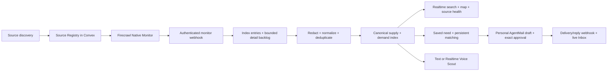

# RoomScout — Provisional Implementation Plan

Status: active implementation plan, updated 2026-08-28. The original staged
gates remain useful for sequencing and review, but the approved YOLO build has
implemented several later capabilities in parallel. Provider-backed live proofs
remain deliberately bounded.

## Source Intelligence and portal-autopilot checkpoint — 2026-08-31

The earlier first-slice non-goals below are retained as historical sequencing,
but they no longer describe the implemented direction. RoomScout now contains:

- a Germany-wide, bounded Firecrawl Search query matrix that persists candidates
  into a review queue without starting a broad crawl;
- geographic coverage, platform, fact, adapter, checkpoint, versioned policy,
  and read-only probe models;
- per-search source include/prefer/exclude controls and honest coverage labels;
- Firecrawl Interact execution of exact, approved public contact forms. Reviewed
  non-HITL workflows may submit after the final gate; CAPTCHA or uncertain state
  pauses in a user-controlled Live View;
- one Browserbase persistent Context per user and portal, with short-lived
  Sessions, human login/2FA handoff, passive recon, bounded platform-inbox
  synchronization, and approved writes through code-owned adapters;
- versioned standing mandates for Research, Outreach, and Negotiation modes,
  with platform/action/data scopes, contact/browser limits, price ceiling,
  expiry, complaint stop, and a kill switch;
- an exact-hash external-action ledger, one-time approvals, mandate snapshots,
  idempotent executions, unified email/platform communication, opportunities,
  and explicit handoffs.

No password, cookie, DOM snapshot, screenshot, raw audio, or ephemeral Live View
URL is stored. No agent can solve a CAPTCHA, enter a password or 2FA code, accept
terms, sign an agreement, complete a booking, or spend money. The generic
Browserbase write executor is implemented and covered by fixture adapters. A
real portal remains non-executable until its concrete flow has an approved
current policy and a tested code-owned adapter; this is a safety and correctness
gate, not hidden autonomy.

**Firecrawl architecture correction, 2026-08-28:** RoomScout now uses Firecrawl
Native Monitoring as the retrieval scheduler. `monitor.page` and
`monitor.check.completed` webhooks feed idempotent Convex ingestion. Convex owns
the Source Registry, processing backlog, stale-state rules, and a reconciliation
watchdog; its cron does not run a second scrape schedule. The older
Convex-owned `changeTracking` scheduler described in the first scaffold has been
superseded.

## Implementation checkpoint — 2026-08-28

The current vertical architecture includes:

- a Source Registry plus Native Monitor synchronization and webhook ingestion;
- index-page expansion into individual `sourceEntries`, with a five-detail limit
  per pilot target and at most two concurrent Firecrawl requests;
- public-signal redaction, private contact candidates, deterministic deduplication,
  strict OpenAI normalization, embeddings, matching, geocoding, and notifications;
- a persistent text Scout with structured search state, fact memory, context
  compression, reviewed external-context import, and explicit Case Card modes;
- personal AgentMail inbox provisioning and exact-content approvals;
- an authenticated OpenAI Realtime WebRTC session endpoint with shared Scout
  context and no stored audio; and
- a RoomScout globe/map adapted from maintainer-owned Jumper map physics, with
  cached Mapbox geocoding and visible location precision.

The three source pilots—Stuttgart, Berlin, and Hamburg—are seeded in a paused
review state. `FIRECRAWL_MONITORS_ENABLED` defaults off. No broad crawl, live
mail send, or production-scale geocoding run is part of this checkpoint.
Translation remains deferred.

## 1. Implementation target

Build RoomScout as a continuously updated discovery layer for the fragmented
online rehearsal-room market. Firecrawl discovers and monitors public supply and
demand sources in the background. Convex turns those observations into a live,
queryable, provenance-aware market index. A musician searches once across that
index instead of repeating the same search across many sites.

### Direct user promise

> Search the fragmented web for rehearsal rooms in one place, understand how
> fresh each result is, and be notified when something relevant appears.

### Structural honesty

RoomScout cannot remove physical scarcity and cannot observe supply that never
leaves private word-of-mouth networks. It can reduce the search loss around the
online-visible market by improving coverage, comparability, freshness, and
coordination.

### Aggregate insight

The same canonical dataset can later reveal supply-demand gaps: where demand
remains unmet, which room characteristics recur, and where sharing may unlock
capacity. Aggregate analysis is a possible community benefit, not the primary
user-facing hackathon promise.

## 2. Scope boundaries

### Core path to prove

- Maintain an operational registry of rehearsal-room market sources.
- Cover both public supply and public demand signals.
- Use scheduled, change-tracked Firecrawl scrapes for reviewed source targets.
- Receive optional asynchronous Firecrawl events through an authenticated
  Convex webhook.
- Normalize heterogeneous entries into one market-signal model.
- Deduplicate entries without hiding source provenance.
- Display current results with source, observed/verified state, and freshness.
- Let a musician save a need and create a relevant alert draft.
- Use AgentMail for an explicitly approved outbound message and an inbound reply.
- Deploy the public SPA through Convex Static Hosting at `convex.site`.

### Historical non-goals for the first vertical slice

- A completed comprehensive crawl of Germany or Europe.
- Booking, payments, contracts, or availability management.
- Unreviewed autonomous account creation on third-party platforms.
- Bypassing login barriers, CAPTCHAs, robots rules, or platform restrictions.
- Bulk cold outreach or automatic introductions.
- Publishing scraped identities or contact details.
- General-purpose musician collaboration matching.
- Production-grade graph analytics or embeddings before deterministic search and
  deduplication work.
- Unreviewed Browserbase write automation. Browserbase is now implemented for
  approved source recon, persistent user login, and passive Inbox retrieval.

## 3. Architecture and responsibility split



| System | Primary responsibility |
|---|---|
| React + Vite | Public search, result detail, saved need, Scout text/voice UI, map, approval UI, Inbox, and Ops views |
| Convex | Source Registry, webhook ingestion, canonical state, indexes, realtime queries, matching, rate limits, approvals, audit trail, and reconciliation |
| Firecrawl | Native Monitoring, changed-index extraction, and bounded detail-page retrieval |
| OpenAI | Terra generation through the Convex AI Gateway, semantic embeddings, and Realtime Voice over WebRTC |
| AgentMail | Personal user inboxes, approved outbound email, delivery events, inbound replies, and thread state |
| Mapbox | Server-side cached geocoding plus browser globe and map rendering |

### Scheduling boundary

Firecrawl Native Monitoring owns recurring retrieval. Convex stores the monitor
mapping and expected cadence, receives authenticated events, and owns
idempotency, application state, and maintenance:

- mark stale signals according to source-specific freshness policies,
- reconcile source targets that have stopped succeeding,
- retry failed normalization jobs,
- expire unverified needs in batches,
- recompute derived market summaries,
- prepare user alert candidates,
- record source-health and job metrics.

There must never be two active schedulers for the same retrieval. The Convex
cron is only a reconciliation watchdog for missing checks, stuck events, stale
signals, and bounded backlog recovery; it does not duplicate Firecrawl scrapes.

## 4. Product and data lifecycle

### 4.1 Source lifecycle

```text
discovered -> reviewing -> approved -> baselining -> active
                                      \-> degraded -> paused
                                      \-> restricted
```

- `discovered`: candidate found through research or web-scale monitoring.
- `reviewing`: access method, relevance, terms, and data quality are being tested.
- `approved`: source is permitted and has a defined extraction contract.
- `baselining`: first complete snapshot is being created and checked.
- `active`: monitor is running and events are being processed.
- `degraded`: extraction or freshness has fallen below the source expectation.
- `paused`: intentionally inactive without discarding configuration or history.
- `restricted`: automation is not permitted or cannot be responsibly supported.

### 4.2 Ingestion lifecycle

```text
received -> authenticated -> recorded -> processing -> processed
                                  \-> duplicate
                                  \-> failed -> retrying -> processed | dead-letter
```

The webhook must acknowledge valid events quickly. Heavy extraction, OpenAI
normalization, deduplication, and notification matching should continue through
scheduled internal work rather than blocking the HTTP response.

### 4.3 Market-signal lifecycle

```text
observed -> normalized -> published -> stale -> expired
                         \-> suppressed
                         \-> disputed
```

Verification is a separate dimension:

```text
unclaimed | user_verified | source_verified | operator_verified
```

This avoids claiming that a scraped public post represents an active RoomScout
member. A signal can be publicly observed and recently seen without being
verified by its author.

### 4.4 Communication lifecycle

```text
drafted -> awaiting_approval -> approved -> sending -> sent -> replied -> parsed
                                \-> rejected
                                \-> failed
```

No transition to `sending` may occur without a persisted approval that refers to
the exact recipients and final content being sent.

## 5. Candidate Convex model

These are implementation candidates to be validated against the first source
cohort. They are not yet a frozen schema.

### `sources`

Operational Source Registry.

- stable slug, name, base URL, and geographic scope,
- market side: `supply`, `demand`, or `both`,
- access mode: `public`, `authenticated`, `partner`, or `restricted`,
- source status and health status,
- terms/automation review state and review timestamp,
- discovery strategy and extraction version,
- freshness policy and expected cadence,
- last successful observation and last error,
- public display and contact-policy flags.

Candidate indexes: by status, by health, by access mode, and by next review time.

### `sourceMonitors`

Maps a source to one or more Firecrawl monitor targets.

- source reference and Firecrawl monitor/target IDs,
- target type: `scrape`, `crawl`, or `search`,
- canonical URLs or query-set reference,
- goal, schedule, extraction version, and active state,
- last check ID, next expected check, and cost estimate where available.

Candidate indexes: by source, by provider monitor ID, and by active state.

### `ingestionEvents`

Immutable-enough receipt and processing ledger for external events.

- provider event ID, monitor ID, check ID, event type, and page URL,
- received time, payload hash, validation result, and processing state,
- retry count, failure summary, and completion time,
- optional restricted reference to retained raw payload.

Candidate indexes: by provider event ID for idempotency, by processing state and
received time for workers, and by monitor/check ID for diagnostics.

### `sourceEntries`

The latest source-specific representation of each discovered listing or post.

- source reference, stable external ID, canonical source URL, and source side,
- extracted title, text summary, source timestamp, and structured fields,
- first seen, last seen, visibility, and source status,
- extraction version, content fingerprint, and normalization state,
- restricted contact-data presence flag without exposing the contact value.

Candidate indexes: by source and external ID, by source and last-seen time, by
normalization state, and by canonical URL.

### `marketSignals`

Canonical supply and demand records used by the product.

- side, canonical key, title, summary, and status,
- city/region/district keys plus optional coordinates or geocode confidence,
- budget or price range and period,
- schedule, duration, room/equipment characteristics, and constraints,
- first observed, last observed, freshness state, and verification state,
- confidence and primary evidence reference,
- optional semantic representation added only after the deterministic baseline.

Candidate indexes should follow actual product queries, likely combinations of
side, status, city/region, and last-seen time. Text search can cover title and
normalized summary; true radius search should not be promised until its query
strategy is tested.

### `signalEvidence`

Preserves many-to-one provenance when duplicate source entries represent one
canonical signal.

- market signal reference, source entry reference, relationship type,
- match method, confidence, and reviewer state.

Candidate indexes: by market signal and by source entry.

### `savedNeeds`

User-controlled room requirements.

- owner identity, location/radius, schedule, budget, equipment, and constraints,
- active/paused/fulfilled/expired state,
- alert preferences, verification time, and next confirmation time,
- matching consent kept separate from public visibility consent.

Candidate indexes: by owner, by active state and city, and by next confirmation.

### `alertDrafts`, `outreachDrafts`, and `mailThreads`

Communication control and AgentMail state.

- exact recipients, immutable content version, reason, and approval state,
- approver, approval timestamp, and content fingerprint,
- AgentMail message/thread IDs and delivery/reply state,
- parsed reply facts separated from raw private message content.

Candidate indexes: by approval state, by owner, by AgentMail thread ID, and by
next action time.

## 6. Source onboarding procedure

Each source is configured once, then maintained as an operational asset.

### Step A: discover and qualify

1. Record the source, geographic scope, and whether it contains supply, demand,
   or both.
2. Check public accessibility, robots behavior, platform terms, expected account
   type, and whether automation or messaging needs permission.
3. Classify the access mode. Login capability is not treated as permission.
4. Capture representative pages with PII redaction during technical evaluation.
5. Decide whether the source provides enough relevant, current information to
   justify ongoing credits and maintenance.

### Step B: choose the monitored page pattern

- **Index-page target:** stable result page from which individual current entries
  and detail URLs can be extracted.
- **Detail-page retrieval:** only new or meaningfully changed entries are scraped
  and normalized.
- **Discovery research:** additional domains enter `reviewing`; web-scale search
  does not automatically publish or activate a monitor.
- **Interact/profile:** only for an approved authenticated source where simple
  scraping is insufficient; not part of the initial core path.

### Step C: define the extraction contract

- Stable source ID and canonical URL rules.
- Required fields: side, title, location, source date, description, and detail URL.
- Optional fields: budget, schedule, equipment, size, access, and contact-channel
  presence.
- Include/exclude paths, crawl depth, pagination behavior, and noise exclusions.
- Firecrawl goal and JSON schema where structured change tracking is valuable.
- Version identifier so extraction changes are auditable and reprocessable.

Monitoring and extraction depend on exact source URLs and consistent scrape
parameters. The same URL should not alternate between incompatible tag,
content-selection, or main-content settings.

### Step D: baseline and activate

1. Run the first snapshot and store the source-specific entries.
2. Review a sample against the source page for field accuracy and omissions.
3. Run a second controlled check to verify `same` behavior.
4. Test a known or controlled content change and verify `new`/`changed` handling.
5. Confirm the webhook reaches Convex and retries do not duplicate records.
6. Record expected cadence and failure thresholds.
7. Activate the monitor only after the policy and data-quality review passes.

### Step E: maintain health

- Compare expected and observed entry counts without treating count changes as
  proof of deletion.
- Mark a source `degraded` if extraction suddenly returns zero, required fields
  disappear, login expires, or checks stop arriving.
- Preserve the last trusted signals while degraded; do not mass-delete.
- Route source changes to an admin review queue.
- Allow an AI-assisted repair proposal, but require review before changing a
  production extraction contract.

## 7. Normalization and deduplication

### Deterministic first

Use cheap, explainable rules before embeddings or LLM judgments:

1. provider event ID and source external ID,
2. canonical URL,
3. stable content fingerprint,
4. normalized source-specific identifiers,
5. exact or near-exact title/location/date combinations.

### OpenAI normalization second

For new or meaningfully changed entries, request schema-constrained output for:

- market side and listing type,
- normalized location and location confidence,
- price/budget and billing period,
- schedule and recurrence,
- equipment, room features, and constraints,
- dates, urgency, flexibility, and apparent active state,
- missing or contradictory facts,
- short evidence-grounded summary.

Store the model, prompt/schema version, input fingerprint, output, and confidence.
The model must not invent missing values; unknown should remain unknown.

### Duplicate candidates third

Use normalized similarity and later embeddings to propose cross-source duplicate
candidates. Preserve every source entry as evidence even when several entries
are attached to one market signal. Automatically merge only high-confidence,
explainable cases; route ambiguous candidates to review.

### Matching after the index works

- Supply-to-demand matching uses location, schedule, budget, and constraints.
- Demand clustering describes market concentration.
- Room-sharing matching additionally requires practical compatibility such as
  complementary schedules and sharing consent.
- Musical similarity alone must not be presented as room-sharing compatibility.

## 8. Convex API organization

Organize functions by domain rather than by UI page:

```text
convex/
  schema.ts
  http.ts
  crons.ts
  sources.ts
  monitors.ts
  ingestion.ts
  normalization.ts
  signals.ts
  search.ts
  savedNeeds.ts
  alerts.ts
  outreach.ts
  agentmail.ts
  admin.ts
```

Implementation rules:

- define explicit argument and return validators for every function,
- use indexes for filtered queries instead of database `.filter()`,
- keep webhook storage and state transitions in internal mutations,
- use actions only for external APIs such as Firecrawl, OpenAI, geocoding, and
  AgentMail,
- make event processing and external-send transitions idempotent,
- batch maintenance work and continue it through scheduled internal functions,
- use `ConvexError` only for useful user-facing failures,
- keep public query return values free of restricted source data and private
  communication content.

## 9. Webhook design

### Firecrawl endpoint

Provisional route: `/api/webhooks/firecrawl`.

1. Read the raw body and configured authentication headers.
2. Validate the shared webhook secret or the current official signature method.
3. Reject oversized, malformed, or unsupported events.
4. Derive a stable event idempotency key.
5. Record the receipt through an internal mutation.
6. Schedule processing and return promptly.
7. Treat `monitor.page` as page-level work and `monitor.check.completed` as
   reconciliation/health information.
8. For `new` and `changed`, scrape the current index, derive individual source
   entries, and queue no more than five new detail pages per target in the pilot.
9. Treat one missing snapshot as uncertainty. Mark an entry stale only after two
   successful snapshots omit it; never mass-delete after one empty response.

### AgentMail endpoint

Provisional route: `/api/webhooks/agentmail`.

- verify webhook signatures using the current official AgentMail mechanism,
- deduplicate delivery and message events,
- associate replies through AgentMail thread/message IDs,
- keep raw private content restricted,
- run OpenAI reply parsing asynchronously,
- update the approval/thread UI through Convex mutations.

## 10. Product surfaces

### Public search

- City/region plus supply/demand toggle.
- Filters that the initial dataset can support honestly.
- Paginated or bounded realtime result list.
- Result cards with source, first seen, last seen, freshness, and verification.
- Clear link to the original source.
- No implication that observed demand users are reachable through RoomScout.

### Result detail

- Canonical normalized information.
- Source evidence and conflicting facts.
- Freshness explanation rather than a generic “current” badge.
- Explicit unknown fields.
- Save/share actions that do not expose private identities.

### Saved need

- Compact structured form before conversational onboarding.
- Review screen showing what will be stored and what can become public.
- Alert candidate list with reasons.
- Separate toggles for email alerts, matching, and profile visibility.

### Admin Source Registry

- Source/monitor status, side, access mode, cadence, and last successful check.
- Entry counts and changed/new/error summaries.
- Extraction version and policy-review state.
- Event failures, retry controls, and degraded-source warnings.
- Activation, pause, and review actions protected by admin authorization.

### Live ingestion view for the demo

- recent Firecrawl checks,
- new/changed page event,
- normalization status,
- canonical signal creation/update,
- realtime appearance in public search.

### Globe and map

- The landing globe shows aggregated `marketAreas`; `/map` exposes city-level
  pins and filters.
- Exact pins are allowed only when the public source actually publishes exact
  location information. District and city geocodes are visibly approximate.
- Server-side Mapbox geocodes are cached in Convex; a failed geocode never blocks
  signal publication.
- The globe physics, fog, rotation, and fly-to behavior are adapted from the
  maintainer's Jumper studio-map implementation and restyled for RoomScout.

### Realtime Voice Scout

- `POST /api/realtime/session` authenticates the Convex user, rate-limits session
  creation, and proxies browser SDP to OpenAI `/v1/realtime/calls` using multipart
  text fields named `sdp` and `session`.
- The default model is `gpt-realtime-2.1`, configurable through the deployment
  environment. The browser carries microphone and model audio through WebRTC.
- Voice uses the same search, signal focus, draft, and memory domains as text.
  Tools can create an outreach draft but cannot approve or send it.
- Final transcripts and memory events may be stored; raw audio is never stored.
- Mic denial, disconnect, mute, reconnect, and session-end states remain visible.

## 11. Implementation phases and exit gates

### Phase 0 — Lock the experiment contract

Tasks:

- Choose one pilot geography based on source coverage, not ambition.
- Select a small cohort representing at least one demand-list pattern, one
  supply-list pattern, and one discovery-search pattern.
- Complete source access/policy review before monitoring.
- Define the user moment the first build must prove.
- Set working data-quality and freshness expectations.

Recommended first proof:

> A musician searches one city, sees recent supply and demand signals from
> multiple sources with honest freshness, saves a need, and observes a newly
> detected matching signal appear without repeating the search.

Exit gate:

- At least two technically feasible public sources with different page patterns.
- One chosen pilot geography.
- One-page scope statement listing inclusions and explicit exclusions.

### Phase 1 — Scaffold the technical foundation

Tasks:

- Initialize React + Vite + TypeScript and Tailwind CSS v4.
- Initialize Convex and generated TypeScript bindings.
- Configure local development without committing secrets.
- Add the official Convex Static Hosting component and `/api` route boundary.
- Add formatting, type-checking, unit-test, and build scripts.
- Create a minimal public shell and protected admin placeholder.

Exit gate:

- SPA loads against the development Convex deployment.
- A reactive health query updates in the frontend.
- Production build succeeds locally.
- No deployment occurs until explicitly requested.

### Phase 2 — Establish the canonical data spine

Tasks:

- Define validators and initial tables for sources, monitors, events,
  source entries, signals, and evidence.
- Add indexes required by the first real queries.
- Implement internal idempotent event receipt and processing transitions.
- Implement public result projections that cannot leak restricted fields.
- Seed only controlled test fixtures, clearly separated from real observations.

Exit gate:

- Duplicate fixture events do not create duplicate entries.
- Public queries expose only approved fields.
- Source entry and canonical signal remain independently inspectable.

### Phase 3 — Build the Source Registry and first adapter

Tasks:

- Implement admin create/review/pause flows.
- Onboard the first public source manually using the documented checklist.
- Capture a redacted fixture for repeatable tests.
- Define its extraction contract and baseline.
- Store its Firecrawl monitor metadata in Convex.

Exit gate:

- Admin can explain how the source is accessed, monitored, and interpreted.
- Baseline extraction matches a reviewed sample.
- Source can be paused without deleting data.

### Phase 4 — Complete the Firecrawl-to-Convex vertical slice

Tasks:

- Add the authenticated Firecrawl webhook endpoint.
- Process `monitor.page` and `monitor.check.completed` events idempotently.
- Expand index snapshots into multiple source entries, then process only bounded
  new or changed detail pages.
- Handle new, changed, removed, same, and error states.
- Add degraded-source safeguards against false mass removal.
- Expose source health and recent ingestion events in the admin UI.

Exit gate:

- A repeated event is harmless.
- A changed source creates one traceable canonical update.
- The public UI updates through a Convex subscription without refresh.
- Invalid webhook requests are rejected and logged safely.

### Phase 5 — Add source diversity and ongoing discovery

Tasks:

- Seed reviewed pilot targets for Stuttgart, Berlin, and Hamburg without
  activating them automatically.
- Discover new result URLs or source candidates through controlled research;
  do not start a web-scale monitor in this run.
- Route discovered domains into `reviewing`, not directly into production.
- Measure credits and expected monthly monitoring cost per source.
- Add source-health thresholds and review reminders.

Exit gate:

- All reviewed index-page patterns feed the same multi-entry ingestion contract.
- New source candidates do not become public until reviewed.
- Cost and health are visible per monitor.

### Phase 6 — Normalize and deduplicate with OpenAI

Tasks:

- Define a strict canonical extraction schema.
- Implement an OpenAI action for new/meaningfully changed entries only.
- Store versioned normalization runs and evidence.
- Add deterministic deduplication before semantic candidate generation.
- Add a review queue for ambiguous cross-source duplicates.
- Add representative German-language fixtures and unknown-field cases.

Exit gate:

- The same source entry is not normalized repeatedly without input/version change.
- Unknown information remains unknown.
- Every canonical fact links back to source evidence.
- Low-confidence duplicates remain separate until reviewed.

### Phase 7 — Deliver the musician-facing index

Tasks:

- Build search, filters, result list, and detail view.
- Display supply and demand distinctly.
- Display observed/verified and fresh/stale distinctly.
- Add source links and explain why a result is shown.
- Add pagination before the dataset can grow without bound.
- Add district/city aggregation and map pins with an explicit precision label.

Exit gate:

- One musician can complete the core search job without understanding the
  ingestion architecture.
- No result hides provenance or overstates availability.
- Search remains responsive with a realistic seeded dataset.

### Phase 8 — Saved needs and approved AgentMail alerts

Tasks:

- Use Convex Auth v2 Alpha for private saved needs and approvals.
- Add a structured saved-need form and lifecycle.
- Match new signals against active needs with explainable rules.
- Create alert drafts rather than sending immediately.
- Add explicit recipient/content approval.
- Lazily provision one deterministic personal AgentMail inbox per user.
- Send an approved message through AgentMail and ingest delivery/reply events.
- Parse a reply with OpenAI and update the live thread state.

Exit gate:

- No message can be sent without an exact approval record.
- An approved message and reply complete one traceable round trip.
- Private saved needs are never exposed through public queries.

### Phase 9 — Optional coordination layer

Only enter this phase if the index and alert loop are reliable.

Possible tasks:

- Let a user claim an observed demand signal.
- Separate visibility, matching, and introduction consent.
- Propose room-sharing candidates using practical compatibility.
- Require both sides to approve an introduction.
- Draft a group inquiry with approval from all required participants.

Exit gate:

- A match explanation distinguishes similarity from compatibility.
- No private identity is revealed before required consent.
- The feature improves the room job rather than becoming generic social matching.

### Phase 10 — Reliability, privacy, and security hardening

Tasks:

- Run the Convex security review/check skills against the implementation.
- Audit public/internal function boundaries and every query projection.
- Verify webhook authentication, replay resistance, idempotency, and limits.
- Add retention and deletion rules for raw events and private mail content.
- Add rate limits and abuse controls to saved needs and approvals.
- Test stale, removed, degraded, duplicate, retry, and out-of-order events.
- Confirm logs contain no secrets, scraped contacts, or raw private messages.
- Add source-policy review dates and a pause mechanism.

Exit gate:

- Security checklist has no unresolved high-severity findings.
- Failure drills do not corrupt canonical state or send messages.
- Public data exposure matches the documented policy.

### Phase 11 — Deployment and hackathon proof

Tasks:

- Deploy only after explicit instruction.
- Verify the production SPA and `/api` webhook routes on `convex.site`.
- Run a deterministic end-to-end demo using a controlled public source change or
  clearly disclosed replay; do not pretend a third-party site changed live.
- Confirm the live app, public repository, social post, and sub-three-minute demo
  satisfy current submission requirements.
- Run `/hackathon` after the implementation evidence exists.

Recommended demo sequence:

1. Search the existing multi-source rehearsal-room index.
2. Show source provenance and freshness.
3. Trigger or replay a disclosed Firecrawl change event.
4. Watch Convex process and publish the normalized signal live.
5. Show a saved need become a match candidate.
6. Approve one AgentMail message.
7. Show the reply return and update the UI.
8. Use Voice to update the same search card and show the city on the map.

Exit gate:

- Public deployment and demo flow are independently reproducible.
- Sponsor roles are visible and necessary, not decorative.
- Build log and hackathon log match the actual implementation.

## 12. Testing strategy

### Unit tests

- URL canonicalization and content fingerprints.
- Source status and market-signal state transitions.
- Freshness calculations.
- Deterministic deduplication rules.
- Matching rules and explanation inputs.
- Public data projection and restricted-field exclusion.

### Contract tests

- Firecrawl webhook payload validation.
- AgentMail webhook payload and signature validation.
- OpenAI structured output validation and unknown handling.
- Source extraction fixtures per extraction version.

### Integration tests

- Duplicate and out-of-order webhooks.
- New, changed, removed, and error monitor events.
- Degraded source returning zero entries.
- Event-to-source-entry-to-market-signal pipeline.
- Approved send and inbound reply round trip.

### End-to-end tests

- Search and filter public signals.
- Open provenance and original source.
- Save a private need.
- Observe a realtime matching update.
- Approve exactly one message and verify its final content.
- Confirm an unapproved or modified message cannot send.

### Data-quality checks

- Required-field coverage by source.
- Freshness lag from source observation to public index.
- Duplicate candidate and false-merge rate.
- Unexpected count drops and false removal rate.
- Location normalization confidence.
- Percentage of public results with clear provenance.

## 13. Observability and operating metrics

### Source health

- checks expected versus received,
- last successful check and last successful entry extraction,
- new/changed/removed/error counts,
- entry-count deviation,
- required-field coverage,
- monitor credit estimate and actual usage where available.

### Pipeline health

- webhook receipt and rejection counts,
- processing latency and retry depth,
- normalization success/failure counts,
- duplicate candidate backlog,
- dead-letter events,
- alert-draft and approved-send counts.

### Product usefulness

- active fresh supply and demand signals per pilot geography,
- number of distinct useful sources,
- searches yielding at least one relevant result,
- saved needs receiving an explainable match,
- alert precision based on user approval/rejection,
- successful reply round trips.

Avoid vanity totals that mix stale observations, duplicates, and verified users.

## 14. Decision gates before they become code

The following choices remain open and should be made at the latest phase that
requires them:

| Decision | Needed by | Default recommendation |
|---|---|---|
| Pilot geography | Implemented configuration | Stuttgart, Berlin, and Hamburg; each source starts paused in `reviewing` |
| Initial source cohort | Implemented configuration | Public index pages only; five new details per target and two concurrent Firecrawl requests |
| Retrieval ownership | Implemented | Firecrawl Native Monitoring; Convex only reconciles health and processing |
| Map in MVP | Implemented foundation | Globe plus `/map`, with precision-aware cached Mapbox geocoding |
| Auth provider | Implemented | Convex Auth v2 Alpha, Username + Password |
| Embeddings | Implemented | Direct OpenAI `text-embedding-3-small`; exact constraints remain deterministic |
| Voice | Implemented foundation | Direct OpenAI Realtime WebRTC; no audio storage and no send/approval tool |
| AgentMail identity | Implemented foundation | Personal inbox per user, provisioned lazily at first outreach |
| Authenticated third-party sources | After core index | Require source-specific permission and a human checkpoint |
| Browserbase | After source evidence | Add only for a permitted flow Firecrawl cannot reliably support |
| Band-to-band introductions | Phase 9 | Optional; never block the core index and alert loop |

## 15. Core MVP definition of done

The leading core hypothesis is proven when:

- the public app is deployed on Convex Static Hosting,
- multiple reviewed sources feed one canonical supply/demand index,
- Firecrawl detects and reports a real or controlled disclosed change,
- Convex ingests it idempotently and updates the UI in realtime,
- OpenAI performs evidence-grounded normalization or deduplication,
- every result exposes provenance, freshness, and observed/verified state,
- a musician can save a need and receive a relevant alert draft,
- text and Voice update the same owned search and memory domains,
- the globe/map shows only source-supported locations with visible precision,
- one explicitly approved AgentMail message and reply complete the loop,
- no source restriction, private contact, or unapproved message is bypassed,
- automated tests and production smoke checks pass,
- the documentation and hackathon evidence describe only what actually exists.

Everything beyond this definition—autonomous source repair, authenticated-source
automation, room-sharing pools, translation, and broader superconnector
behavior—remains an extension until the core index proves useful.
