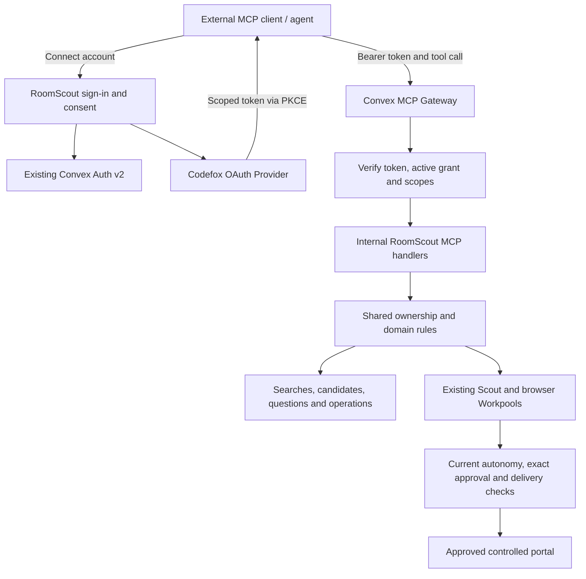

# RoomScout MCP with OAuth Provider and MCP Gateway

2026-09-19 · Proposed full integration; the isolated Phase 0 proof has been implemented separately. See [proof results](MCP_HELLO_WORLD_RESULTS.md). Existing RoomScout deployments remain unchanged by this MCP work.

**First execution slice:** [Isolated MCP / OAuth hello-world proof](MCP_HELLO_WORLD_PLAN.md). This companion scopes Phase 0 to a separate deployment, Auth v2, both components and one authenticated tool connected from ChatGPT. It ends with a findings report; later phases require a separate instruction.

## 1. Outcome and boundaries

A user connects ChatGPT, Claude or another compatible MCP client to RoomScout. They can sign in or create an account during OAuth and return directly to consent. Band details can then be supplied by their agent through a scoped profile tool, without a manual onboarding questionnaire. Their chosen agent can read their searches and candidates, change a search, start or pause it, and answer ordinary Scout questions. RoomScout continues to own matching, durable state, provider conversations, delivery and approval enforcement.

Use both components:

| Layer | Responsibility |
| --- | --- |
| Existing Convex Auth v2 | Sign in to RoomScout and identify the person granting access |
| `@codefox-inc/oauth-provider` | OAuth authorization, PKCE, client registration, delegated tokens and refresh rotation |
| `convex-mcp-gateway` | MCP HTTP transport, explicit tool registry, schemas, identity injection and protocol responses |
| RoomScout domain functions | Ownership, scoped permissions, search lifecycle, account autonomy, decisions and delivery safeguards |
| Existing Agent and Workpool components | Provider assessment, asynchronous processing and the queued approved-portal-write path |

The intended deployment stays in the current Convex backend and React/Vite frontend. No auth migration or separate OAuth service is planned. Prove the HTTP/token boundary in phase 0 before committing to that deployment shape.

Initial delivery is a portable MCP server. Embedded ChatGPT cards, app-store submission, MCP sampling and new provider channels are separate follow-ups. The external agent supplies the conversation; this integration does not add another Scout LLM or change existing model choices.

Preserve the user's existing product decisions:

- A general request to contact a particular room opens its details/conversation in RoomScout; there is no general-purpose MCP message-send tool. Starting an authorized search still invokes RoomScout's existing autonomous workflow.
- Account-level `scoutAutonomy` remains authoritative. Do not recreate per-search mandates or daily contact limits. See accepted [ADR 1](adr/0001-handlungsspielraum-pro-nutzer.md) and [ADR 2](adr/0002-autopilot-ohne-tageslimits.md).
- Review mode still needs exact approval of each outgoing message. Binding acceptance, contracts, deposits and payments always require the existing first-party human flow. An external agent cannot approve its own action.
- The demo's approved provider channel remains the controlled `roomscout.dev` portal. Public listings remain research-only where no approved contact channel exists.
- Keep validation small and functional. No full test-suite expansion, live microphone test or real-provider outreach is required for this integration.

## 2. Verified baseline

Inspected on branch `autopilot-policy`, through `e2520b8`, on 2026-09-19. Recheck these seams before implementation if the branch changes.

- Main app: Convex `1.45.0`, `@convex-dev/auth` `2.0.0-alpha.1`, Agent `0.7.1`, Workpool `0.4.11` and Static Hosting `0.2.1`.
- Evaluated component versions: Codefox `0.4.2` and MCP Gateway `2.0.0`. Neither is currently registered in `convex/convex.config.ts`. Pin tested versions and any reviewed patch in the lockfile.
- `convex/auth.config.ts` trusts only first-party Auth v2 JWTs. Existing public functions derive a user from `ctx.auth` and generally do not enforce third-party OAuth scopes.
- Codefox's core configuration is usable independently of its older Convex Auth examples. Do not copy its legacy auth-table helpers or replace RoomScout's v2 setup.
- Gateway supports a custom identity resolver, authorization during tool listing/calling, internal function references and a hidden `identityArg`. These are the integration points; it does not automatically enforce RoomScout scopes or business rules.
- Approved portal writes now enter `portalWriteQueue.ts` and the existing browser Workpool. The wider per-connection coordination and status work remains partly deferred; do not claim the entire [browser plan](BROWSER_WORKPOOL_PLAN.md) is implemented.

## 3. Authorization design

### 3.1 Keep delegated tokens out of ordinary first-party APIs

Keep `auth.config.ts` first-party-only. Verify Codefox access tokens in the gateway's custom resolver. Globally adding the OAuth issuer would otherwise allow a token with limited MCP scopes to authenticate against existing public functions that only check ownership.

**Phase 0 exit gate:** On an isolated development backend, send a real Codefox access token to a minimal MCP tool while its issuer is absent from `auth.config.ts`. Confirm the HTTP action reaches the custom resolver, succeeds for that token and rejects an invalid token. Also confirm that the delegated token cannot call an ordinary first-party API directly. Gateway source supports this resolver, but its documentation is ambiguous about Convex's earlier HTTP bearer validation; a source review does not prove the deployed behavior.

If Convex rejects the bearer before the resolver executes, stop this architecture path and document the measured failure. Do not silently add global trust. Reassess a supported token boundary before proceeding; an external HTTP adapter or a comprehensive first-party issuer guard would be a material plan change.

### 3.2 Canonical routes

Let `SITE` be the deployment's configured public Convex site origin. Use separate development and production configuration and keys.

| Route / value | Owner |
| --- | --- |
| `SITE/api/mcp` | Canonical MCP resource and access-token audience |
| `/api/mcp/` | Optional transport alias; same canonical resource |
| `SITE/api/oauth` | Codefox issuer |
| `/api/oauth/authorize`, `/api/oauth/token`, `/api/oauth/register` | Codefox authorization, exchange and client-registration routes |
| `/api/oauth/.well-known/jwks.json` | Codefox public signing keys |
| `/.well-known/oauth-authorization-server/api/oauth` | Discovery for that issuer |
| `/.well-known/oauth-protected-resource/api/mcp` | Gateway resource metadata pointing at the Codefox issuer |
| `/settings/connections` | First-party connected-app management |
| `/connect/authorize` | First-party login/consent continuation screen |

Register explicit HTTP routes before `registerStaticRoutes`. Root `/.well-known` routes are the discovery exception to the app's `/api` convention. Disable duplicate root discovery registration in the Codefox helper and own the canonical aliases explicitly. Its prefix-local metadata routes remain registered even with `registerRootWellKnown: false`; manually mount the supported handlers or adapt the helper so unused protected-resource metadata does not advertise a conflicting resource. Retain the correct prefix-local issuer/OIDC discovery and userinfo routes as needed. Do not enable the gateway's OAuth/DCR bridge: Codefox already supplies the authorization server and client registration.

Use private MCP mode (`requireAuth`) and correct `401`/`WWW-Authenticate` challenges with protected-resource metadata. Advertise the same resource and scopes consistently in discovery and tools. Explicitly configure supported browser origins, CORS/preflight and allowed transport methods; native clients without an Origin header still require valid authorization. CORS is not the permission check.

### 3.3 Login and consent

1. Validate the client, exact registered redirect, S256 PKCE, requested scopes and exact RoomScout resource before displaying consent. Unknown scopes/resources fail closed.
2. Create a short-lived server-side continuation containing normalized OAuth parameters, the original client `state`, expiry and a separate browser binding. The URL carries only an opaque handle. Do not use the client's `state` as RoomScout's CSRF protection.
3. Use existing Auth v2 login. A pre-login continuation becomes bound to the authenticated user only after verifying the initiating browser binding. Existing-account checks and reset/tombstone guards still apply.
4. Render the client name as untrusted text, requested permissions and their consequences. Do not automatically fetch arbitrary client logos or URLs. Default to read permissions; write permissions require explicit consent.
5. Approve/deny through a first-party authenticated endpoint with same-origin/CSRF protection. Load all parameters server-side, verify the user/browser binding, expiry and single-use state, then consume the continuation atomically. The browser cannot supply a replacement user, redirect, client, resource or scope list.
6. Issue the code through the atomic Codefox grant/code API described below; the current `OAuthProvider.issueAuthorizationCode` wrapper uses two separate component calls and is not sufficient for the new generation contract. Redirect only to the stored validated redirect with the original `state`. Denial uses the same validated destination. Invalid redirects never receive a redirect response.
7. Code exchange and refresh stay in Codefox, with PKCE/resource checks and hashed token storage. No application code invents tokens or exposes first-party session tokens to the client.

Use dedicated OAuth signing keys instead of reusing Auth v2 keys. Keep keys server-side, support `kid` rotation and never put them in `VITE_*`, source control or logs. Request `offline_access` only when persistent connection/refresh is wanted; unnecessary email/profile OIDC scopes are excluded.

Start with known development clients. Enable Dynamic Client Registration for clients that require it after adding bounded registration, request-size and abuse limits. A registered client is not a trusted client and receives no account access until consent.

### 3.4 Revocation must remain effective after reconnecting

Codefox `0.4.2` has indexed hashed token storage, but its available helpers do not provide the complete bounded token/grant check needed here. Checking only that a user/client authorization exists can allow an old signed JWT to become usable after regrant. Some cleanup/revocation operations also use unbounded collection or filtering.

Before production, implement the following as a small reviewed upstream change or maintained pinned component patch/fork. Keep Codefox responsible for OAuth; do not build a second token server around it.

- Expose `resolveActiveAccessTokenByHash` using the existing hash index. Compute the hash once in the HTTP layer so raw bearer tokens are not passed as logged Convex function arguments. Use the exact canonical SHA-256 encoding used by Codefox's `hashToken`; the component query accepts the hash directly and must not hash it again. Return only the principal, scopes, resource, expiry and grant generation.
- Persist an immutable generation through authorization codes, access-token rows and refresh lineage. An authorization record is retained as active/revoked; regrant advances its generation rather than resetting history. V1 supports one canonical MCP resource and client-wide disconnect.
- Consent activation and code creation must stamp the same generation atomically. Token saving and refresh rotation re-read that authorization in their mutations and reject stale/revoked generations. This closes the consume-code → revoke → save-token race.
- Revocation atomically invalidates the grant first. Delete old codes/tokens later in indexed, bounded batches. Refresh-token reuse and code replay branches must atomically mark the affected grant generation revoked, replacing their current deletion-based grant handling; delayed cleanup alone cannot provide immediate invalidation.
- Add the expiry/client indexes and return validators needed by the used paths. Preserve replay tombstones and refresh families for their actual replay/refresh lifetime, rather than deleting by access-token expiry alone.

On every authenticated MCP request: verify signature with the configured RS256 keys, issuer, audience, expiry and access-token type; then require a stored active token under the current grant generation, matching user/client/resource/scopes. Do not accept an OIDC ID token or trust unsigned decoded claims. Do not cache positive grant authorization across requests; key-material caching is separate.

Expose a separate `isGrantGenerationActive(userId, clientId, resource, generation)` component API for mutation handlers and background workers to recheck permission where effects are authorized. Workers must not retain the user's bearer token to do this. Return/check current scopes as well as generation. Component isolation requires these explicit APIs; the host cannot inspect component tables directly.

## 4. Initial MCP tool contract

Register an explicit fixed allowlist with `defineMcpQuery`, `defineMcpMutation` and, only when necessary, `defineMcpAction`. Never export the generated `api` tree or accept arbitrary Convex function names.

Proposed permission bundles:

Effective permission is the intersection of delegated scopes, current account autonomy and the existing domain/approval rules. OAuth consent can narrow access; it cannot expand the user's standing authority or satisfy an exact-message approval.

| Scope | Meaning |
| --- | --- |
| `roomscout:read` | Minimal profile, owned searches, candidate facts and high-level progress |
| `roomscout:profile:write` | Update the connected user's confirmed musician/band introduction fields only; excludes credentials, permissions and autonomy settings |
| `roomscout:conversations:read` | The user's provider messages and private Scout questions/answers |
| `roomscout:searches:write` | Create/edit inactive search drafts |
| `roomscout:searches:run` | Start, pause or change active searches; may trigger existing non-binding outreach |
| `roomscout:questions:answer` | Answer ordinary Scout questions; resuming a provider workflow additionally needs `searches:run` |

| Tool | Contract and existing implementation seam |
| --- | --- |
| `get_profile` | Minimal user identity/display and onboarding readiness; reuse the safe projection in `users.current`, excluding credentials/contact data not needed by the agent |
| `update_profile` | Agent-supplied, user-confirmed first name and band/artist name when available, optional last name; allowlisted profile fields through shared onboarding validation, ownership from token, profile-write scope, expected revision and idempotency key. Never treat an authentication username as a band name or import the agent's whole memory |
| `list_searches`, `get_search` | Owned, bounded saved needs, revisions and current state; `savedNeeds.ts` |
| `list_candidates`, `get_candidate` | Current fit/near-budget candidates, reasons, evidence freshness, photo URL and RoomScout detail link; reuse `matches.listCandidatesForOwner`. For already tracked rooms, conversation status can explain a later exclusion; do not claim this helper lists all excluded rooms |
| `get_conversation` | Bounded message page plus actual delivery/progress state; extract the owned projection from `conversations.ts`; requires conversation-read scope |
| `list_open_questions` | Owned decisions with type, round/question IDs, expected revision and permitted response choices. Conversation-bound details require conversation-read scope; without it return only a minimal first-party review reference. Approval-only decisions always use that review link, never an MCP approval affordance |
| `get_operation` | Owned durable status/result references, safe failure or blocked reason and any first-party action link |
| `create_search` | Create an inactive draft through shared normalization; write scope and idempotency key |
| `update_search` | Expected-revision edit through shared lifecycle; write scope, plus run scope if the search is active |
| `set_search_state` | Explicit active/paused target, never a toggle; run scope, expected revision and idempotency key |
| `answer_scout_question` | Owned open `scout_question` only, with current question/round/revision; answer scope and run scope when it can resume provider processing |

Candidate links follow the current detail-first UI, with “Open conversation” inside RoomScout when a conversation exists. A candidate without one opens its details and available first-party actions. There is no MCP `send_message`, `approve_action`, `accept_offer`, arbitrary browser action, credential handling or autonomy-settings mutation in this release. Do not expose operator/reset/debug APIs, raw memory, provider-private scenario instructions or internal reasoning. Question-answer scope alone does not grant visibility of provider messages or drafts.

Ordinary answers remain scoped: a concession for one room does not change the global search. Full question rounds must be completed before reassessment resumes. Reject generic approval decisions, stale versions and binding decisions even if the caller supplies an apparently valid choice ID. A model-supplied `approved: true`, tool annotation, or MCP elicitation answer is not proof of human approval.

Return typed structured results plus a short readable summary. Include search revision, evidence time, operation/conversation IDs and explicit `queued`, `waiting_for_you`, `waiting_for_provider`, `failed` or terminal outcomes as applicable. Never describe a queued inquiry as sent. List/message responses use cursors and bounded page sizes; long transcripts are not dumped into every tool result. Treat listing and message content as untrusted data, separate from tool instructions.

Mark read/write and external effects accurately in MCP annotations/security metadata. In particular, activating or editing an active search and answering some questions can later cause contact: these are not harmless local-only edits merely because the immediate function is a mutation.

## 5. Shared domain logic and asynchronous work

### 5.1 One business implementation

Create internal MCP handlers that take a gateway-injected, validated caller. Configure `identityArg` so a client-supplied value is stripped and replaced. Map the verified subject to an existing active RoomScout user; never map by email or accept a caller-controlled owner ID. Internal handlers independently check scopes, current grants and resource ownership.

Refactor trusted owner-aware helpers without weakening the first-party wrappers:

- `users.ts`: minimal owned profile projection.
- `savedNeeds.ts` and `lib/needLifecycle.ts`: shared create/update/status helpers. Preserve normalization, revision increments, stale-match retirement, recomputation and activation scheduling.
- `matches.ts`: reuse the existing owned candidate helper; bound/paginate any currently unbounded paths used by MCP.
- `conversations.ts`: owned read projections with bounded message pagination.
- `decisions.ts`: a narrow ordinary-question helper that validates decision kind before entering the existing answer logic. Never expose its generic approval-capable entrypoint.

Use generated internal references and shared TypeScript helpers; do not loop back through public HTTP APIs or simulate a user's session. Every resource ID must be checked against its parent search/conversation and owner. Foreign and nonexistent private IDs return the same safe not-found response.

### 5.2 Idempotency and provenance

Every mutation accepts a client-generated idempotency key. In one Convex mutation, check current authorization and expected revision, claim the key, change state and enqueue any downstream work. Key uniqueness is scoped to grant generation, tool and key; a different normalized payload under the same key is rejected. Retries return the original result/reference, never repeat an external action.

Propagate a server-owned origin envelope through search activation, rematching, provider events, decision answers and action requests: connected grant/generation, request ID and the initiating search revision. Never let the external agent manufacture this envelope. First-party jobs remain valid without it; add optional fields to existing tables for an additive migration.

Before MCP-origin work makes a consequential state transition, and immediately before claiming an external write, recheck the grant, need revision/status, current `scoutAutonomy`, exact approval where required, reset state and existing execution guards. Subsequent provider-reply processing must retain the conversation's workflow origin; it must not accidentally become unscoped first-party work.

Disconnect stops future MCP-origin work. Persist the active search's controlling origin alongside its matching revision. Pause it only if that origin still matches the disconnected grant/generation and the revision recorded for that control assignment. Later first-party edits/resumes explicitly adopt control, clear the delegated origin and bump the revision; later changes by another authorized client replace the assignment. Perform the disconnect predicate check and pause atomically through the shared lifecycle, and explain the effect on the disconnect screen. Do not pause unrelated or subsequently adopted searches or erase saved preferences/messages. Stale queued work remains invalid after adoption.

An already claimed remote write may have happened. Revocation/cancellation must preserve its receipt and reconciliation state and must not promise “nothing was sent.” Do not retry an uncertain delivery under a new idempotency key.

### 5.3 Reuse current queues and truthful status

Use `scoutWorkpool` for provider processing and `portalWriteQueue` → `browserWorkpool` for approved portal writes. Preserve current retry rules: bounded retryable reads/interpretation, no automatic retry of a potentially submitted write. MCP must not call the direct browser-write escape paths or create a competing queue. The deferred browser-coordinator improvements remain a separate effort.

Do not hold a tool call open through crawling, provider replies or browser delivery. Return an accepted operation reference and let `get_operation` read persisted progress. Existing action/conversation ledgers determine delivery success; Workpool's `finished` state alone does not. Capture WorkIds where useful for queue state, and persist business completion so status survives component cleanup.

The RoomScout settings/status UI uses Convex reactive queries. External MCP clients may request status later; no promise is made that an idle ChatGPT conversation will receive unsolicited updates. Standard tool calls are sufficient for v1; newer MCP task/subscription extensions are optional later.

## 6. Files, state and Convex conventions

Proposed new modules: `convex/mcp/gateway.ts`, `auth.ts`, `oauth.ts`, `consent.ts`, `tools.ts` and `operations.ts`. Split only where it creates a clear authorization or lifecycle boundary; these names are implementation targets, not mandatory scaffolding.

Shared files: `convex/convex.config.ts`, `http.ts`, `schema.ts`, `crons.ts`, the domain files above, the settings routes, `.env.example`, package manifest/lockfile and any reviewed component patch. Keep one integration owner for these cross-cutting files.

Minimal additional state:

- `mcpAuthorizationRequests`: hashed opaque continuation, normalized parameters, browser/user binding, expiry and consumed state; indexes for lookup and bounded expiry cleanup.
- `mcpOperations`: owner, grant/generation, tool, idempotency key, normalized request hash, target/revision, outcome references and timestamps. Index by grant/tool/key, owner/update time and cleanup time. Reuse existing action/event IDs for execution rather than duplicating their state machines.
- OAuth clients, grants, codes and tokens stay in Codefox. Do not maintain a second host token/grant authority. Connected-app UI reads a safe component projection through an authenticated host query.

Apply the repository's current generated Convex guidelines and best practices:

- Object-form functions with explicit argument **and return** validators; typed IDs, small DTOs, internal visibility by default. Only the first-party consent/settings endpoints are public Convex functions; MCP handlers are internal.
- Indexed bounded lookups and pagination; no new unbounded `.collect()` or database `.filter()` scans. Use `paginationOptsValidator`/`paginationResultValidator` and preserve pagination options.
- Queries stay pure. Use server time supplied by the HTTP/action boundary for security expiry checks, or a materialized state transition for reactive UI; do not rely on query wall-clock expiry to invalidate subscriptions.
- Atomic validation, idempotency and domain writes in mutations. LLMs/network calls in actions. HTTP/auth code uses the default Convex runtime and supported WebCrypto APIs; Node-only imports stay outside `http.ts` and shared default-runtime modules.
- Await all work; durable continuation goes through the scheduler/Workpool. Never use detached promises to finish an MCP request.
- Mount/use the existing rate-limiter dependency for DCR and per-client/user service abuse limits where needed. This does not add daily outreach limits to the user's autonomy policy.
- Sanitize protocol errors. Gateway audit is supplementary; it is not a transactional record of approval or delivery. Log IDs, durations and safe codes, with token, prompt, message and personal-data redaction. Add bounded retention to new audit/session records used by the integration.
- Generate API/component types with codegen; do not hand-edit generated bindings. New schema fields on existing rows are optional, with bounded migrations only if needed.

For operations, publish a finite replay/status retention policy. Expired retained requests must reject or explicitly expire retries instead of silently re-running an old external action. OAuth retention follows code/token/replay-family validity; cleanup runs in small indexed batches.

## 7. Implementation sequence and exit gates

| Phase | Work | Exit condition |
| --- | --- | --- |
| **0 — Compatibility proof** | Follow the [hello-world companion](MCP_HELLO_WORLD_PLAN.md): isolate deployment, pin both components, mount one authenticated tool and connect through Codefox PKCE from ChatGPT. Prove delegated bearer reaches the resolver and fails against first-party APIs. Observe stock revocation without implementing Phase 1 hardening. | Target-client result and authorization observations recorded separately; no global auth trust added; stop after report |
| **1 — OAuth boundary** | Add canonical discovery/routes, first-party consent, separate keys, scoped clients and the bounded revocation/generation component adaptation. | Login → consent → token → refresh → revoke works; old credentials stay invalid after reconnect |
| **2 — Read tools** | Add injected identity, deny-by-default list/call authorization, owned projections, pagination and minimal structured results. | Two accounts remain isolated; read tokens cannot mutate or access undelegated conversation content |
| **3 — Domain commands** | Extract shared lifecycle helpers, add idempotency/revision checks, question-kind restrictions and end-to-end async provenance. Enable write scopes only when worker rechecks land. | Repeated/stale calls do not duplicate work or bypass approvals; revoked queued work cannot initiate delivery |
| **4 — User controls** | Connected-app settings, scopes, disconnect, affected-search explanation, first-party review links and safe operation status. | User can see and remove access; normal RoomScout login/voice/text behavior remains intact |
| **5 — Client acceptance** | One MCP Inspector flow and one real target client account-connection flow using synthetic accounts. Exercise read/draft/question behavior; test outreach only through the approved controlled fixture when explicitly running that acceptance. | Demonstrated compatible client; no claim of broader client support without a check |

Astra/integration owner controls auth, schema, shared lifecycle/provenance contracts and final review. After those contracts are stable, delegate read/tool handlers and consent/settings UI independently to Sol with separate file ownership. Never parallelize competing changes to `auth.config.ts`, `convex.config.ts`, schema or approval gates.

Each phase should be reviewable in its own commit. No unrelated model, portal simulation, matching-policy or UI redesign changes belong in these commits.

## 8. Small functional validation only

Use one focused MCP integration file and a small component-boundary test file if the grant patch requires it. Reuse existing fixtures. The following are scenarios, not a request to build a large matrix or duplicate the components' full protocol suites:

1. **Real auth boundary:** PKCE connection, refresh, invalid token rejection, and inability to use the OAuth bearer on ordinary first-party APIs. Confirm normal Auth v2 login still works.
2. **Isolation and scope:** Account A cannot read/change B's search or conversation; spoofed identity injection fails; read-only token cannot invoke writes or omitted conversation scopes. Wrong audience/resource and expired token fail closed.
3. **Consent and reconnect:** A foreign, expired or replayed continuation cannot issue a code or redirect to a substituted URL. Check code-consumed → revoke → token-save, refresh-read/sign → revoke → rotation, and revoke → regrant → old access/refresh use: all stale credentials fail. Exercise cleanup once above its batch size.
4. **Lifecycle and retry:** Repeated create/update/start returns one result, stale revisions fail, active edits require run scope, and accepted work is reported as queued rather than completed.
5. **Private question versus approval:** One multi-question room concession resumes only when complete; generic message approval/binding decisions are refused through MCP. Room-specific answers remain room-specific.
6. **Queued effects and revocation:** Revoke before execution and observe no new provider write; preserve an already uncertain delivery for reconciliation. Ordinary first-party work and a search subsequently adopted in RoomScout are unaffected by that client's disconnect.

Run scoped typechecking/lint for changed modules plus the normal build if frontend/package wiring changes. Run the bounded tests once after the implementation stabilizes; broaden only for an actual uncovered failure. Manual client checks use synthetic users/data. No full historical suite or microphone retest is planned.

## 9. Rollout and completion

Develop behind a server-side MCP enable switch, initially off in production. Read-only connection is the first rollout milestone; write capabilities require completed provenance and approval checks. Consent must describe indirect outreach before run scope is granted. Existing users and first-party authentication need no migration.

Before deployment, record the tested component versions/patch, exact canonical issuer/resource, supported client, secret names and key-rotation procedure. Set deployment-specific configuration and publish frontend/backend changes together where consent routes depend on new functions. A custom-domain move later requires deliberate issuer/resource/client migration rather than an unnoticed URL change.

Rollback disables new MCP/token issuance and MCP tool access and invalidates delegated grants, while leaving Auth v2 and first-party RoomScout working. Pausing MCP-origin workflows uses the same lifecycle and claim/reconciliation rules; do not delete evidence or blindly replay jobs. Additive data/component registrations may remain until bounded cleanup is safe.

**Done when:** a new external client can connect an existing account; see only its permitted RoomScout data; create/edit/start/pause a search under the same domain rules; answer ordinary private question rounds; follow first-party links for protected approvals; inspect honest asynchronous outcomes; and lose delegated access immediately on disconnect, including after reconnection. Both components must perform their intended work, and all claims must be backed by the bounded acceptance checks above.

## Sources and evidence

- [Convex best practices](https://docs.convex.dev/understanding/best-practices/) and local `convex/_generated/ai/guidelines.md` for the installed runtime.
- [Convex function authentication](https://docs.convex.dev/auth/functions-auth), [HTTP actions](https://docs.convex.dev/functions/http-actions) and [component isolation/usage](https://docs.convex.dev/components/using).
- [Codefox component](https://www.convex.dev/components/codefox-inc/oauth-provider), [required component skill](https://www.convex.dev/components/codefox-inc/oauth-provider/SKILL.md) and [inspected 0.4.2 source](https://github.com/codefox-inc/convex-oauth-provider/tree/50d547117d2dc0ce3d051b187508d8238c5cc7d2). Its marketing description is not a substitute for the boundary checks above.
- [MCP Gateway source/docs](https://github.com/tfohlmeister/convex-mcp-gateway), [authorization guide](https://github.com/tfohlmeister/convex-mcp-gateway/blob/main/docs/authorization.md) and [required component skill](https://www.convex.dev/components/convex-mcp-gateway/SKILL.md). Implementation must use the inspected published 2.0.0 API, not assume future `main` remains identical.
- [MCP authorization specification](https://modelcontextprotocol.io/specification/2025-11-25/basic/authorization) and [OpenAI MCP app authentication](https://developers.openai.com/plugins/build/auth) for client discovery, PKCE and resource-bound access.

The plan records source inspection and design, not a completed interoperability test, security certification or deployed MCP feature.
